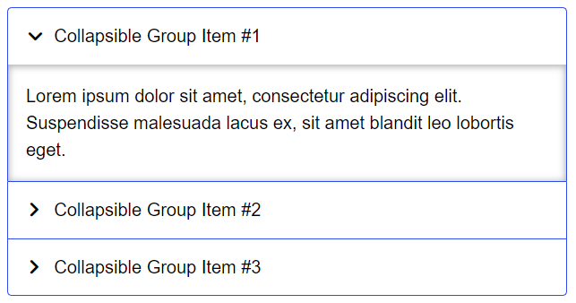
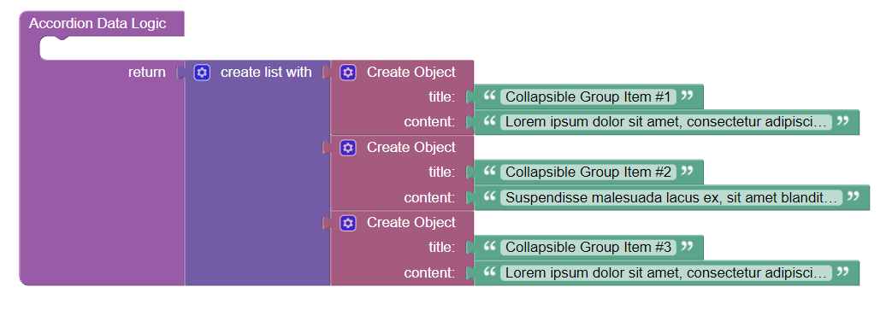

DO NOT MERGE

# Accordion

Accordion is the component that can be used in Backendless [UI-Builder](https://backendless.com/developers/#ui-builder). It allows displaying structured content through progressive disclosure. This component is divided into two logical blocks:

	1. The title that provides a high level overview of the content.
	2. The section that contains the actual content.

To save extra space in the application, the section with content remains hidden and only the title is visible. To disclose the hidden content of the section, a user must click the title.

<p align="center">
  
</p>

Additional properties allow customizing the font size, background color, text color, padding and behavior of the component. Refer to the Properties section below.

## Configuration

Configuration can be done in the UI Builder or using the Codeless Logic. You have to specify the data that will be displayed in the title and the section of the component.

## Properties

| Property                 | Type       | Default value                                                                                                    | Logic                | Data Binding | UI Setting | Description                                                                                                                                               |
|--------------------------|------------|------------------------------------------------------------------------------------------------------------------|----------------------|--------------|------------|-----------------------------------------------------------------------------------------------------------------------------------------------------------|
| Accordion Data           | *JSON*     | `[{"title": "Collapsible Group Item #1","content": "Lorem ipsum dolor sit amet, consectetur adipiscing elit."}]` | Accordion Data Logic | NO           | YES        | Specifies a JSON array containing data for the title and the section : `{title: string, content: string}`. Watch [Codeless Examples](#codeless-examples). |
| Controlled Accordion     | *Checkbox* | false                                                                                                            |                      | NO           | YES        | when enabled, only one section expands at a time.                                                                                                         |
| Title Font Size          | *Text*     | "16px"                                                                                                           |                      | NO           | YES        | controls the font size of the title.                                                                                                                      |
| Title Color              | *Color*    |                                                                                                                  |                      | NO           | YES        | controls the color of the title.                                                                                                                          |
| Title Background Color   | *Color*    |                                                                                                                  |                      | NO           | YES        | controls the background color of the title.                                                                                                               |
| Title Padding            | *Text*     | "12px 16px 12px 10px"                                                                                            |                      | NO           | YES        | controls the padding of the title.                                                                                                                        |
| Content Font Size        | *Text*     | "16px"                                                                                                           |                      | NO           | YES        | controls the font size of the section's content.                                                                                                          |
| Content Color            | *Color*    |                                                                                                                  |                      | NO           | YES        | controls the color of the section's content.                                                                                                              |
| Content Background Color | *Color*    |                                                                                                                  |                      | NO           | YES        | controls the background color of the section's content.                                                                                                   |
| Content Padding          | *Text*     | "16px"                                                                                                           |                      | NO           | YES        | controls the padding of the section's content.                                                                                                            |

## Events

| Name                      | Triggers                                               | Context Blocks |
|---------------------------|--------------------------------------------------------|----------------|
| On Open Item Event        | when the user opens the accordion section              | `Item`         |
| On Close Item Event       | when the user closes the accordion section             | `Item`         |
| On Mouse Over Event       | when the mouse pointer hovers over the accordion       |                |
| On Mouse Out Event        | when the mouse pointer leaves the accordion boundaries |                |

## Actions

| Action               | Inputs | Returns |
|----------------------|--------|---------|
| Open All Accordion   |        |         |
| Close All Accordion  |        |         |
| Toggle All Accordion |        |         |

## Styles

**Theme**

````
@bl-customComponent-accordion-themeColor: @themePrimary;
@bl-customComponent-accordion-backgroundColor: @appBackgroundColor;
@bl-customComponent-accordion-textColor: @appTextColor;
````

**General**

````
@bl-customComponent-accordion-title-icon-color: @bl-customComponent-accordion-textColor;
@bl-customComponent-accordion-content-backgroundColor: @bl-customComponent-accordion-backgroundColor;
````

**Dimensions**

````
@bl-customComponent-accordion-width: 100%;
@bl-customComponent-accordion-title-padding: 12px 16px 12px 10px;
@bl-customComponent-accordion-title-width: 100%;
@bl-customComponent-accordion-title-icon-width: 1em;
@bl-customComponent-accordion-title-icon-height: 1em;
@bl-customComponent-accordion-content-padding: 16px;
@bl-customComponent-accordion-content-width: 100%;
@bl-customComponent-accordion-content-open-maxHeight: 500px;
````

**Typography**

````
@bl-customComponent-accordion-fontSize: 16px;
@bl-customComponent-accordion-lineHeight: 1.5;
````

**Decoration**

````
@bl-customComponent-accordion-borderRadius: 4px;
@bl-customComponent-accordion-border: 1px solid @bl-customComponent-accordion-themeColor;
@bl-customComponent-accordion-item-firstChild-borderRadius: 4px 4px 0 0;
@bl-customComponent-accordion-item-lastChild-borderRadius: 0 0 4px 4px;
@bl-customComponent-accordion-title-icon-transition: all 0.2s ease-in-out;
@bl-customComponent-accordion-title-icon-transform: rotateZ(90deg);
@bl-customComponent-accordion-content-transition: max-height 0.2s ease-in-out;
@bl-customComponent-accordion-content-shadow: 0px 1px 6px 1px fade(@bl-customComponent-accordion-textColor, 30%) inset;
````

## Codeless Examples

Below is a Codeless Example highlighting how to use the Accordion component:


