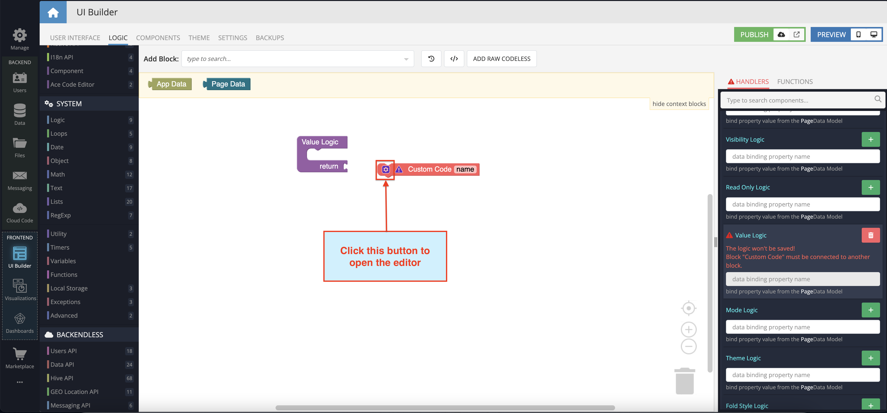

# Ace Code Editor

Ace Code Editor is a component of Backendless UI-Builder designer. The Ace Code Editor component is the high-performance code editor for the web. This component is created using the [react-ace](https://www.npmjs.com/package/react-ace) library.

  

## Properties

| Property                                            | Type                                                                                                                                                                                                               | Default Value   | Logic                         | Data Binding | UI Setting | Description                                                                    |
|-----------------------------------------------------|--------------------------------------------------------------------------------------------------------------------------------------------------------------------------------------------------------------------|-----------------|-------------------------------|--------------|------------|--------------------------------------------------------------------------------|
| Read Only `readOnly`                            | Checkbox                                                                                                                                                                                                           | `false`         | Read Only Logic               | YES          | YES        | This handler allows you to disable editing of the component value.             |
| Value `value`                                   | Text                                                                                                                                                                                                               | ""              | Value Logic                   | YES          | NO         | This handler allows you to add value to the component. Watch [Usage Guide](#usage-guide). |
| Mode `mode`                                     | Select [Java:`java` JavaScript:`javascript` TypeScript:`typescript` Python:`python` JSON:`json` PHP:`php` C and C++:`c_cpp` C#:`csharp` Ruby:`ruby` HTML:`html` CSS:`css`] | Java:`java`     | Mode Logic                    | YES          | YES        | This handler allows you to select the mode of a component.                     |
| Theme `theme`                                   | Select [GitHub:`github` Chrome:`chrome` Monokai:`monokai` Nord Dark:`nord_dark` Twilight:`twilight` idle Fingers:`idle_fingers`]                                                               | GitHub:`github` | Theme Logic                   | YES          | YES        | This handler allows you to select the theme of a component.                    |
| Fold Style `foldStyle`                          | Select [Manual:`manual` Mark begin:`markbegin` Mark begin and end:`markbeginend`]                                                                                                                          | Manual:`manual` | Fold Style Logic              | NO           | YES        | This handler allows you to select the fold style.                              |
| Placeholder `placeholder`                       | Text                                                                                                                                                                                                               | "Placeholder"   | Placeholder Logic             | NO           | YES        | This handler allows you to specify the placeholder for a component.            |
| Width `width`                                   | Text                                                                                                                                                                                                               | "750px"         | Width Logic                   | YES          | YES        | This handler allows you to specify the width of a component.                   |
| Height `height`                                 | Text                                                                                                                                                                                                               | "500px"         | Height Logic                  | YES          | YES        | This handler allows you to specify the height of a component.                  |
| Font Size `fontSize`                            | Number                                                                                                                                                                                                             | 16              | Font Size Logic               | YES          | YES        | This handler allows you to specify the font size for the value of a component. |
| Tab Size `tabSize`                              | Number                                                                                                                                                                                                             | 4               | Tab Size Logic                | NO           | YES        | This handler allows you to specify the tab size.                               |
| Print Margin Column `printMarginColumn`         | Number                                                                                                                                                                                                             | 80              | Print Margin Column Logic     | NO           | YES        | This handler allows you to specify the print margin column.                    |
| Print Margin Visibility `printMarginVisibility` | Checkbox                                                                                                                                                                                                           | `true`          | Print Margin Visibility Logic | NO           | YES        | This handler allows you to control the visibility of the print margin.         |
| Gutter Visibility `gutterVisibility`            | Checkbox                                                                                                                                                                                                           | `true`          | Gutter Visibility Logic       | NO           | YES        | This handler allows you to control the visibility of the gutter.               |
| Autocompletion `autocompletion`                 | Checkbox                                                                                                                                                                                                           | `false`         | Autocompletion Logic          | NO           | YES        | This handler allows you to add auto-completion capability for a component.     |
| Highlight Active Line `highlightActiveLine`     | Checkbox                                                                                                                                                                                                           | `true`          | Highlight Active Line Logic   | NO           | YES        | This handler allows you to add a highlight for the active line.                |
| Highlight Selected Word `highlightSelectedWord` | Checkbox                                                                                                                                                                                                           | `false`         | Highlight Selected Word Logic | NO           | YES        | This handler allows you to add the ability to highlight the selected word.     |
| Show Invisibles `showInvisibles`                | Checkbox                                                                                                                                                                                                           | `false`         | Show Invisibles Logic         | NO           | YES        | This handler allows you to add the ability to highlight empty spaces.          |
## Events

| Name            | Triggers                                | Context Blocks          |
|-----------------|-----------------------------------------|-------------------------|
| On Change Event | when the value of the component changes | Value: `String`         |

## Actions

| Action          | Inputs                                  | Returns                 |
|-----------------|-----------------------------------------|-------------------------|
| Set Value       | Value: `String`                         |                         |
| Get Value       |                                         | `String`: current value |

##  Usage Guide

> **To paste code using `Value` property:**

1. Select the `Custom Code` block:

2. Open the editor:

3. Paste the code and select `Return result` checkbox:

4. Paste the `Custom Code` block into the `Value` block return:

