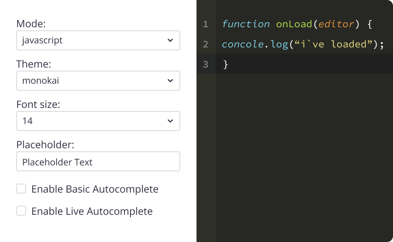

# Ace Editor

Ace is the embeddable code editor which supports the syntax highlighting for the following programming languages: Java, JavaScript, TypeScript, Python, JSON, PHP, C, C++, C#, Ruby, HTML, CSS.

When this component is deployed it can highlight only one programming language that was set by developer in the Logic of the Backendless UI-Builder. Therefore, a user cannot switch to another programming language while using the editor. 

This component is created using the [react-ace](https://www.npmjs.com/package/react-ace) library.

  

The editor supports 6 graphical themes:
 1. Github
 2. Chrome
 3. Monokai
 4. Nord
 5. Dark Twilight
 6. Idle Fingers

You can set the desired theme in the Logic of this component in the UI-Builder.

  

Below you can find the description for each property of this component:

## Properties

| Property                | Type                                                                                                                                                                                     | Default Value | Logic                         | Data Binding | UI Setting | Description                                                                    |
|-------------------------|------------------------------------------------------------------------------------------------------------------------------------------------------------------------------------------|---------------|-------------------------------|--------------|------------|--------------------------------------------------------------------------------|
| Read Only               | *Checkbox*                                                                                                                                                                               | `false`       | Read Only Logic               | YES          | YES        | This handler allows you to disable editing of the component value.             |
| Name                    | *Text*                                                                                                                                                                                   | "Ace Editor"  | Name Logic                    | NO           | YES        | This handler allows you to specify the name of the component.                    |
| Value                   | *Text*                                                                                                                                                                                   | ""            | Value Logic                   | YES          | YES        | This handler allows you to add a default value to the component. This can be a code snippet which will be displayed to the user when the page is loaded.                        |
| Mode                    | *Select*   "Java"   "JavaScript" \|  "TypeScript" \|  "Python" \|  "JSON" \|  "PHP" \|  "C and C++" \|  "C#" \|  "Ruby" \|  "HTML" \|  "CSS" | "Java"        | Mode Logic                    | YES          | YES        | This handler allows you to select the mode of the component.                     |
| Theme                   | *Select*   "GitHub"   "Chrome" \|  "Monokai" \|  "Nord Dark" \|  "Twilight" \|  "idle Fingers"                                                                   | "GitHub"      | Theme Logic                   | YES          | YES        | This handler allows you to select the theme of the component.                    |
| Fold Style              | *Select*   "Manual" \| "Mark begin" \| "Mark begin and end"                                                                                                                          | "Manual"      | Fold Style Logic              | NO           | YES        | This handler allows you to select the fold style.                              |
| Placeholder             | *Text*                                                                                                                                                                                   | "Placeholder" | Placeholder Logic             | NO           | YES        | This handler allows you to specify the placeholder for the component. The placeholder is a default value which is displayed to the user before any text is entered in the component on the page. This can be a simple statement such as "Insert your code".            |
| Width                   | *Text*                                                                                                                                                                                   | "750px"       | Width Logic                   | YES          | YES        | This handler allows you to specify the width of the component.                   |
| Height                  | *Text*                                                                                                                                                                                   | "500px"       | Height Logic                  | YES          | YES        | This handler allows you to specify the height of the component.                  |
| Font Size               | *Number*                                                                                                                                                                                 | 16            | Font Size Logic               | YES          | YES        | This handler allows you to specify the font size which affects the size of all text entered in the component on the page. |
| Tab Size                | *Number*                                                                                                                                                                                 | 4             | Tab Size Logic                | NO           | YES        | The Tab Size represents the number of spaces in one Tab. For instance, the default value of this property is 4, hence if you enter the Tab button while in the editor, the component will add 4 spaces. 
| Print Margin Column     | *Number*                                                                                                                                                                                 | 80            | Print Margin Column Logic     | NO           | YES        | This handler allows you to specify the print margin column.                    |
| Print Margin Visibility | *Checkbox*                                                                                                                                                                               | `true`        | Print Margin Visibility Logic | NO           | YES        | This handler allows you to control the visibility of the print margin.         |
| Gutter Visibility       | *Checkbox*                                                                                                                                                                               | `true`        | Gutter Visibility Logic       | NO           | YES        | This handler allows you to control the visibility of the gutter.               |
| Autocompletion          | *Checkbox*                                                                                                                                                                               | `false`       | Autocompletion Logic          | NO           | YES        | This handler allows adding auto-completion capability to the component. For example, if your code contains a few variables and functions, then while entering their names you will be prompted to select one of the options matching the name criteria in the interactive drop-down menu. This also applies to keywords.      |
| Highlight Active Line   | *Checkbox*                                                                                                                                                                               | `true`        | Highlight Active Line Logic   | NO           | YES        | When this handler is activated, then the active line will be highlighted.              |
| Highlight Selected Word | *Checkbox*                                                                                                                                                                               | `false`       | Highlight Selected Word Logic | NO           | YES        | When this handler is activated, then the selected word will be highlighted.     |
| Show Invisibles         | *Checkbox*                                                                                                                                                                               | `false`       | Show Invisibles Logic         | NO           | YES        | When this handler is activated, it  highlights the empty spaces.          |
## Events

| Name            | Triggers                                | Context Blocks          |
|-----------------|-----------------------------------------|-------------------------|
| On Change Event | when the value of the component changes | Value: `String`         |

## Actions

| Action          | Inputs                                  | Returns                 |
|-----------------|-----------------------------------------|-------------------------|
| Set Value       | Value: `String`                         |                         |
| Get Value       |                                         | `String`: current value |
