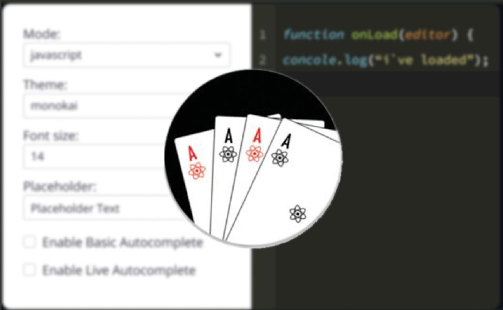

# Ace Editor

Ace Editor is a component of Backendless UI-Builder designer. The Ace Editor component is the high-performance code editor for the web. This component is created using the [react-ace](https://www.npmjs.com/package/react-ace) library.

  

## Properties

| Property                | Type                                                                                                                                                                                     | Default Value | Logic                         | Data Binding | UI Setting | Description                                                                    |
|-------------------------|------------------------------------------------------------------------------------------------------------------------------------------------------------------------------------------|---------------|-------------------------------|--------------|------------|--------------------------------------------------------------------------------|
| Read Only               | *Checkbox*                                                                                                                                                                               | `false`       | Read Only Logic               | YES          | YES        | This handler allows you to disable editing of the component value.             |
| Value                   | *Text*                                                                                                                                                                                   | ""            | Value Logic                   | YES          | YES        | This handler allows you to add value to the component.                         |
| Mode                    | *Select*   "Java"   "JavaScript" \|  "TypeScript" \|  "Python" \|  "JSON" \|  "PHP" \|  "C and C++" \|  "C#" \|  "Ruby" \|  "HTML" \|  "CSS" | "Java"        | Mode Logic                    | YES          | YES        | This handler allows you to select the mode of a component.                     |
| Theme                   | *Select*   "GitHub"   "Chrome" \|  "Monokai" \|  "Nord Dark" \|  "Twilight" \|  "idle Fingers"                                                                   | "GitHub"      | Theme Logic                   | YES          | YES        | This handler allows you to select the theme of a component.                    |
| Fold Style              | *Select*   "Manual" \| "Mark begin" \| "Mark begin and end"                                                                                                                          | "Manual"      | Fold Style Logic              | NO           | YES        | This handler allows you to select the fold style.                              |
| Placeholder             | *Text*                                                                                                                                                                                   | "Placeholder" | Placeholder Logic             | NO           | YES        | This handler allows you to specify the placeholder for a component.            |
| Width                   | *Text*                                                                                                                                                                                   | "750px"       | Width Logic                   | YES          | YES        | This handler allows you to specify the width of a component.                   |
| Height                  | *Text*                                                                                                                                                                                   | "500px"       | Height Logic                  | YES          | YES        | This handler allows you to specify the height of a component.                  |
| Font Size               | *Number*                                                                                                                                                                                 | 16            | Font Size Logic               | YES          | YES        | This handler allows you to specify the font size for the value of a component. |
| Tab Size                | *Number*                                                                                                                                                                                 | 4             | Tab Size Logic                | NO           | YES        | This handler allows you to specify the tab size.                               |
| Print Margin Column     | *Number*                                                                                                                                                                                 | 80            | Print Margin Column Logic     | NO           | YES        | This handler allows you to specify the print margin column.                    |
| Print Margin Visibility | *Checkbox*                                                                                                                                                                               | `true`        | Print Margin Visibility Logic | NO           | YES        | This handler allows you to control the visibility of the print margin.         |
| Gutter Visibility       | *Checkbox*                                                                                                                                                                               | `true`        | Gutter Visibility Logic       | NO           | YES        | This handler allows you to control the visibility of the gutter.               |
| Autocompletion          | *Checkbox*                                                                                                                                                                               | `false`       | Autocompletion Logic          | NO           | YES        | This handler allows you to add auto-completion capability for a component.     |
| Highlight Active Line   | *Checkbox*                                                                                                                                                                               | `true`        | Highlight Active Line Logic   | NO           | YES        | This handler allows you to add a highlight for the active line.                |
| Highlight Selected Word | *Checkbox*                                                                                                                                                                               | `false`       | Highlight Selected Word Logic | NO           | YES        | This handler allows you to add the ability to highlight the selected word.     |
| Show Invisibles         | *Checkbox*                                                                                                                                                                               | `false`       | Show Invisibles Logic         | NO           | YES        | This handler allows you to add the ability to highlight empty spaces.          |
## Events

| Name            | Triggers                                | Context Blocks          |
|-----------------|-----------------------------------------|-------------------------|
| On Change Event | when the value of the component changes | Value: `String`         |

## Actions

| Action          | Inputs                                  | Returns                 |
|-----------------|-----------------------------------------|-------------------------|
| Set Value       | Value: `String`                         |                         |
| Get Value       |                                         | `String`: current value |
