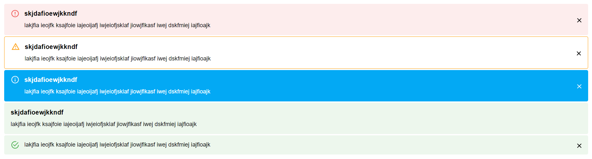

# Alert

Alert is a component of the Backendless [UI-Builder](https://backendless.com/developers/#ui-builder). It allows notifying a user when a specific event happens. This component supports 4 different notification types:

    1. Error
    2. Warning
    3. Info
    4. Success

Every notification type has different appearance:


You can specify the title and the description in the UI-Builder. 


<p align="center">
  
</p>

## Properties

| Property              | Type                                                   | Default Value | Logic                         | Data Binding | UI Setting | Description                                                              |
|-----------------------|--------------------------------------------------------|---------------|-------------------------------|--------------|------------|--------------------------------------------------------------------------|
| messageTitle          | String                                                 |               | Message Title Logic           | YES          | YES        | Allows writing the title of message.                                     |
| messageText           | String                                                 |               | Message Text Logic            | YES          | YES        | Allows writing the text of message.                                      |
| messageType           | Select ["error", "warning", "info", "success"]         | "error"       | Message Type Logic            | NO           | YES        | Allows select type of alert (error, warning, info, success).             |
| iconVisibility        | Boolean                                                | `true`        | Icon Visibility Logic         | NO           | YES        | Allows making alerts with or without icon.                               |
| closeButtonVisibility | Boolean                                                | `true`        | Close Button Visibility Logic | NO           | YES        | Allows making alerts with or without a close button.                     |
| variant               | Select ["alert root", "alert outline", "alert filled"] | "alert root"  |                               | NO           | YES        | Allows select style for alert (alert root, alert outline, alert filled). |
| closingDuration       | Number                                                 | 200           | Closing Duration Logic        | NO           | YES        | Allows specifying speed animation closing (ms) for the alert.            |

## Events

| Name            | Triggers                          | Context Blocks |
|-----------------|-----------------------------------|----------------|
| On Close Button | when a user click on close button |                |


## Actions

| Action | Inputs | Returns |
|--------|--------|---------|
| Close  |        |         |

## Styles

**Font-family**
````
@bl-customComponent-alert-fontFamily: "Roboto", "Helvetica", "Arial", sans-serif;
````

**Dimensions**
````
@bl-customComponent-alert-fontSize: 12.8px;
@bl-customComponent-alert-titleSize: 16px;

@bl-customComponent-alert-closeButtonSize: 18px;
@bl-customComponent-alert-borderRadius: 4px;
@bl-customComponent-alert-iconSize: 22px;
````

**Colors**
````
@bl-customComponent-alert-textColor: @appTextColor;
@bl-customComponent-alert-errorBackgroundColor: if(luma(@appBackgroundColor) < 50%, darken(#fdeded, 90%), #fdeded);
@bl-customComponent-alert-warningBackgroundColor: if(luma(@appBackgroundColor) < 50%, darken(#fff4e5, 90%), #fff4e5);
@bl-customComponent-alert-infoBackgroundColor: if(luma(@appBackgroundColor) < 50%, darken(#e5f6fd, 90%), #e5f6fd);
@bl-customComponent-alert-successBackgroundColor: if(luma(@appBackgroundColor) < 50%, darken(#edf7ed, 90%), #edf7ed);

@bl-customComponent-alert-errorTextColor: if(luma(@appBackgroundColor) > 50%, darken(#ef5350, 40%), lighten(#ef5350, 28%));
@bl-customComponent-alert-warningTextColor: if(luma(@appBackgroundColor) > 50%, darken(#ff9800, 30%), lighten(#ff9800, 28%));
@bl-customComponent-alert-infoTextColor: if(luma(@appBackgroundColor) > 50%, darken(#03a9f4, 30%), lighten(#03a9f4, 28%));
@bl-customComponent-alert-successTextColor: if(luma(@appBackgroundColor) > 50%, darken(#4caf50, 30%), lighten(#4caf50, 28%));

@bl-customComponent-alert-errorPrimaryColor: #ef5350;
@bl-customComponent-alert-warningPrimaryColor: #ff9800;
@bl-customComponent-alert-infoPrimaryColor: #03a9f4;
@bl-customComponent-alert-successPrimaryColor: #4caf50;
````
