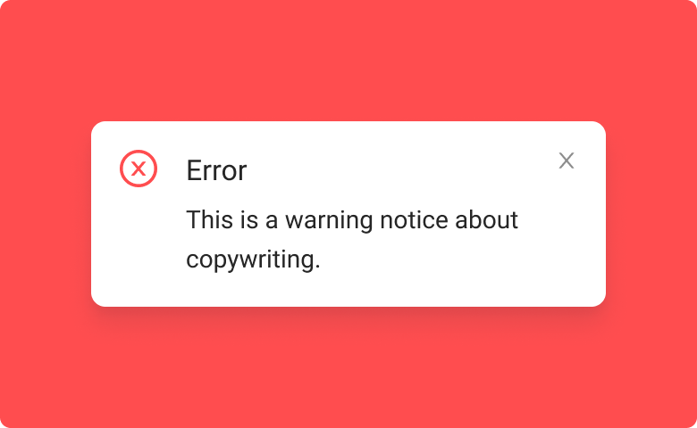

# Alert

Alert is a component of the Backendless [UI-Builder](https://backendless.com/developers/#ui-builder). It allows notifying a user when a specific event happens. 

<p align="center">
  
</p>

This component supports 4 different notification types:

    1. Error
    2. Warning
    3. Info
    4. Success

Every notification type has different appearance:


The appearance of notifications can be easily configured in the UI-Builder. At the moment, there are 3 graphical variants of these messages:


You can also specify the title and the description of the notification in the settings:


Every notification has a close button located in the top right corner, but it is disabled by default:


To enable the close button, select the component and enter the desired ID:


Then navigate to the **Logic** section of the selected component, and in the **UI Library** click the Alert, and from the appeared menu select the **Close Alert** action item and connect it to the **On Close Button** event:


## Properties

| Property              | Type                                                   | Default Value | Logic                         | Data Binding | UI Setting | Description                                                                                          |
|-----------------------|--------------------------------------------------------|---------------|-------------------------------|--------------|------------|------------------------------------------------------------------------------------------------------|
| messageTitle          | String                                                 |               | Message Title Logic           | YES          | YES        | the title of an alert message.                                                                       |
| messageText           | String                                                 |               | Message Text Logic            | YES          | YES        | the content of an alert message.                                                                     |
| messageType           | Select ["error", "warning", "info", "success"]         | "error"       | Message Type Logic            | NO           | YES        | this property allows selecting the alert type: error, warning, info, success.                        |
| iconVisibility        | Boolean                                                | `true`        | Icon Visibility Logic         | NO           | YES        | when enabled, the alert icon is displayed in the message.                                            |
| closeButtonVisibility | Boolean                                                | `true`        | Close Button Visibility Logic | NO           | YES        | when enabled, the alert message appears without the close button.                                    |
| variant               | Select ["alert root", "alert outline", "alert filled"] | "alert root"  |                               | NO           | YES        | this property allows selecting the graphical variant of an alert: root, alert outline, alert filled. |
| closingDuration       | Number                                                 | 200           | Closing Duration Logic        | NO           | YES        | allows specifying the animation speed in milliseconds when closing the alert.                        |

## Events

| Name            | Triggers                          | Context Blocks |
|-----------------|-----------------------------------|----------------|
| On Close Button | when a user click on close button |                |


## Actions

| Action | Inputs | Returns |
|--------|--------|---------|
| Close  |        |         |

## Styles

**Font-family**
````
@bl-customComponent-alert-fontFamily: "Roboto", "Helvetica", "Arial", sans-serif;
````

**Dimensions**
````
@bl-customComponent-alert-fontWeight: 400;
@bl-customComponent-alert-fontSize: 12.8px;
@bl-customComponent-alert-padding: 6px 16px;
@bl-customComponent-alert-borderRadius: 4px;

@bl-customComponent-alert-titleSize: 16px;
@bl-customComponent-alert-title-margin: -2px 0 8px 0;
@bl-customComponent-alert-title-fontWeight: 600;

@bl-customComponent-alert-text-fontWeight: 500;

@bl-customComponent-alert-content-padding: 8px 0;

@bl-customComponent-alert-buttonContainer-padding: 4px 0 0 16px;
@bl-customComponent-alert-buttonContainer-margin: 0 -8px 0 auto;

@bl-customComponent-alert-outline-border: 1px solid;

@bl-customComponent-alert-closeButton-borderRadius: 50%;
@bl-customComponent-alert-closeButton-padding: 5px;
@bl-customComponent-alert-closeButtonSize: 18px;

@bl-customComponent-alert-iconSize: 22px;
@bl-customComponent-alert-icon-padding: 7px 0;
@bl-customComponent-alert-icon-marginRight: 12px;
@bl-customComponent-alert-icon-opacity: 0.9;
````

**Colors**
````
@bl-customComponent-alert-errorBackgroundColor: if(luma(@appBackgroundColor) < 50%, darken(#fdeded, 90%), #fdeded);
@bl-customComponent-alert-warningBackgroundColor: if(luma(@appBackgroundColor) < 50%, darken(#fff4e5, 90%), #fff4e5);
@bl-customComponent-alert-infoBackgroundColor: if(luma(@appBackgroundColor) < 50%, darken(#e5f6fd, 90%), #e5f6fd);
@bl-customComponent-alert-successBackgroundColor: if(luma(@appBackgroundColor) < 50%, darken(#edf7ed, 90%), #edf7ed);

@bl-customComponent-alert-errorTextColor: if(luma(@appBackgroundColor) > 50%, darken(#ef5350, 40%), lighten(#ef5350, 28%));
@bl-customComponent-alert-warningTextColor: if(luma(@appBackgroundColor) > 50%, darken(#ff9800, 30%), lighten(#ff9800, 28%));
@bl-customComponent-alert-infoTextColor: if(luma(@appBackgroundColor) > 50%, darken(#03a9f4, 30%), lighten(#03a9f4, 28%));
@bl-customComponent-alert-successTextColor: if(luma(@appBackgroundColor) > 50%, darken(#4caf50, 30%), lighten(#4caf50, 28%));

@bl-customComponent-alert-errorPrimaryColor: #ef5350;
@bl-customComponent-alert-warningPrimaryColor: #ff9800;
@bl-customComponent-alert-infoPrimaryColor: #03a9f4;
@bl-customComponent-alert-successPrimaryColor: #4caf50;

@bl-customComponent-alert-closeButton-backgroundColor: transparent;
@bl-customComponent-alert-closeButton-backgroundColor-hover: rgba(0, 0, 0, 0.04);

@bl-customComponent-alert-outline-backgroundColor: transparent;

@bl-customComponent-alert-filled-color: #fff;
@bl-customComponent-alert-filled-icon-fill: #fff;
````

**Others**
````
@bl-customComponent-alert-closeButton-cursor: pointer;

@bl-customComponent-alert-closeButton-transition: background-color 150ms cubic-bezier(0.4, 0, 0.2, 1) 0ms;

@bl-customComponent-alert-openAnimation: alert-open linear forwards;
@bl-customComponent-alert-closeAnimation: alert-close linear forwards;
````
