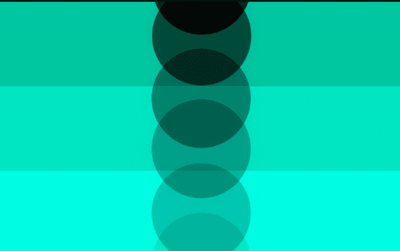
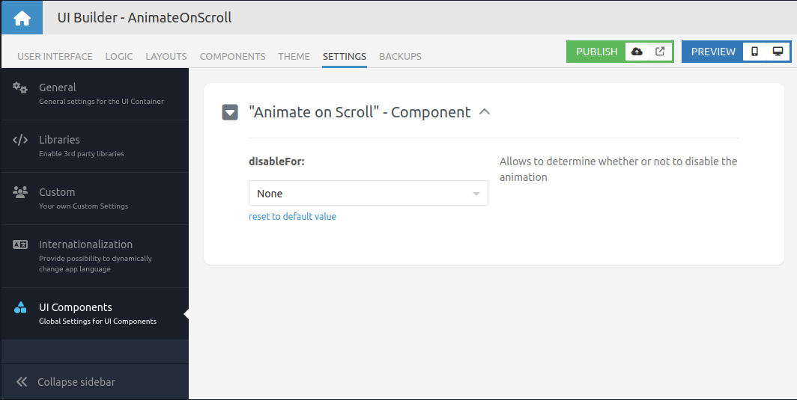

# Animate on Scroll

Animate on Scroll is a component of the Backendless UI-Builder designer. This component allows adding animation for elements
when scrolling the page.

The component is based on external [Animate on Scroll](https://github.com/michalsnik/aos).

  

## Properties

| Property                        | Type                                                                                                                                                                                                                                                                                                                                                                                                                                                                                                                                                                                                                                          | Default Value    | Logic        | Data Binding | UI Setting | Description                                                                                                       |
|---------------------------------|-----------------------------------------------------------------------------------------------------------------------------------------------------------------------------------------------------------------------------------------------------------------------------------------------------------------------------------------------------------------------------------------------------------------------------------------------------------------------------------------------------------------------------------------------------------------------------------------------------------------------------------------------|------------------|--------------|--------------|------------|-------------------------------------------------------------------------------------------------------------------|
| Animation Type: `animationType` | Select [Fade: `fade`, Flip: `flip`, Slide: `slide`, Zoom In: `zoom-in`, Zoom Out: `zoom-out`]                                                                                                                                                                                                                                                                                                                                                                                                                                                                                                                                                 | Fade: `fade`     |              | NO           | YES        | Allows to determine the type of animation.                                                                        |
| Side: `side`                    | Select [None: `none`, Up: `up`, Right: `right`, Down: `down`, Left: `left`]                                                                                                                                                                                                                                                                                                                                                                                                                                                                                                                                                                   | None: `none`     |              | NO           | YES        | Allows to determine the side of animation.                                                                        |
| Easing: `easing`                | Select [linear: `linear`, ease: `ease`, ease-in: `ease-in`, ease-out: `ease-out`, ease-in-out: `ease-in-out`, ease-in-back: `ease-in-back`, ease-out-back: `ease-out-back`, ease-in-out-back: `ease-in-out-back`, ease-in-sine: `ease-in-sine`, ease-out-sine: `ease-out-sine`, ease-in-out-sine: `ease-in-out-sine`, ease-in-quad: `ease-in-quad`, ease-out-quad: `ease-out-quad`, ease-in-out-quad: `ease-in-out-quad`, ease-in-cubic: `ease-in-cubic`, ease-out-cubic: `ease-out-cubic`, ease-in-out-cubic: `ease-in-out-cubic`, ease-in-quart: `ease-in-quart`, ease-out-quart: `ease-out-quart`, ease-in-out-quart: `ease-in-out-quart`] | linear: `linear` |              | NO           | YES        | Allows to determine to ease of animation.                                                                         |
| Duration (ms): `duration`       | Range                                                                                                                                                                                                                                                                                                                                                                                                                                                                                                                                                                                                                                         | 500              |              | NO           | YES        | Allows to determine the duration of animation.                                                                    |
| Delay (ms): `delay`             | Range                                                                                                                                                                                                                                                                                                                                                                                                                                                                                                                                                                                                                                         | 0                |              | NO           | YES        | Allows to determine the delay for starting animation.                                                             |
| Anchor: `anchor`                | Text                                                                                                                                                                                                                                                                                                                                                                                                                                                                                                                                                                                                                                          |                  | Anchor Logic | YES          | YES        | Allows to determine the element by class whose offset will be used to trigger animation instead of an actual one. |
| Offset: `offset`                | Number                                                                                                                                                                                                                                                                                                                                                                                                                                                                                                                                                                                                                                        | 0                |              | NO           | YES        | Allows to determine offset(px) from the original trigger point.                                                   |
| Mirrored: `mirror`              | Checkbox                                                                                                                                                                                                                                                                                                                                                                                                                                                                                                                                                                                                                                      | `true`           |              | NO           | YES        | Allows to determine whether elements should animate out while scrolling past them.                                |
| Play Once: `once`               | Checkbox                                                                                                                                                                                                                                                                                                                                                                                                                                                                                                                                                                                                                                      | `false`          |              | NO           | YES        | Allows to determine whether the animation should happen only once - while scrolling down.                         |

## Settings

| Name                      | Type                                                                  | Default Value | Required | Description                                                                         |
|---------------------------|-----------------------------------------------------------------------|---------------|----------|-------------------------------------------------------------------------------------|
| Disable for: `disableFor` | Select [ Mobile: `mobile`, Tablet: `tablet`, All: `all`, None: `none` | None: `none`  | No       | Allows to determine whether or not to disable the animation. Watch [Usage](#usage). |

## Events

| Name               | Triggers                       | Context Blocks        |
|--------------------|--------------------------------|-----------------------|
| On Animation Event | whenever any element animates  | Detail: `HTMLElement` |

## Usage

To deactivate the component's animation, navigate to the SETTINGS tab in UI Builder. Then, select 'UI Components' from
the sidebar, and choose the desired parameter from the dropdown menu.

  

