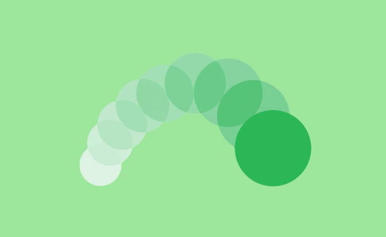
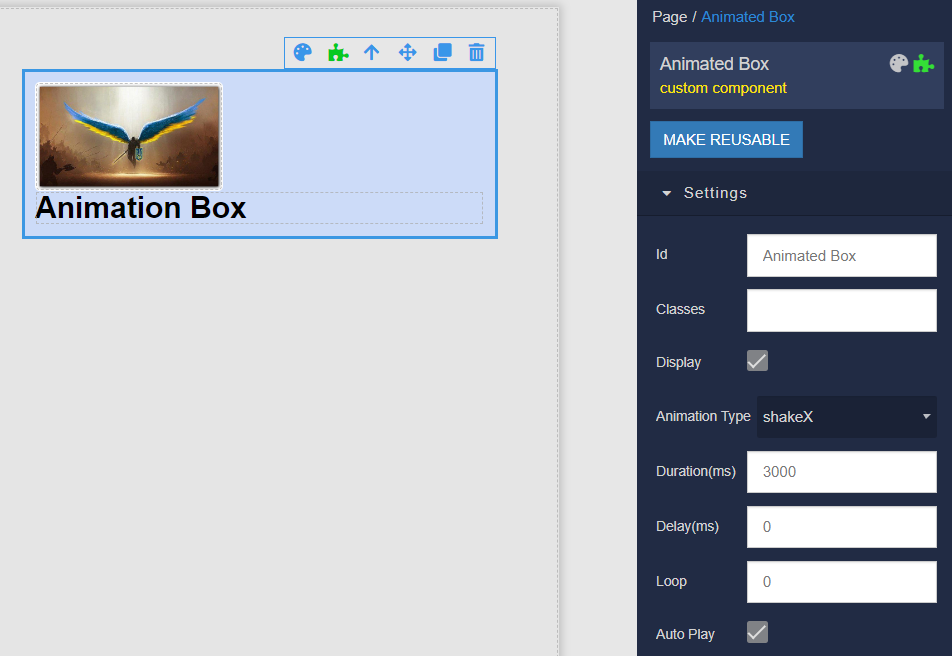
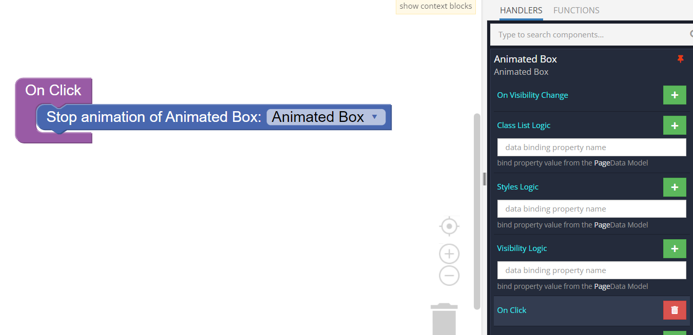
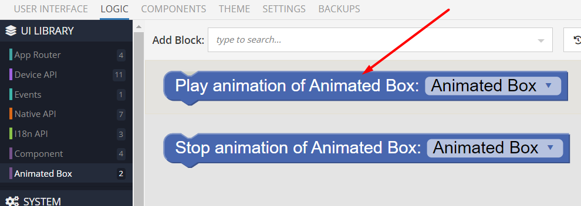

# Animated Box

Animated Box is the component that can be used in Backendless [UI-Builder](https://backendless.com/developers/#ui-builder). This component is for displaying an animated box with customizable animation settings.

<p align="center">
  
</p>

## Properties

| Property                     | Type                                                                                                                                                                                                                                           | Default value | Logic | Data Binding | UI Setting | Description                                                                          |
|------------------------------|------------------------------------------------------------------------------------------------------------------------------------------------------------------------------------------------------------------------------------------------|---------------|-------|--------------|------------|--------------------------------------------------------------------------------------|
| Animation Type <br> `type`   | *Select* <br> [`bounce`, `bounceIn`, `bounceOut`, `flash`, `flip`, `flipInX`, `flipInY`, `heartBeat`, `hinge`, `jackInTheBox`, `jello`, `pulse`, `rotateIn`, `rubberBand`, `shakeX`, `shakeY`, `swing`, `tada`, `wobble`, `zoomIn`, `zoomOut`] | `bounce`      |       | NO           | YES        | Controls the component animation type.                                               |
| Duration(ms) <br> `duration` | *Number*                                                                                                                                                                                                                                       | 1000          |       | NO           | YES        | Controls the animation duration, in milliseconds.                                    |
| Delay(ms) <br> `delay`       | *Number*                                                                                                                                                                                                                                       | 0             |       | NO           | YES        | Controls the animation delay duration, in milliseconds.                              |
| Loop <br> `loop`             | *Number*                                                                                                                                                                                                                                       | 0             |       | NO           | YES        | Controls the number of times the animation must repeat, 0 is equivalent to infinite. |
| Auto Play <br> `autoPlay`    | *Checkbox*                                                                                                                                                                                                                                     | `true`        |       | NO           | YES        | Controls whether to play animation on startup or not.                                |

## Events

| Name               | Triggers                                                | Context Blocks |
|--------------------|---------------------------------------------------------|----------------|
| On Click           | when the user clicks on the component.                  |                |
| On Mouse Over      | when the mouse pointer hovers over the component.       |                |
| On Mouse Out       | when the mouse pointer leaves the component.            |                |
| On Animation Start | when the animation start.                               |                |
| On Cycle Complete  | when the component finishes a loop.                     |                |
| On Animation End   | when the animation end, only calls if loop is non-zero. |                |

## Actions

| Action            | Inputs | Returns |
|-------------------|--------|---------|
| Play animation of |        |         |
| Stop animation of |        |         |

## Styles

**Dimensions**
```
@bl-customComponent-animated-box-width: 100%;
```

## Examples

Below is an Example highlighting how to use the Animated Box component:

For example, you want to apply a horizontal shaker effect to a block with an image and text inside, no delay, a duration of 3 seconds for one cycle, infinite playback, and automatic start of the animation. Let's add the following settings:

<p align="center">
  
</p>

If there is a need to stop the animation, for example on a click on the component itself, please add the following action on the component's click event:

<p align="center">
  
</p>

And to restart, use the following action at the right time:

<p align="center">
  
</p>
