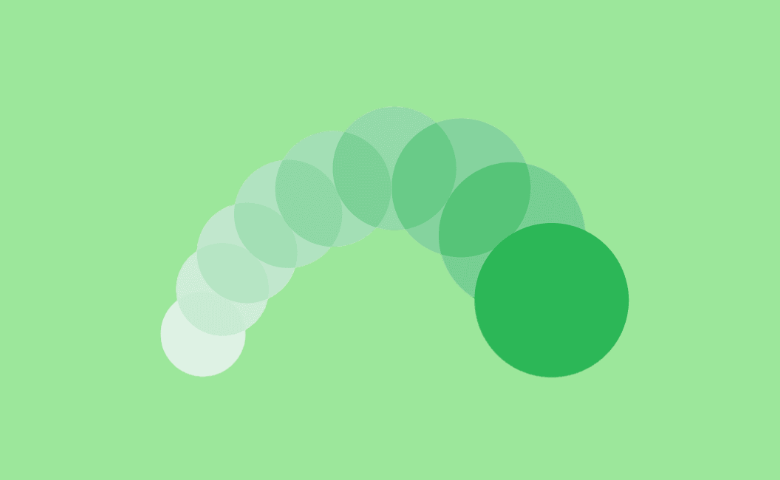

# Animated Box

Animated Box is the component that can be used in Backendless [UI-Builder](https://backendless.com/developers/#ui-builder). This component displays for displaying an animated box with customizable animation settings. Animation starts automatically, you can control it using actions. Animation starts and stops depending on the visibility of the component on the page.

<p align="center">
  
</p>

## Properties

| Property                   | Type                                                                                                                                                                                                                                           | Default value | Logic | Data Binding | UI Setting | Description                                                                          |
|----------------------------|------------------------------------------------------------------------------------------------------------------------------------------------------------------------------------------------------------------------------------------------|---------------|-------|--------------|------------|--------------------------------------------------------------------------------------|
| Animation Type <br> `type` | *Select* <br> [`bounce`, `bounceIn`, `bounceOut`, `flash`, `flip`, `flipInX`, `flipInY`, `heartBeat`, `hinge`, `jackInTheBox`, `jello`, `pulse`, `rotateIn`, `rubberBand`, `shakeX`, `shakeY`, `swing`, `tada`, `wobble`, `zoomIn`, `zoomOut`] | `bounce`      |       | NO           | YES        | Controls the animation type of the component.                                        |
| Duration <br> `duration`   | *Number*                                                                                                                                                                                                                                       | 1             |       | NO           | YES        | Controls the duration of the animation, in seconds.                                  |
| Delay <br> `delay`         | *Number*                                                                                                                                                                                                                                       | 0             |       | NO           | YES        | Controls the duration to delay the animation, in seconds.                            |
| Loop <br> `loop`           | *Number*                                                                                                                                                                                                                                       | 0             |       | NO           | YES        | Controls the number of times the animation should loop, 0 is equivalent to infinite. |

## Events

| Name               | Triggers                                                | Context Blocks |
|--------------------|---------------------------------------------------------|----------------|
| On Click           | when the user clicks on the component.                  |                |
| On Mouse Over      | when the mouse pointer hovers over the component.       |                |
| On Mouse Out       | when the mouse pointer leaves the component.            |                |
| On Animation Start | when the animation start.                               |                |
| On Cycle Complete  | when the component finishes a loop.                     |                |
| On Animation End   | when the animation end, only calls if loop is non-zero. |                |

## Actions

| Action | Inputs | Returns |
|--------|--------|---------|
| Play   |        |         |
| Pause  |        |         |

## Styles

**Dimensions**
```
@bl-customComponent-animated-box-width: 100%;
```

**Other**
````
@bl-customComponent-animated-box-animation-fill-mode    : both;
@bl-customComponent-animated-box-animate-duration       : 1s;
@bl-customComponent-animated-box-animate-delay          : 0s;
@bl-customComponent-animated-box-animate-iteration-count: infinite;
````

## Examples

Below is an Example highlighting how to use the Animated Box component:

For example, if you want to apply a horizontal shaker effect to a block with an image and text inside, without delay, lasting 3 seconds for one cycle and endless play. Let's add the following settings:

<p align="center">
  
</p>

If there is a need to stop the animation, for example on a click on the component itself, please add the following action on the component's click event:

<p align="center">
  
</p>

And to restart, use the following action at the right time:

<p align="center">
  
</p>
