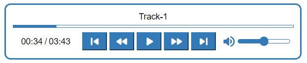

# Audio Player

This is a component for Backendless [UI-Builder](https://backendless.com/developers/#ui-builder) designer. You will have a styled player with the set of your tracks. It supports one or multiple audio sources and has all functions you can think of.

While the player can be configured with multiple settings it is easy in use and provides users with smooth experience.

<p align="center">
  
</p>

## Properties

| Property                    | Type       | Default value | Logic             | Data Binding | UI Setting | Description                                                      |
|-----------------------------|------------|---------------|-------------------|--------------|------------|------------------------------------------------------------------|
| Audio Url                   | *Text*     |               | Audio Url Logic   | YES          | YES        | specifies the url of the audio or the list of audio urls         |
| Audio Title                 | *Text*     |               | Audio Title Logic | YES          | YES        | specifies the title of the audio or the list of audio titles     |
| Player Visibility           | *Checkbox* | `true`        |                   | NO           | YES        | enables the visibility of the audio player                       |
| Track Navigation Visibility | *Checkbox* | `true`        |                   | NO           | YES        | enables the visibility of the track navigation                   |
| Title Visibility            | *Checkbox* | `true`        |                   | NO           | YES        | enables the visibility of the track title                        |
| Default Volume              | *Range*    | 50            |                   | NO           | YES        | controls the default volume of the player                        |
| Auto Play                   | *Checkbox* | `false`       |                   | NO           | YES        | enables automatic playback of the track after the page is loaded |
| Repeat                      | *Checkbox* | `false`       |                   | NO           | YES        | enables repeating one track over and over again                  |

## Actions

| Action        | Inputs                                     | Returns |
|---------------|--------------------------------------------|---------|
| Play Audio    |                                            |         |
| Stop Audio    |                                            |         |
| Replace Audio | `Audio Url: String`, `Audio Title: String` |         |

## Styles

**Theme**

````
@bl-customComponent-audioPlayer-themeColor: @themePrimary;
@bl-customComponent-audioPlayer-backgroundColor: @appBackgroundColor;
@bl-customComponent-audioPlayer-textColor: @appTextColor;
@bl-customComponent-audioPlayer-ShadowColor: @appComponentShadowColor;
@bl-customComponent-audioPlayer-disabledColor: @disabledColor;
````

**General**

````
@bl-customComponent-audioPlayer-button-disabledBackground: @bl-customComponent-audioPlayer-disabledColor;
@bl-customComponent-audioPlayer-button-disabledColor: contrast(@bl-customComponent-audioPlayer-button-disabledBackground);
@bl-customComponent-audioPlayer-button-backgroundColor: @bl-customComponent-audioPlayer-themeColor;
@bl-customComponent-audioPlayer-button-color: contrast(@bl-customComponent-audioPlayer-button-backgroundColor);
@bl-customComponent-audioPlayer-icon-color: @bl-customComponent-audioPlayer-themeColor;
````

**Dimensions**

````
@bl-customComponent-audioPlayer-width: 100%;
@bl-customComponent-audioPlayer-padding: 10px;
@bl-customComponent-audioPlayer-trackNavigation-width: @bl-customComponent-audioPlayer-width;
@bl-customComponent-audioPlayer-trackNavigation-height: 5px;
@bl-customComponent-audioPlayer-trackNavigation-margin: 5px 0;
@bl-customComponent-audioPlayer-controls-width: @bl-customComponent-audioPlayer-width;
@bl-customComponent-audioPlayer-button-margin: 2px;
@bl-customComponent-audioPlayer-input-maxWidth: 85px;
@bl-customComponent-audioPlayer-input-height: 7px;
@bl-customComponent-audioPlayer-input-thumb-height: 15px;
@bl-customComponent-audioPlayer-input-thumb-width: 15px;
````

**Typography**

````
@bl-customComponent-audioPlayer-fontSize: 14px;
````

**Decoration**

````
@bl-customComponent-audioPlayer-border: 3px solid @bl-customComponent-audioPlayer-themeColor;
@bl-customComponent-audioPlayer-borderRadius: 10px;
@bl-customComponent-audioPlayer-trackNavigation-border: 1px solid @bl-customComponent-audioPlayer-themeColor;
@bl-customComponent-audioPlayer-button-shadowColor: @bl-customComponent-audioPlayer-ShadowColor;
@bl-customComponent-audioPlayer-button-shadowHover: 0px 2px 4px -1px fade(@bl-customComponent-audioPlayer-button-shadowColor, 20%), 0px 4px 5px 0px fade(@bl-customComponent-audioPlayer-button-shadowColor, 14%), 0px 1px 10px 0px fade(@bl-customComponent-audioPlayer-button-shadowColor, 12%);
@bl-customComponent-audioPlayer-button-shadowDisabled: none;
@bl-customComponent-audioPlayer-input-border: 1px solid @bl-customComponent-audioPlayer-themeColor;
@bl-customComponent-audioPlayer-input-borderRadius: 5px;
@bl-customComponent-audioPlayer-input-thumb-borderRadius: 50%;
````
