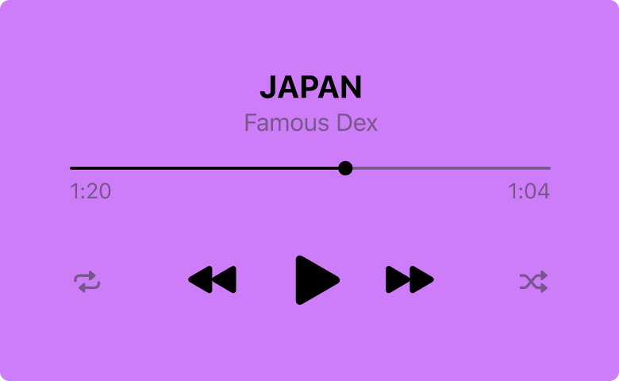
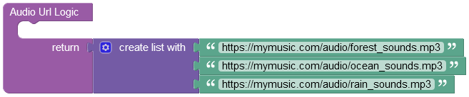

# Audio Player

The Audio Player component provides basic functionality to play audio files and streams.

For more information about the configuration of this component, refer to the [Configuration](#configuration) section below.

<p align="center">
  
</p>

## Demo

View an example of how to install this component and how it works in your UI [here](https://app.arcade.software/share/lhHSsprNT679NEr2W3Ag).

## Properties

| Property                    | Type       | Default value | Logic             | Data Binding | UI Setting | Description                                                      |
|-----------------------------|------------|---------------|-------------------|--------------|------------|------------------------------------------------------------------|
| Audio Url                   | *Text*     |               | Audio Url Logic   | YES          | YES        | specifies the url of the audio file or the list containing audio urls         |
| Audio Title                 | *Text*     |               | Audio Title Logic | YES          | YES        | specifies the title of the audio or the list of audio titles     |
| Player Visibility           | *Checkbox* | `true`        |                   | NO           | YES        | enables the visibility of the audio player                       |
| Track Navigation Visibility | *Checkbox* | `true`        |                   | NO           | YES        | enables the visibility of the track navigation                   |
| Title Visibility            | *Checkbox* | `true`        |                   | NO           | YES        | enables the visibility of the track title                        |
| Default Volume              | *Range*    | 50            |                   | NO           | YES        | controls the default volume of the player                        |
| Auto Play                   | *Checkbox* | `false`       |                   | NO           | YES        | enables automatic playback of the track after the page is loaded |
| Repeat                      | *Checkbox* | `false`       |                   | NO           | YES        | enables repeating one track infinitely                  |

## Actions

| Action                        | Inputs                                     | Returns |
|-------------------------------|--------------------------------------------|---------|
| Play Audio in Audio Player    |                                            |         |
| Stop Audio in Audio Player    |                                            |         |
| Replace Audio in Audio Player | `Audio Url: String`, `Audio Title: String` |         |

## Styles

**Theme**

````
@bl-customComponent-audioPlayer-themeColor: @themePrimary;
@bl-customComponent-audioPlayer-backgroundColor: @appBackgroundColor;
@bl-customComponent-audioPlayer-textColor: @appTextColor;
@bl-customComponent-audioPlayer-ShadowColor: @appComponentShadowColor;
@bl-customComponent-audioPlayer-disabledColor: @disabledColor;
````

**General**

````
@bl-customComponent-audioPlayer-button-disabledBackground: @bl-customComponent-audioPlayer-disabledColor;
@bl-customComponent-audioPlayer-button-disabledColor: contrast(@bl-customComponent-audioPlayer-button-disabledBackground);
@bl-customComponent-audioPlayer-button-backgroundColor: @bl-customComponent-audioPlayer-themeColor;
@bl-customComponent-audioPlayer-button-color: contrast(@bl-customComponent-audioPlayer-button-backgroundColor);
@bl-customComponent-audioPlayer-icon-color: @bl-customComponent-audioPlayer-themeColor;
````

**Dimensions**

````
@bl-customComponent-audioPlayer-width: 100%;
@bl-customComponent-audioPlayer-padding: 10px;
@bl-customComponent-audioPlayer-trackNavigation-width: @bl-customComponent-audioPlayer-width;
@bl-customComponent-audioPlayer-trackNavigation-height: 5px;
@bl-customComponent-audioPlayer-trackNavigation-margin: 5px 0;
@bl-customComponent-audioPlayer-controls-width: @bl-customComponent-audioPlayer-width;
@bl-customComponent-audioPlayer-button-margin: 2px;
@bl-customComponent-audioPlayer-input-maxWidth: 85px;
@bl-customComponent-audioPlayer-input-height: 7px;
@bl-customComponent-audioPlayer-input-thumb-height: 15px;
@bl-customComponent-audioPlayer-input-thumb-width: 15px;
````

**Typography**

````
@bl-customComponent-audioPlayer-fontSize: 14px;
````

**Decoration**

````
@bl-customComponent-audioPlayer-border: 3px solid @bl-customComponent-audioPlayer-themeColor;
@bl-customComponent-audioPlayer-borderRadius: 10px;
@bl-customComponent-audioPlayer-trackNavigation-border: 1px solid @bl-customComponent-audioPlayer-themeColor;
@bl-customComponent-audioPlayer-button-shadowColor: @bl-customComponent-audioPlayer-ShadowColor;
@bl-customComponent-audioPlayer-button-shadowHover: 0px 2px 4px -1px fade(@bl-customComponent-audioPlayer-button-shadowColor, 20%), 0px 4px 5px 0px fade(@bl-customComponent-audioPlayer-button-shadowColor, 14%), 0px 1px 10px 0px fade(@bl-customComponent-audioPlayer-button-shadowColor, 12%);
@bl-customComponent-audioPlayer-button-shadowDisabled: none;
@bl-customComponent-audioPlayer-input-border: 1px solid @bl-customComponent-audioPlayer-themeColor;
@bl-customComponent-audioPlayer-input-borderRadius: 5px;
@bl-customComponent-audioPlayer-input-thumb-borderRadius: 50%;
````

## Configuration

For every audio file or stream that you want to run in the player, you must provide a valid URL where the audio file is located.

There are two ways to specify the audio file URL in the Settings of this component:
 1. Enter a string value in the **Audio Url** property. The entered value must be the URL to the audio file or the stream.
 2. Create a list containing URL addresses in the Logic of this component.

The valid format of the URL address looks as following: ````https://example-cloudservice.com/audio/ambience/forest_sounds.mp3````

Note how the URL leads right to the audio file(forest_sounds.mp3), and not just a directory. The URL must always lead directly to the audio file.

For audio streams, the URL can be of the following format: ````https://cast.radiogroup.com.ua/nrj````

To create a list containing multiple URLs to the audio files or streams, you have to navigate to the Logic of the component, and there you have to add the **Audio Url Logic** handler.

In this block you must specify the list containing the URLs as following:

<p align="center">
  
</p>

<details>
<summary> Codeless Block XML Code</summary>

```
<block xmlns="http://www.w3.org/1999/xhtml" type="lists_create_with" id="u[X|uT@6bN9@L{YGx3CU" x="146" y="100"><mutation items="3"></mutation><value name="ADD0"><block type="text" id="8|`:XT),oXrLYXww](Qh"><field name="TEXT">https://mymusic.com/audio/forest_sounds.mp3</field></block></value><value name="ADD1"><block type="text" id="S0]CoWI:@Cs)sR1`Wh38"><field name="TEXT">https://mymusic.com/audio/ocean_sounds.mp3</field></block></value><value name="ADD2"><block type="text" id="s[8Qx]M2`ZLyUnhRqmh{"><field name="TEXT">https://mymusic.com/audio/rain_sounds.mp3</field></block></value></block>
```
</details>
