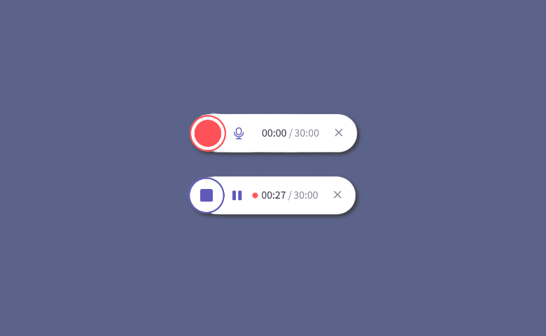

# Audio Recorder

Audio Recorder is a component of Backendless UI-Builder designer. This allows recording audio from the user's microphone and using the recorded file.

<p align="center">
  
</p>

## Properties

| Property                 | Type                                                       | Default Value       | Logic                      | Data Binding | UI Setting | Description                                                                      |
|--------------------------|------------------------------------------------------------|---------------------|----------------------------|--------------|------------|----------------------------------------------------------------------------------|
| Show Player              | *Checkbox*                                                 | `true`              | Show PLayer Logic          | YES          | YES        | This is a handler to control audio player visibility.                            |
| Show Controls            | *Checkbox*                                                 | `true`              | Show Controls Logic        | YES          | YES        | This handler allows to show or hide control buttons.                             |
| Control Labels Type      | *Select* <br/>[`icons`, `text`]                            | `icons`             |                            | NO           | YES        | This is a handler to control the control button labels.                          |
| Noise Suppression        | *Checkbox*                                                 | `true`              |                            | NO           | YES        | This is a handler to control Noise Suppression property.                         |
| File Name                | *Text*                                                     | 'Recorded Audio'    | File Name Logic            | YES          | YES        | This is a handler to control the name of the downloaded file.                    |
| File Type                | *Select* <br/>[`mp3`, `mp4`, `webm`, `wav`, `mpeg`, `ogg`] | 'mp4'               |                            | NO           | YES        | This is a handler to control the type of the downloaded file.                    |
| Width                    | *Text*                                                     | '380px'             |                            | NO           | YES        | This is a handler to control the width of the component.                         |
| Start Record Button Text | *Text*                                                     | 'Start Record'      | Start Button Text Logic    | YES          | NO         | This is a handler that controls the Start Button Text.                           |
| Stop Record Button Text  | *Text*                                                     | 'Stop Record'       | Stop Button Text Logic     | YES          | NO         | This is a handler that controls the Stop Button Text.                            |
| Download Button Text     | *Text*                                                     | 'Download Recorded' | Download Button Text Logic | YES          | NO         | This is a handler that controls the Download Button Text.                        |
| Pause Button Text        | *Text*                                                     | 'Pause'             | Pause Button Text Logic    | YES          | NO         | This is a handler that controls the Pause Button Text when recording.            |
| Resume Button Text       | *Text*                                                     | 'Resume'            | Resume Button Text Logic   | YES          | NO         | This is a handler that controls the Resume Button Text when recording is paused. |

## Events

| Name               | Triggers                                  | Context Blocks                                                                                     |
|--------------------|-------------------------------------------|----------------------------------------------------------------------------------------------------|
| On Start Recording | When the recording is started             |                                                                                                    |
| On Stop Recording  | When the recording is stopped             |                                                                                                    |
| On Download File   | When the recorded file starts downloading | [Blob](https://developer.mozilla.org/en-US/docs/Web/API/Blob) File: `{size: Number, type: String}` |
| On State Change    | When the recorder state is changed.       | State: `String`                                                                                    |

## Actions

| Action                                     | Inputs                     | Returns               |
|--------------------------------------------|----------------------------|-----------------------|
| Start Record in Audio Recorder             |                            |                       |
| Stop Record in Audio Recorder              |                            |                       |
| Download Recorded file from Audio Recorder |                            |                       |
| Get Blob from Audio Recorder               |                            | `Blob`: recorded blob |
| Pause/Resume in Audio Recorder             |                            |                       |

## Styles

**Dimensions**
````
@bl-customComponent-audioRecorder-button-borderWidth: 0px;
@bl-customComponent-audioRecorder-button-height: 36px;
````

**Other**
````
@bl-customComponent-audioRecorder-button-backgroundColor: #f1f3f4;
@bl-customComponent-audioRecorder-button-disabled: #c1c2c3;
@bl-customComponent-audioRecorder-button-borderRadius: 18px;
@bl-customComponent-audioRecorder-button-color: #000;
@bl-customComponent-audioRecorder-button-shadowColor: #000;
@bl-customComponent-audioRecorder-button-shadowHover: 0px 2px 4px -1px fade(@bl-customComponent-audioRecorder-button-shadowColor, 20%), 0px 4px 5px 0px fade(@bl-customComponent-audioRecorder-button-shadowColor, 14%), 0px 1px 10px 0px fade(@bl-customComponent-audioRecorder-button-shadowColor, 12%);
@bl-customComponent-audioRecorder-button-shadow: 0px 3px 1px -2px fade(@bl-customComponent-audioRecorder-button-shadowColor, 20%), 0px 2px 2px 0px fade(@bl-customComponent-audioRecorder-button-shadowColor, 14%), 0px 1px 5px 0px fade(@bl-customComponent-audioRecorder-button-shadowColor, 12%);
@bl-customComponent-audioRecorder-button-cursor: pointer;
@bl-customComponent-audioRecorder-button-disabled-background: #c1c2c3;
@bl-customComponent-audioRecorder-button-disabled-color: @bl-customComponent-audioRecorder-button-backgroundColor;
@bl-customComponent-audioRecorder-button-disabled-cursor: default;
@bl-customComponent-audioRecorder-button-fontSize: 0.875rem;
@bl-customComponent-audioRecorder-button-borderStyle: solid;
@bl-customComponent-audioRecorder-button-outline: none;
@bl-customComponent-audioRecorder-button-icon-fill: @bl-customComponent-audioRecorder-button-color;
@bl-customComponent-audioRecorder-button-icon-size: 1rem;
````
