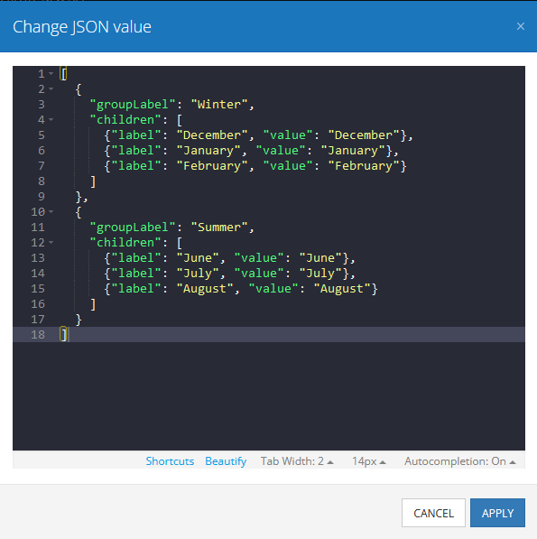
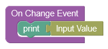
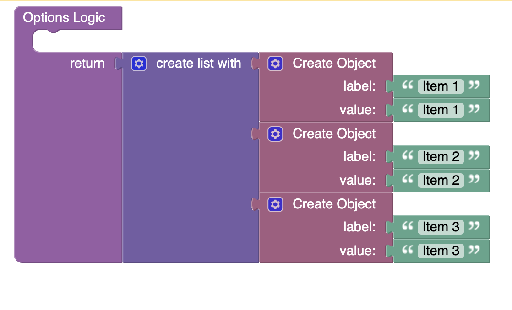
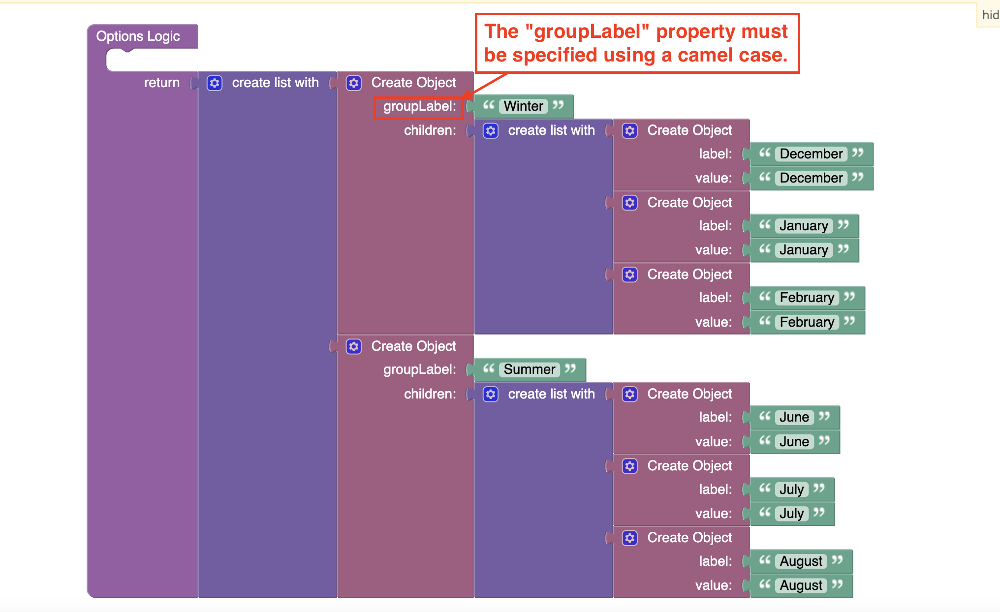

# Autocomplete

Autocomplete is the component of Backendless UI-Builder designer. It allows selecting one of the options from the list.

<p align="center">
  
</p>

All options are stored in a JSON object, that can be set either by using UI-Builder settings or Codeless Logic. You can also group options by passing a list containing JSON objects to the component:

<p align="center">
  
</p>

Once the option is selected from the list it gets saved to the local variable **Input Value** in the Codeless Logic. Suppose you selected the "Basketball" option from the list in the e-commerce store, then this value can be used later on to load and display products of a specific category ("Basketball") on the page. You must use the **On Changed Event** handler to get the selected value.

<p align="center">
  
</p>


## Properties

| Property                                    | Type                                                                     | Default Value                                                                                                                                                                                                                                                                                                                                                   | Logic                     | Data Binding | UI Setting | Description                                                                                                                                                                                                                                                                                                              |
|---------------------------------------------|--------------------------------------------------------------------------|-----------------------------------------------------------------------------------------------------------------------------------------------------------------------------------------------------------------------------------------------------------------------------------------------------------------------------------------------------------------|---------------------------|--------------|------------|--------------------------------------------------------------------------------------------------------------------------------------------------------------------------------------------------------------------------------------------------------------------------------------------------------------------------|
| Disabled<br/>`disabled`                     | Checkbox                                                                 | `false`                                                                                                                                                                                                                                                                                                                                                         | Disabled Logic            | YES          | YES        | This handler allows disabling a component.                                                                                                                                                                                                                                                                          |
| Placeholder<br/>`placeholder`               | Text                                                                     | "Placeholder"                                                                                                                                                                                                                                                                                                                                                   | Placeholder Logic         | YES          | YES        | This handler allows specifying a label of autocomplete component.                                                                                                                                                                                                                                                    |
| Empty Options Label<br/>`emptyOptionsLabel` | Text                                                                     | "No options"                                                                                                                                                                                                                                                                                                                                                    | Empty Options Label Logic | YES          | YES        | This handler allows adding a label that will be displayed when the dropdown menu is empty.                                                                                                                                                                                                                           |
| Variant<br/>`variant`                       | Select [Outlined:`outlined`<br/>Standart:`standart`<br/>Filled:`filled`] | Outlined:`outlined`                                                                                                                                                                                                                                                                                                                                             | Variant Logic             | YES          | YES        | This handler allows specifying the variant of the autocomplete.                                                                                                                                                                                                                                                          |
| Options<br/>`options`                       | JSON                                                                     | `[`<br/>`{"groupLabel":"Winter",`<br/>`"children": [{"label": "December", "value": "December"},{"label": "January", "value": "January"},{"label": "February", "value": "February"}]},`<br/>`{"groupLabel": "Summer",`<br/>`"children": [{"label": "June", "value": "June"},{"label": "July", "value": "July"},{"label": "August", "value": "August"}]}`<br/>`]` | Options Logic             | YES          | YES        | This handler allows you to add options to be displayed in the options list. Watch [Codeless Examples](#examples). Signature of options: list of objects `{value: String, label: String}`. Signature of grouped options: list of objects `{groupLabel: String, children: list of objects {value: String, label: String}}` |

## Events

| Name                        | Triggers                                    | Context Blocks                             |
|-----------------------------|---------------------------------------------|--------------------------------------------|
| On Change Event             | when the user enters text into a text field | Input Value: `String`                      |
| On Button Clear Click Event | when the user clicks the clear button       |                                            |

## Styles

**Theme**
````
@bl-customComponent-autocomplete-themeColor: @themePrimary;
@bl-customComponent-autocomplete-backgroundColor: @appBackgroundColor;
@bl-customComponent-autocomplete-textColor: @appTextColor;
````

**Dimensions**
````
@bl-customComponent-autocomplete-width: 300px;
@bl-customComponent-autocomplete-options-maxHeight: 40vh;
@bl-customComponent-autocomplete-option-padding: 6px 16px;
@bl-customComponent-autocomplete-groupLabel-padding: 6px 10px;
@bl-customComponent-autocomplete-borderRadius: 4px;
````

**Colors**
````
@bl-customComponent-autocomplete-boxShadow: @boxShadowPrimary;
@bl-customComponent-autocomplete-iconFill: @bl-customComponent-autocomplete-themeColor;
@bl-customComponent-autocomplete-groupLabel-color: @bl-customComponent-autocomplete-textColor;
@bl-customComponent-autocomplete-groupLabel-backgroundColor: rgba(@themePrimary, 0.5);
@bl-customComponent-autocomplete-option-backgroundColorOnHover: @backgroundColorOnHoverPrimary;
````

## <a id="examples"></a> Codeless Examples

Adding options to the component:



Adding grouped options to the component:


