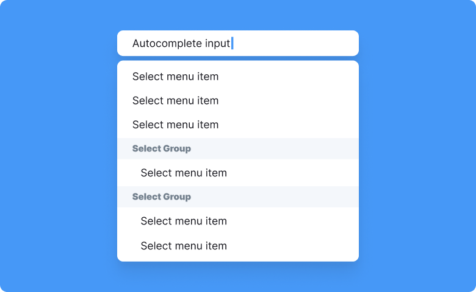
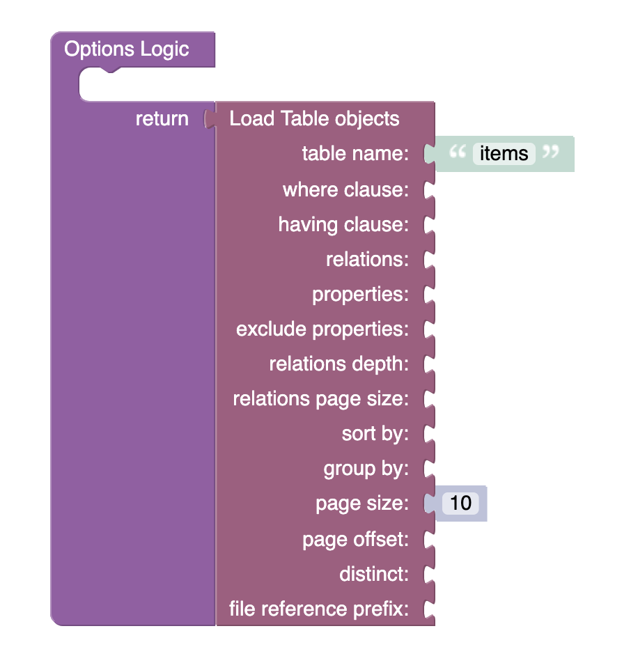

# Autocomplete

Autocomplete is a component of Backendless UI-Builder designer. This allows you to select an item from a list of options.

<p align="center">
  
</p>

## Properties

| Property             | Type                                                | Default value | Logic                      | Data Binding | UI Setting | Description                                                               |
|----------------------|-----------------------------------------------------|---------------|----------------------------|--------------|------------|---------------------------------------------------------------------------|
| Disabled             | *Checkbox*                                          | `false`       | Disabled Logic             | YES          | YES        | This handler allows you to disable a component.                                         |
| Placeholder          | *Text*                                              | 'Placeholder' | Placeholder Logic          | YES          | YES        | This handler allows you to select a label of autocomplete component.                                         |
| Autocomplete Variant | *Select* <br/> "outlined" \| "standart" \| "filled" | 'outlined'    | Autocomplete Variant Logic | YES          | YES        | This handler allows you to select the variant of autocomplete.                                      |
| Options              | *JSON*                                              |               | Options Logic              | YES          | YES        | This handler allows you to add items to be displayed in the options list. Watch [Codeless Examples](#Examples). Signature of option `{objectId, value, label}` |

## Events

| Name                        | Triggers                                    | Context Blocks                             |
|-----------------------------|---------------------------------------------|--------------------------------------------|
| On Change Event             | when the user enters text into a text field | Input Value: `String`                      |
| On Button Clear Click Event | when the user clicks the clear button       |                                            |

## Styles

**Theme**
````
@bl-customComponent-autocomplete-themeColor: @themePrimary;
@bl-customComponent-autocomplete-backgroundColor: @appBackgroundColor;
@bl-customComponent-autocomplete-textColor: @appTextColor;
````

**Dimensions**
````
@bl-customComponent-autocomplete-width: 300px;
````

## <a name="Examples"></a> Codeless Examples

Adding options to options list:


