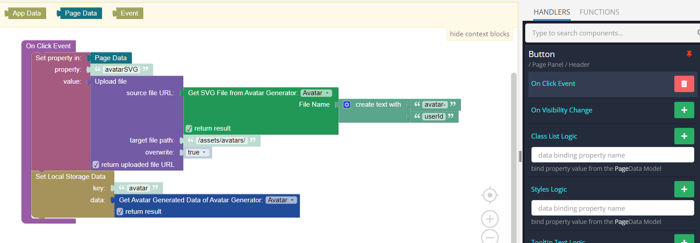
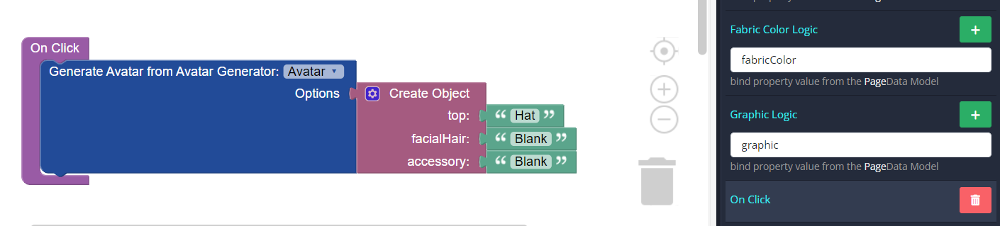

# Avatar Generator

The Avatar Generator is a feature-rich component seamlessly integrated into Backendless [UI-Builder](https://backendless.com/developers/#ui-builder). It empowers users to create highly customizable avatars, enhancing user engagement and personalization within your applications. With a wide range of options spanning skin tones, hairstyles, accessories, and facial features, it offers an intuitive and visually engaging solution for avatar creation. Its straightforward integration makes it an invaluable addition to any application seeking to provide users with dynamic and personalized avatars.

<p align="center">
  
</p>

## Demo

View an example of how to install this component and how it works in your UI [here](https://app.arcade.software/share/FqtH1yt9e1TGNVGLYv6O).

## Properties

| Property                                 | Type                                                                                                                                                                                                                                                                                                                                                                                                                                                                                                                                                                                                                                                                                                      | Default value         | Logic                       | Data Binding | UI Setting | Description                                                                                                             |
|------------------------------------------|-----------------------------------------------------------------------------------------------------------------------------------------------------------------------------------------------------------------------------------------------------------------------------------------------------------------------------------------------------------------------------------------------------------------------------------------------------------------------------------------------------------------------------------------------------------------------------------------------------------------------------------------------------------------------------------------------------------|-----------------------|-----------------------------|--------------|------------|-------------------------------------------------------------------------------------------------------------------------|
| Avatar Style <br> `avatarStyle`          | *Select* <br> [`circle`, `square`]                                                                                                                                                                                                                                                                                                                                                                                                                                                                                                                                                                                                                                                                        | `circle`              |                             | NO           | YES        | Controls the avatar container style.                                                                                    |
| Background <br> `background`             | *Color*                                                                                                                                                                                                                                                                                                                                                                                                                                                                                                                                                                                                                                                                                                   | `rgba(255,255,255,0)` | Background Logic            | YES          | YES        | This logic allows to specify avatar background.                                                                         |
| Internal Circle Color <br> `circleColor` | *Color*                                                                                                                                                                                                                                                                                                                                                                                                                                                                                                                                                                                                                                                                                                   | `#e6e6e6`             | Internal Circle Color Logic | YES          | YES        | This logic allows you to specify the color of the inner circle of the avatar (with the selected avatar style - circle). |
| Skin <br> `skin`                         | *Select* <br> [`Tanned`, `Yellow`, `Pale`, `Light`, `Brown`, `DarkBrown`, `Black`]                                                                                                                                                                                                                                                                                                                                                                                                                                                                                                                                                                                                                        | `Tanned`              | Skin Logic                  | YES          | YES        | This logic allows you to specify the skin color of the avatar.                                                          |
| Top <br> `top`                           | *Select* <br> [`NoHair`, `Eyepatch`, `Hat`, `Hijab`, `Turban`, `WinterHat1`, `WinterHat2`, `WinterHat3`, `WinterHat4`, `LongHairBigHair`, `LongHairBob`, `LongHairBun`, `LongHairCurly`, `LongHairCurvy`, `LongHairDreads`, `LongHairFrida`, `LongHairFro`, `LongHairFroBand`, `LongHairNotTooLong`, `LongHairShavedSides`, `LongHairMiaWallace`, `LongHairStraight`, `LongHairStraight2`, `LongHairStraightStrand`, `ShortHairDreads01`, `ShortHairDreads02`, `ShortHairFrizzle`, `ShortHairShaggy`, `ShortHairShaggyMullet`, `ShortHairShortCurly`, `ShortHairShortFlat`, `ShortHairShortRound`, `ShortHairShortWaved`, `ShortHairSides`, `ShortHairTheCaesar`, `ShortHairTheCaesarSidePart`, `Random`] | `Random`              | Top Logic                   | YES          | YES        | This logic allows you to specify the top type of the avatar.                                                            |
| Hair Color <br> `hairColor`              | Select <br> [`Auburn`, `Black`, `Blonde`, `BlondeGolden`, `Brown`, `BrownDark`, `PastelPink`, `Platinum`, `Red`, `SilverGray`, `Random`]                                                                                                                                                                                                                                                                                                                                                                                                                                                                                                                                                                  | `Random`              | Hair Color Logic            | YES          | YES        | This logic allows you to specify the hair color of the avatar.                                                          |
| Hat Color <br> `hatColor`                | *Select* <br> [`Black`, `Blue01`, `Blue02`, `Blue03`, `Gray01`, `Gray02`, `Gray03`, `Heather`, `PastelBlue`, `PastelGreen`, `PastelOrange`, `PastelRed`, `PastelYellow`, `Pink`, `Red`, `White`, `Random`]                                                                                                                                                                                                                                                                                                                                                                                                                                                                                                | `Random`              | Hat Color Logic             | YES          | YES        | This logic allows you to specify the hat color of the avatar.                                                           |
| Brows <br> `brows`                       | *Select* <br> [`Angry`, `AngryNatural`, `Default`, `DefaultNatural`, `FlatNatural`, `FrownNatural`, `RaisedExcited`, `RaisedExcitedNatural`, `SadConcerned`, `SadConcernedNatural`, `UnibrowNatural`, `UpDown`, `UpDownNatural`, `Random`]                                                                                                                                                                                                                                                                                                                                                                                                                                                                | `Default`             | Brows Logic                 | YES          | YES        | This logic allows you to specify the brows type of the avatar.                                                          |
| Eyes <br> `eyes`                         | *Select* <br> [`Close`, `Cry`, `Default`, `Dizzy`, `EyeRoll`, `Happy`, `Hearts`, `Side`, `Squint`, `Surprised`, `Wink`, `WinkWacky`, `Random`]                                                                                                                                                                                                                                                                                                                                                                                                                                                                                                                                                            | `Default`             | Eyes Logic                  | YES          | YES        | This logic allows you to specify the eyes type of the avatar.                                                           |
| Mouth <br> `mouth`                       | *Select* <br> [`Concerned`, `Default`, `Disbelief`, `Eating`, `Grimace`, `Sad`, `ScreamOpen`, `Serious`, `Smile`, `Tongue`, `Twinkle`, `Vomit`, `Random`]                                                                                                                                                                                                                                                                                                                                                                                                                                                                                                                                                 | `Default`             | Mouth Logic                 | YES          | YES        | This logic allows you to specify the mouth type of the avatar.                                                          |
| Facial Hair <br> `facialHair`            | *Select* <br> [`Blank`, `BeardMedium`, `BeardLight`, `BeardMajestic`, `MoustacheFancy`, `MoustacheMagnum`, `Random`]                                                                                                                                                                                                                                                                                                                                                                                                                                                                                                                                                                                      | `Blank`               | Facial Hair Logic           | YES          | YES        | This logic allows you to specify the facial hair type of the avatar.                                                    |
| Facial Hair Color <br> `facialHairColor` | Select <br> [`Auburn`, `Black`, `Blonde`, `BlondeGolden`, `Brown`, `BrownDark`, `PastelPink`, `Platinum`, `Red`, `SilverGray`, `Random`]                                                                                                                                                                                                                                                                                                                                                                                                                                                                                                                                                                  | `Random`              | Facial Hair Color Logic     | YES          | YES        | This logic allows you to specify the facial hair color of the avatar.                                                   |
| Accessory <br> `accessory`               | *Select* <br> [`Blank`, `Kurt`, `Prescription01`, `Prescription02`, `Round`, `Sunglasses`, `Wayfarers`, `Random`]                                                                                                                                                                                                                                                                                                                                                                                                                                                                                                                                                                                         | `Blank`               | Accessory Logic             | YES          | YES        | This logic allows you to specify the accessory type of the avatar.                                                      |
| Clothes <br> `clothes`                   | *Select* <br> [`BlazerShirt`, `BlazerSweater`, `CollarSweater`, `GraphicShirt`, `Hoodie`, `Overall`, `ShirtCrewNeck`, `ShirtScoopNeck`, `ShirtVNeck`, `Random`]                                                                                                                                                                                                                                                                                                                                                                                                                                                                                                                                           | `Random`              | Clothes Logic               | YES          | YES        | This logic allows you to specify the clothes type of the avatar.                                                        |
| Fabric Color <br> `fabricColor`          | *Select* <br> [`Black`, `Blue01`, `Blue02`, `Blue03`, `Gray01`, `Gray02`, `Gray03`, `Heather`, `PastelBlue`, `PastelGreen`, `PastelOrange`, `PastelRed`, `PastelYellow`, `Pink`, `Red`, `White`, `Random`]                                                                                                                                                                                                                                                                                                                                                                                                                                                                                                | `Random`              | Fabric Color Logic          | YES          | YES        | This logic allows you to specify the fabric color of the avatar.                                                        |
| Graphic <br> `graphic`                   | *Select* <br> [`Bat`, `Bear`, `Blank`, `Cumbia`, `Deer`, `Diamond`, `Hola`, `Pizza`, `Resist`, `Selena`, `Skull`, `SkullOutline`, `Random`]                                                                                                                                                                                                                                                                                                                                                                                                                                                                                                                                                               | `Blank`               | Graphic Logic               | YES          | YES        | This logic allows you to specify the graphic type of the avatar.                                                        |

## Events

| Name     | Triggers                              | Context Blocks |
|----------|---------------------------------------|----------------|
| On Click | when the user clicks on the component |                |

## Actions

| Action                                        | Inputs                                                                                                                                                                                                                                                                                                                  | Returns                                                                                                                                                                                                                                                                                                                            |
|-----------------------------------------------|-------------------------------------------------------------------------------------------------------------------------------------------------------------------------------------------------------------------------------------------------------------------------------------------------------------------------|------------------------------------------------------------------------------------------------------------------------------------------------------------------------------------------------------------------------------------------------------------------------------------------------------------------------------------|
| Generate Avatar from Avatar Generator         | Options: `{ "background": String, "circleColor": String, "skin": String, "top": String, "hairColor": String, "hatColor": String, "brows": String, "eyes": String, "mouth": String, "facialHair": String, "facialHairColor": String, "accessory": String, "clothes": String, "fabricColor": String, "graphic": String }` |                                                                                                                                                                                                                                                                                                                                    |
| Get Avatar Generated Data of Avatar Generator |                                                                                                                                                                                                                                                                                                                         | `{ "top": String, "accessory": String, "mouth": String, "facialHair": String, "clothes": String, "graphic": String, "eyes": String", "brows": String, "background": String, "circleColor": String, "skin": String, "hairColor": String, "hatColor": String, "facialHairColor": String, "fabricColor": String }`                    |
| Get SVG File from Avatar Generator            | File Name: `String`                                                                                                                                                                                                                                                                                                     | File: `Object`                                                                                                                                                                                                                                                                                                                     |
| Get PNG File from Avatar Generator            | File Name: `String`                                                                                                                                                                                                                                                                                                     | File: `Object`                                                                                                                                                                                                                                                                                                                     |
| Get JPEG File from Avatar Generator           | File Name: `String`                                                                                                                                                                                                                                                                                                     | File: `Object`                                                                                                                                                                                                                                                                                                                     |
| Get All Options Data of Avatar Generator      |                                                                                                                                                                                                                                                                                                                         | `{ "skin": [...String], "top": [...String], "hairColor": [...String], "hatColor": [...String], "brows": [...String], "eyes": [...String], "mouth": [...String], "facialHair": [...String], "facialHairColor": [...String], "accessory": [...String], "clothes": [...String], "fabricColor": [...String], "graphic": [...String] }` |
| Get Property Options of Avatar Generator      | Property Name: `String`                                                                                                                                                                                                                                                                                                 | Property Options: `[...String]`                                                                                                                                                                                                                                                                                                    |

## Styles

````
@bl-customComponent-avatar-generator-width: 200px;
@bl-customComponent-avatar-generator-cursor: default;
````

## Usage examples

Below is an example of using the Avatar Generator to allow the user to create his personalized avatar and then save its settings for editing in the future.

In this example, we will use local storage, and you can choose, for example, to work with your database.

First, add the component to the page and select the avatar container type in the settings.

<p align="center">
  
</p>

In the logic of each of the necessary parameters, specify the date binding (parameter names are at your discretion).

<p align="center">
  
</p>

Next, in the logic on Page Enter, we check whether we have previously saved data about the avatar and, if not, we will set the default parameters, or the data will be generated randomly.

<p align="center">
  
</p>

<details>
<summary>Try yourself</summary>

```
<block xmlns="http://www.w3.org/1999/xhtml" type="variables_set" id="b8%+jy~qnN=w^s@Dqiv]"><field name="VAR">avatar</field><value name="VALUE"><block type="local_storage_get" id="*)oR9r1:6fo/AAnm3|ax"><value name="key"><shadow type="text" id="`tBw/@vEmdkyp*+5Bn{a"><field name="TEXT">avatar</field></shadow></value></block></value><next><block type="set_object_property" id="x;v~!Bn?B(0F|bm2UUmA" inline="true"><value name="object"><block type="root_block_ui_builder_common__context_blocks_pageData" id="?-T(n^U*sbbJvF6q`|V|" bl_meta="{&quot;label&quot;:&quot;Page Data&quot;}"></block></value><value name="propName"><shadow type="text" id="Ov./)+7xcc/Io`ksgw6%"><field name="TEXT">top</field></shadow></value><value name="propValue"><block type="logic_ternary" id="*MW!M2!wWBwB`:OP3ZA+" inline="true"><value name="IF"><block type="variables_get" id="KANN|l_V1O(C@%A|@bi0"><field name="VAR">avatar</field></block></value><value name="THEN"><block type="get_object_property" id="xZ53AbqU4baA?Bcp0;=l"><value name="prop_name"><shadow type="text" id="ly~+J@#eZ~h~2;QXTn0i"><field name="TEXT">top</field></shadow></value><value name="object"><block type="variables_get" id="U(TxErW{]n71wPn#|*im"><field name="VAR">avatar</field></block></value></block></value></block></value><next><block type="set_object_property" id="FxDVp*dNhRS(X^7@~Rz[" inline="true"><value name="object"><block type="root_block_ui_builder_common__context_blocks_pageData" id="EpLx!Hxx{t]0XD:0nJDb" bl_meta="{&quot;label&quot;:&quot;Page Data&quot;}"></block></value><value name="propName"><shadow type="text" id="7M(.VMyYX/Ro$dig@Ayf"><field name="TEXT">brows</field></shadow></value><value name="propValue"><block type="logic_ternary" id="+zQo%.Lc0~hn/lv$TE_/" inline="true"><value name="IF"><block type="variables_get" id="|G2-2U[mm.$8Cb%$dqn2"><field name="VAR">avatar</field></block></value><value name="THEN"><block type="get_object_property" id="Y~S`LU;?g6Dv!5)WtDKC"><value name="prop_name"><shadow type="text" id="c]CM;#]pdxX2q;lmQY[#"><field name="TEXT">brows</field></shadow></value><value name="object"><block type="variables_get" id="ni8#3R^:10*c}cN/ztS!"><field name="VAR">avatar</field></block></value></block></value></block></value><next><block type="set_object_property" id="`tHnm3(-X.SzVjX^?J43" inline="true"><value name="object"><block type="root_block_ui_builder_common__context_blocks_pageData" id="#IU}w5YUA9O8oZ|}Y9zl" bl_meta="{&quot;label&quot;:&quot;Page Data&quot;}"></block></value><value name="propName"><shadow type="text" id="9T#TBSapp;+I3K+{W~Zv"><field name="TEXT">mouth</field></shadow></value><value name="propValue"><block type="logic_ternary" id="WhzbmxOza_wF)k^,Co6L" inline="true"><value name="IF"><block type="variables_get" id="k4!DUmbhE0bHB+=i^SRq"><field name="VAR">avatar</field></block></value><value name="THEN"><block type="get_object_property" id="hIUN?c!)P!Z5#|G]lG~C"><value name="prop_name"><shadow type="text" id=",N*YKeC}A(e(xLY@dp^R"><field name="TEXT">mouth</field></shadow></value><value name="object"><block type="variables_get" id="n7IpQ.o8N,HFWjURT4?v"><field name="VAR">avatar</field></block></value></block></value></block></value><next><block type="set_object_property" id="Kyg[c.u#Lw_BZH0H]68G" inline="true"><value name="object"><block type="root_block_ui_builder_common__context_blocks_pageData" id="~h[wIn4GwQ6X!0v4:xNC" bl_meta="{&quot;label&quot;:&quot;Page Data&quot;}"></block></value><value name="propName"><shadow type="text" id="7E+Z#]t%+q6w_uOsoM[F"><field name="TEXT">eyes</field></shadow></value><value name="propValue"><block type="logic_ternary" id="|i5ims^-B;,b~zfR$3`R" inline="true"><value name="IF"><block type="variables_get" id="qHCs[-8cdspAc3g|.^z-"><field name="VAR">avatar</field></block></value><value name="THEN"><block type="get_object_property" id="%D??,i32~kCN8]_ycx[P"><value name="prop_name"><shadow type="text" id="RGiDnaVSzTC35~Y-ayR`"><field name="TEXT">eyes</field></shadow></value><value name="object"><block type="variables_get" id="7~F*Ml,iYLllmNG9#}I_"><field name="VAR">avatar</field></block></value></block></value></block></value><next><block type="set_object_property" id="kk4rwGByKX#i+.-KAiSs" inline="true"><value name="object"><block type="root_block_ui_builder_common__context_blocks_pageData" id="Vyi%[q@V[_N6DG6S1W)x" bl_meta="{&quot;label&quot;:&quot;Page Data&quot;}"></block></value><value name="propName"><shadow type="text" id="x/{DlkCoKatLIpuZ_${L"><field name="TEXT">background</field></shadow></value><value name="propValue"><block type="logic_ternary" id="5MNo?#gclVx[z_%Id5Xx" inline="true"><value name="IF"><block type="variables_get" id="DYs8m/f1{WuLuvZq1[vM"><field name="VAR">avatar</field></block></value><value name="THEN"><block type="get_object_property" id="%$`=Pk.Y4%Q+:4J0zu7U"><value name="prop_name"><shadow type="text" id="qQtTbm8:qpV9;7sCct88"><field name="TEXT">background</field></shadow></value><value name="object"><block type="variables_get" id="ga^w4Lm2g85m.I6+G_vU"><field name="VAR">avatar</field></block></value></block></value></block></value><next><block type="set_object_property" id="/-_AeQ2$2EVn9f;vh%~5" inline="true"><value name="object"><block type="root_block_ui_builder_common__context_blocks_pageData" id="5mU*O`[vN!qQZ{NXJII9" bl_meta="{&quot;label&quot;:&quot;Page Data&quot;}"></block></value><value name="propName"><shadow type="text" id="b9vT%mwR|{qn5@ks*|CR"><field name="TEXT">circleColor</field></shadow></value><value name="propValue"><block type="logic_ternary" id=":T3~HT1O(xl.L@*By1!y" inline="true"><value name="IF"><block type="variables_get" id="vai50Rv@Z/ni.Y]HIm8E"><field name="VAR">avatar</field></block></value><value name="THEN"><block type="get_object_property" id="87Qb$1)~G/O!#)w.~q*@"><value name="prop_name"><shadow type="text" id="5A:[7+)XTARUUtR}zqj$"><field name="TEXT">circleColor</field></shadow></value><value name="object"><block type="variables_get" id="y.{_c@xxd]p1j9R.-l!x"><field name="VAR">avatar</field></block></value></block></value></block></value><next><block type="set_object_property" id="kFA+%CH?X]XpVX:G)e|i" inline="true"><value name="object"><block type="root_block_ui_builder_common__context_blocks_pageData" id="cOI8T7x%c}!7!M}D{A*c" bl_meta="{&quot;label&quot;:&quot;Page Data&quot;}"></block></value><value name="propName"><shadow type="text" id="B4`@f{GLm@aglO+{^CqH"><field name="TEXT">clothes</field></shadow></value><value name="propValue"><block type="logic_ternary" id="NY=R_x=ICA;8i)zp.hSb" inline="true"><value name="IF"><block type="variables_get" id="`)XAp[!7/A:JsjFOc-}6"><field name="VAR">avatar</field></block></value><value name="THEN"><block type="get_object_property" id="s(1BeHLh@z-LfZeaZTBh"><value name="prop_name"><shadow type="text" id="y?LjJENf[U%0F+GXWNd$"><field name="TEXT">clothes</field></shadow></value><value name="object"><block type="variables_get" id="LS#uP(8w!~T_1|iJ)w?["><field name="VAR">avatar</field></block></value></block></value></block></value><next><block type="set_object_property" id="Ksu-.-0wl6,YS#$m?u5O" inline="true"><value name="object"><block type="root_block_ui_builder_common__context_blocks_pageData" id="b11V#-)yzQdp@2naJ}G7" bl_meta="{&quot;label&quot;:&quot;Page Data&quot;}"></block></value><value name="propName"><shadow type="text" id="S)pYYU8_S;:NY[EkL}F#"><field name="TEXT">fabricColor</field></shadow></value><value name="propValue"><block type="logic_ternary" id="nN;s]xu(=SEY;wM/I,%x" inline="true"><value name="IF"><block type="variables_get" id="55pD{;|m{)6LH~FbsNI^"><field name="VAR">avatar</field></block></value><value name="THEN"><block type="get_object_property" id="_QP8]=lafNQl;mguIe7N"><value name="prop_name"><shadow type="text" id="8[-Kp[eTaZ}^EKH*P;G["><field name="TEXT">fabricColor</field></shadow></value><value name="object"><block type="variables_get" id="E$j9hkUH1|s^fG_t|,Bw"><field name="VAR">avatar</field></block></value></block></value></block></value><next><block type="set_object_property" id="Uoq_i;Qc0o08F(8B`wQZ" inline="true"><value name="object"><block type="root_block_ui_builder_common__context_blocks_pageData" id=")YyOJqTi:%5]oL1B#F(R" bl_meta="{&quot;label&quot;:&quot;Page Data&quot;}"></block></value><value name="propName"><shadow type="text" id="!Ns_yZhkMG@mMYsaXnSg"><field name="TEXT">facialHair</field></shadow></value><value name="propValue"><block type="logic_ternary" id="#En=JP4OWM}W3G}{d?Dq" inline="true"><value name="IF"><block type="variables_get" id="x)E3^Yb8GY~!iUh4c+|`"><field name="VAR">avatar</field></block></value><value name="THEN"><block type="get_object_property" id="KzifI0k#DCexFNLA1@=%"><value name="prop_name"><shadow type="text" id=";3JK9Le:T9p=0FVFTrPY"><field name="TEXT">facialHair</field></shadow></value><value name="object"><block type="variables_get" id="%HjZL}g7FiHt*9i/QLY="><field name="VAR">avatar</field></block></value></block></value><value name="ELSE"><block type="text" id="S=9?=YTpwfJ{0wH5|;~i"><field name="TEXT">Blank</field></block></value></block></value><next><block type="set_object_property" id="[LO?bD8A.;.w8iL6@WA9" inline="true"><value name="object"><block type="root_block_ui_builder_common__context_blocks_pageData" id="]J`2B5?8c$aKR@~gLvB%" bl_meta="{&quot;label&quot;:&quot;Page Data&quot;}"></block></value><value name="propName"><shadow type="text" id="w:emdqxc1lEzlP)[BS#a"><field name="TEXT">graphic</field></shadow></value><value name="propValue"><block type="logic_ternary" id="}EputaLRsDdbd~nNrOsP" inline="true"><value name="IF"><block type="variables_get" id="?GO/Rnq,ZPwj~_RH0Of;"><field name="VAR">avatar</field></block></value><value name="THEN"><block type="get_object_property" id="LLSeAdD]l#@GQz3+c!G;"><value name="prop_name"><shadow type="text" id="N3hs:3DfEa^}u;B?BK%7"><field name="TEXT">graphic</field></shadow></value><value name="object"><block type="variables_get" id="kod[x/u8m6O6isj[j,Gj"><field name="VAR">avatar</field></block></value></block></value><value name="ELSE"><block type="text" id="?1oJ@DYnx[c`8k-(y9W`"><field name="TEXT">Blank</field></block></value></block></value><next><block type="set_object_property" id="!+6pkye){N/l2l)HVI$R" inline="true"><value name="object"><block type="root_block_ui_builder_common__context_blocks_pageData" id="deubvbo[EvbDyJa/sZ@1" bl_meta="{&quot;label&quot;:&quot;Page Data&quot;}"></block></value><value name="propName"><shadow type="text" id="uGNn*JORAXFNsE!L99T."><field name="TEXT">facialHairColor</field></shadow></value><value name="propValue"><block type="logic_ternary" id="=Q=;%h,{eWNF5H65==]U" inline="true"><value name="IF"><block type="variables_get" id="v4TB`}k8,Bj_(1kSt=W#"><field name="VAR">avatar</field></block></value><value name="THEN"><block type="get_object_property" id="fP#rrT~#4`[%(ej[(.Q|"><value name="prop_name"><shadow type="text" id="D5o9+p4jG9cR.okRc]5c"><field name="TEXT">facialHairColor</field></shadow></value><value name="object"><block type="variables_get" id="?HPSqMpu7i6=SENP?M]o"><field name="VAR">avatar</field></block></value></block></value></block></value><next><block type="set_object_property" id="o)AQ!?gZ0U_a{co058q#" inline="true"><value name="object"><block type="root_block_ui_builder_common__context_blocks_pageData" id="dPX8Ru`RP`)idh8NQaSZ" bl_meta="{&quot;label&quot;:&quot;Page Data&quot;}"></block></value><value name="propName"><shadow type="text" id="Px:~Vn76)pdFsRf8O)z2"><field name="TEXT">hairColor</field></shadow></value><value name="propValue"><block type="logic_ternary" id="bDCf4`s186,$8yK|o^`j" inline="true"><value name="IF"><block type="variables_get" id="jb|_=(yTeM(PM`:b$5U["><field name="VAR">avatar</field></block></value><value name="THEN"><block type="get_object_property" id="5O@m!Ffd]qwzyaJB4,TC"><value name="prop_name"><shadow type="text" id="T6w-%uT.[nHAKFu]9?c2"><field name="TEXT">hairColor</field></shadow></value><value name="object"><block type="variables_get" id="dFTd#N8CMxg8(1lS=-;m"><field name="VAR">avatar</field></block></value></block></value></block></value><next><block type="set_object_property" id="(jXZqs%ak5,hJmp^=:ve" inline="true"><value name="object"><block type="root_block_ui_builder_common__context_blocks_pageData" id="|JFMjaN^4wwrRm+Su)qs" bl_meta="{&quot;label&quot;:&quot;Page Data&quot;}"></block></value><value name="propName"><shadow type="text" id=")xk/eTOnMgx!a6-jn$HX"><field name="TEXT">hatColor</field></shadow></value><value name="propValue"><block type="logic_ternary" id="d6W^L;;7,B*05oI`0E.e" inline="true"><value name="IF"><block type="variables_get" id="3s}fTUO?-R:*hVnpZtT="><field name="VAR">avatar</field></block></value><value name="THEN"><block type="get_object_property" id="Xav2iPG;bx8H(tyWb,r."><value name="prop_name"><shadow type="text" id="~.J*4F{1n+M?B0D;)cbT"><field name="TEXT">hatColor</field></shadow></value><value name="object"><block type="variables_get" id="2RL=`)eg)=:bb$.s{4h1"><field name="VAR">avatar</field></block></value></block></value></block></value><next><block type="set_object_property" id="O1M1m%vZQw~AY6H9f45o" inline="true"><value name="object"><block type="root_block_ui_builder_common__context_blocks_pageData" id="5^Ia?n)BkI7Quh=CDy?o" bl_meta="{&quot;label&quot;:&quot;Page Data&quot;}"></block></value><value name="propName"><shadow type="text" id="kyF[*OCa9MXK2~!E%};}"><field name="TEXT">skin</field></shadow></value><value name="propValue"><block type="logic_ternary" id="BD3%h;xHl]4C3m,kk1uR" inline="true"><value name="IF"><block type="variables_get" id="B7nZV[Xi)G3a~#k2QIK5"><field name="VAR">avatar</field></block></value><value name="THEN"><block type="get_object_property" id=")U`34{o.Vqa!;Cgl)iI8"><value name="prop_name"><shadow type="text" id="A4}H/72/P0%#IxHZ@9:M"><field name="TEXT">skin</field></shadow></value><value name="object"><block type="variables_get" id="5w4dit:j{g#WFHbI?U?l"><field name="VAR">avatar</field></block></value></block></value></block></value><next><block type="set_object_property" id="-dlh7~zwQ..rLJRk7L9V" inline="true"><value name="object"><block type="root_block_ui_builder_common__context_blocks_pageData" id="pU}xV/?~MadWk41/P+@|" bl_meta="{&quot;label&quot;:&quot;Page Data&quot;}"></block></value><value name="propName"><shadow type="text" id="$AgTU-w454`DzFW7OjIg"><field name="TEXT">accessory</field></shadow></value><value name="propValue"><block type="logic_ternary" id="^r:h},`x.CHDw_[Xw`pX" inline="true"><value name="IF"><block type="variables_get" id="P8lPDk8n--!!wj!EX(f/"><field name="VAR">avatar</field></block></value><value name="THEN"><block type="get_object_property" id="YKOlK1qB5v;1+4`BAy|$"><value name="prop_name"><shadow type="text" id="9G%gtypN`[:5$XH(}ZTg"><field name="TEXT">accessory</field></shadow></value><value name="object"><block type="variables_get" id="Dy[5+T|x6R}l56pBon)-"><field name="VAR">avatar</field></block></value></block></value><value name="ELSE"><block type="text" id="DB.,_WgZcdiJ;t/CB8}Z"><field name="TEXT">Blank</field></block></value></block></value></block></next></block></next></block></next></block></next></block></next></block></next></block></next></block></next></block></next></block></next></block></next></block></next></block></next></block></next></block></next></block>
```
</details>

Next, so that the user has the opportunity to select and customize his avatar, we need to create a form with inputs of the select type.

<p align="center">
  
</p>

To configure each of them, apply the logic below using the necessary parameters.

<p align="center">
  
</p>

And, the question remains of saving the parameters and the avatar itself.
Let's add a save button, clicking on which will save the data to local storage.
We’ll save the generated avatar in the file system, for example, we’ll save it in SVG format to the avatars folder inside the assets folder, passing the required file name (instead of the string "user ID", you can pass the ID of your user, for example). To rewrite the same file, instead of creating a new one, set `overwrite` to `true`.

<p align="center">
  
</p>

And one more thing, for your user to have the opportunity to randomly generate an avatar, use the `Generate Avatar from Avatar Generator` action, and if you leave the field empty, the parameters will be taken randomly. Add this action to any button or to the `On Click` event of the Avatar Generator component itself.

<p align="center">
  
</p>

<details>
<summary>Try yourself this way</summary>

```
<block xmlns="http://www.w3.org/1999/xhtml" type="create_object" id="S$+/t,NP6kvQT)ZwEUaa" x="397.94998931884766" y="101"><mutation><properties><item id="property" prop-name="top"></item><item id="property" prop-name="facialHair"></item><item id="property" prop-name="accessory"></item></properties></mutation><value name="create_object_mutator_container_properties_stack_property0"><block type="text" id="JEDnHg*2mGg3h=-Y)IOG"><field name="TEXT">Hat</field></block></value><value name="create_object_mutator_container_properties_stack_property1"><block type="text" id="6`}RTjI9*n`h;?TWnex."><field name="TEXT">Blank</field></block></value><value name="create_object_mutator_container_properties_stack_property2"><block type="text" id="6^Y$%%c0nxRrTaE;p@o="><field name="TEXT">Blank</field></block></value></block>
```
</details>

<details>
<summary>Or another way with a full set of options</summary>

```
<block xmlns="http://www.w3.org/1999/xhtml" type="create_object" id="y~2xm(%XN*=,4OjSsgV]" x="397.94998931884766" y="151"><mutation><properties><item id="property" prop-name="background"></item><item id="property" prop-name="circleColor"></item><item id="property" prop-name="skin"></item><item id="property" prop-name="top"></item><item id="property" prop-name="hairColor"></item><item id="property" prop-name="hatColor"></item><item id="property" prop-name="brows"></item><item id="property" prop-name="eyes"></item><item id="property" prop-name="mouth"></item><item id="property" prop-name="facialHair"></item><item id="property" prop-name="facialHairColor"></item><item id="property" prop-name="accessory"></item><item id="property" prop-name="clothes"></item><item id="property" prop-name="fabricColor"></item><item id="property" prop-name="graphic"></item></properties></mutation><value name="create_object_mutator_container_properties_stack_property3"><block type="text" id="B5nH[A7B%Zpm%:QA06kM"><field name="TEXT">Hat</field></block></value><value name="create_object_mutator_container_properties_stack_property9"><block type="text" id="{C{z~ehQ8j1m,Lt/}K;G"><field name="TEXT">Blank</field></block></value><value name="create_object_mutator_container_properties_stack_property11"><block type="text" id="6^Y$%%c0nxRrTaE;p@o="><field name="TEXT">Blank</field></block></value></block>
```
</details>
