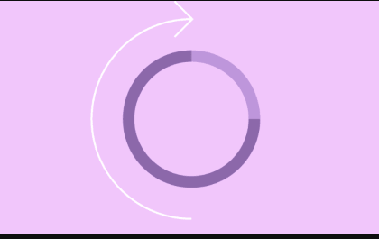

# Backdrop Spinner

Backdrop Spinner is a component of Backendless [UI-Builder](https://backendless.com/developers/#ui-builder) designer.

The component represents a background with a loader in the center of it. The component is customizable,
you can choose the visibility, background color, as well as the color and type of the loader.

<p align="center">
  
</p>

## Properties

| Property           | Type                                                                                                          | Default value          | Logic                     | Data Binding | UI Setting | Description                              |
|--------------------|---------------------------------------------------------------------------------------------------------------|------------------------|---------------------------|--------------|------------|------------------------------------------|
| backdropVisibility | *Checkbox*                                                                                                    | false                  | Backdrop Visibility Logic | YES          | YES        | controls the visibility of a component.  |
| loaderType         | *Select* <br/>[`bar`,`doted circle`,`doted horizon`,`doted line circle`,`doted square`,`line circle`,`radar`] | bar                    | Loader Type Logic         | NO           | YES        | controls the loader type of a component. |

## Events

| Name           | Triggers                                                      | Context Blocks |
|----------------|---------------------------------------------------------------|----------------|
| On Click Event | when the user clicks the mouse or taps on the backdrop loader |                |
| On Open Event  | when the component appears on the screen                      |                |
| On Close Event | when the component disappears from the screen                 |                |

## Styles

**Theme**
````
@bl-customComponent-backdrop-background: @disabledColor;
@bl-customComponent-loader-color: @themePrimary;
````

**Dimensions**
````
@bl-customComponent-loader-size: 120px;
@bl-customComponent-lineCircleLoader-lineWeight: 14px;
@bl-customComponent-lineCircleLoader-containerSize: @bl-customComponent-loader-size;
````

**Colors**
````
@bl-customComponent-lineCircleLoader-color: @bl-customComponent-loader-color;
@bl-customComponent-dotedCircleLoader-color: @bl-customComponent-loader-color;
@bl-customComponent-barLoader-color: @bl-customComponent-loader-color;
@bl-customComponent-dotedLineCircleLoader-color: @bl-customComponent-loader-color;
@bl-customComponent-radarLoader-color: @bl-customComponent-loader-color;
@bl-customComponent-dotedSquareLoader-color: @bl-customComponent-loader-color;
@bl-customComponent-dotedHorizonLoader-color: @bl-customComponent-loader-color;
````

