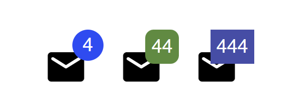
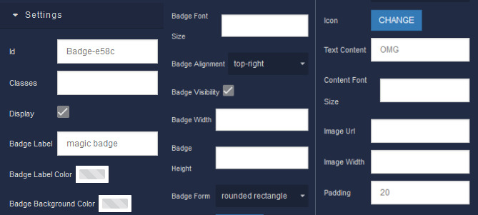
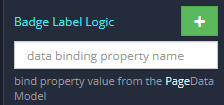
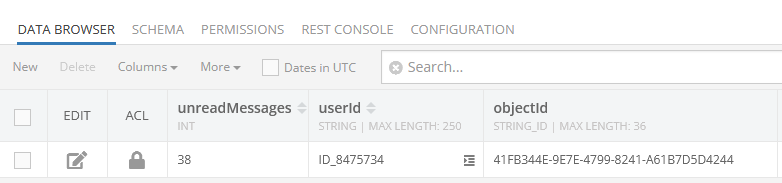
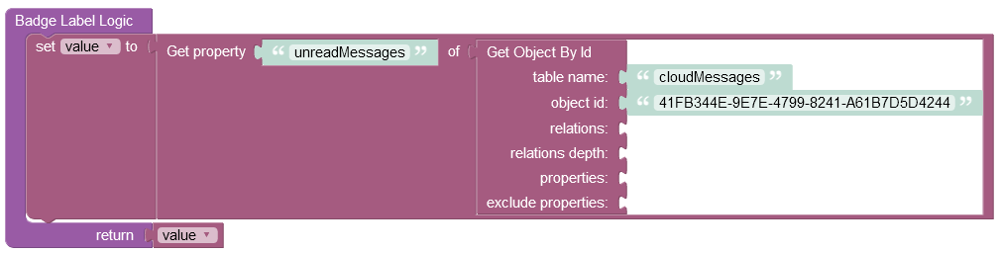
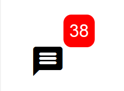

# Badge

The Badge component allows displaying specific data in the corner of the selected image/icon. The data must be a number or a string value which is fetched from the database and projected up into the right corner. This component is available in the [UI-Builder](https://backendless.com/developers/#ui-builder).

Customizations include adjustments of position, size, form, visibility, background color, label color and font size. The Badge supports a wide range of default icons that you can select in the Settings of the component in the UI-Builder.

<p align="center">
  
</p>

## Configuration

This component must be configured using both the UI-Builder and the Codeless Logic. In the UI-Builder you have to set the image and other properties that reflect the final look of the badge.

<p align="center">
  
</p>

To display a specific value in the corner of the badge, you must set the **Badge Label Logic** handler in the Codeless.

<p align="center">
  
</p>

Suppose you have a data table where the number of unread messages is stored:

<p align="center">
  
</p>

To display the number of unread messages in the corner of your badge, you have to set the Logic that fetches the data from the table. The example below retrieves an object from the data table called **cloudMessages**, and then the value of the property **unreadMessages** is extracted from the object:

<p align="center">
  
</p>

As the result, once the page is loaded, the number of unread messages is displayed in the corner of the badge:

<p align="center">
  
</p>

## Properties

| Property               | Type                                                                             | Default value                                | Logic                           | Data Binding      | UI Setting | Description                                                   |
|------------------------|----------------------------------------------------------------------------------|----------------------------------------------|---------------------------------|-------------------|------------|---------------------------------------------------------------|
| Badge Label            | *Text*                                                                           |                                              | Badge Label Logic               | YES               | YES        | controls the label of the badge                               |
| Badge Label Color      | *Color*                                                                          |                                              |                                 | NO                | YES        | controls the color of the badge label                         |
| Badge Background Color | *Color*                                                                          |                                              |                                 | NO                | YES        | controls the background color of the badge                    |
| Badge Font Size        | *Text*                                                                           |                                              |                                 | NO                | YES        | controls the font size of the badge label                     |
| Badge Alignment        | *Select* <br/> "top-right" \|  "top-left" \|  "bottom-left" \| "bottom-right"    | "top-right"                                  |                                 | NO                | YES        | controls the position of the badge                            |
| Badge Visibility       | *Checkbox*                                                                       | `true`                                       | Badge Visibility Logic          | YES               | YES        | enables the visibility of the badge                           |
| Badge Width            | *Text*                                                                           |                                              |                                 | NO                | YES        | controls the width of the badge                               |
| Badge Height           | *Text*                                                                           |                                              |                                 | NO                | YES        | controls the height of the badge                              |
| Badge Form             | *Select* <br/> "rounded rectangle" \| "circle" \| "rectangle"                    | "rounded rectangle"                          |                                 | NO                | YES        | controls the form of the badge                                |
| Icon                   | *MUI Icon*                                                                       |                                              |                                 | NO                | YES        | specifies the icon content of the component                   |
| Text Content           | *Text*                                                                           |                                              |                                 | NO                | YES        | specifies the text content of the component                   |
| Content Font Size      | *Text*                                                                           |                                              |                                 | NO                | YES        | controls the font size of the content                         |
| Image Url              | *Text*                                                                           |                                              |                                 | NO                | YES        | specifies the image content of the component                  |
| Image Width            | *Text*                                                                           |                                              |                                 | NO                | YES        | controls the width of the image content                       |
| Padding                | *Text*                                                                           |                                              |                                 | NO                | YES        | controls the distance from the badge to the component content |


## Events

| Name                        | Triggers                                                       | Context Blocks |
|-----------------------------|----------------------------------------------------------------|----------------|
| On Badge Click Event        | when a user click on the badge                                 |                |
| On Badge Mouse Over Event   | when the mouse pointer hovers over the badge                   |                |
| On Badge Mouse Out Event    | when the mouse pointer leaves the badge boundaries             |                |
| On Content Click Event      | when a user clicks on the component content                     |                |
| On Content Mouse Over Event | when the mouse pointer hovers over the component content       |                |
| On Content Mouse Out Event  | when the mouse pointer leaves the component content boundaries |                |

## Styles

**Theme**

````
@bl-customComponent-badge-themeColor: @themePrimary;
@bl-customComponent-badge-backgroundColor: @appBackgroundColor;
@bl-customComponent-badge-textColor: @appTextColor;
````

**General**

````
@bl-customComponent-badge-badgeBackgroundColor: @bl-customComponent-badge-themeColor;
@bl-customComponent-badge-badgeTextColor: contrast(@bl-customComponent-badge-badgeBackgroundColor);
@bl-customComponent-badge-content-color: @bl-customComponent-badge-textColor;
@bl-customComponent-badge-content-backgroundColor: @bl-customComponent-badge-backgroundColor;
@bl-customComponent-badge-content-iconColor: @bl-customComponent-badge-content-color;
@bl-customComponent-badge-content-iconBackgroundColor: @bl-customComponent-badge-content-backgroundColor;
@bl-customComponent-badge-content-textColor: @bl-customComponent-badge-content-color;
@bl-customComponent-badge-content-textBackgroundColor: @bl-customComponent-badge-content-backgroundColor;
````

**Dimensions**

````
@bl-customComponent-badge-padding: 14px;
@bl-customComponent-badge-badgePadding: 4px;
@bl-customComponent-badge-content-padding: 0;
@bl-customComponent-badge-content-iconPadding: @bl-customComponent-badge-content-padding;
@bl-customComponent-badge-content-textPadding: @bl-customComponent-badge-content-padding;
@bl-customComponent-badge-content-imagePadding: @bl-customComponent-badge-content-padding;
@bl-customComponent-badge-content-imageWidth: 24px;
@bl-customComponent-badge-content-imageHeight: auto;
````

**Typography**

````
@bl-customComponent-badge-badgeFontSize: 12px;
@bl-customComponent-badge-content-fontSize: 24px;
@bl-customComponent-badge-content-iconFontSize: @bl-customComponent-badge-content-fontSize;
@bl-customComponent-badge-content-textFontSize: @bl-customComponent-badge-content-fontSize;
````
