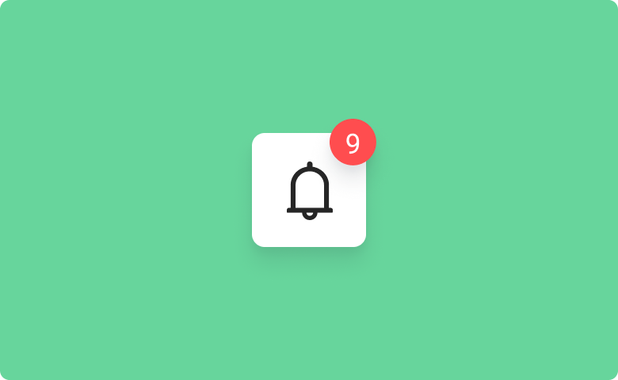

# Badge

This is a component of Backendless [UI-Builder](https://backendless.com/developers/#ui-builder) designer. It generates a small badge to the corner of its child(ren). Any text, custom image or Material icon can be as a content of the component. It is also possible to combine them.

Customizations include adjustments of position, size, form, visibility, background color, label color and font size.

<p align="center">
  
</p>

## Configuration

After adding the component to the page, specify the label of the badge. This can be done in UI-Builder designer or using codeless logic.

Then it is necessary to determine the contents of the component. Go to UI-Builder designer and specify one of the content field or combine them if you need. The component will be displayed with default properties. If you need even more flexibility, make other changes to its appearance in UI-Builder designer or by codeless logic.

## Demo

View an example of how to install this component and how it works in your UI [here](https://app.arcade.software/share/0mgOJyiY78PDX03OuPs2).

## Properties

| Property               | Type                                                                             | Default value                                | Logic                           | Data Binding      | UI Setting | Description                                                   |
|------------------------|----------------------------------------------------------------------------------|----------------------------------------------|---------------------------------|-------------------|------------|---------------------------------------------------------------|
| Badge Label            | *Text*                                                                           |                                              | Badge Label Logic               | YES               | YES        | controls the label of the badge                               |
| Badge Label Color      | *Color*                                                                          |                                              |                                 | NO                | YES        | controls the color of the badge label                         |
| Badge Background Color | *Color*                                                                          |                                              |                                 | NO                | YES        | controls the background color of the badge                    |
| Badge Font Size        | *Text*                                                                           |                                              |                                 | NO                | YES        | controls the font size of the badge label                     |
| Badge Alignment        | *Select* <br/> "top-right" \|  "top-left" \|  "bottom-left" \| "bottom-right"    | "top-right"                                  |                                 | NO                | YES        | controls the position of the badge                            |
| Badge Visibility       | *Checkbox*                                                                       | `true`                                       | Badge Visibility Logic          | YES               | YES        | enables the visibility of the badge                           |
| Badge Width            | *Text*                                                                           |                                              |                                 | NO                | YES        | controls the width of the badge                               |
| Badge Height           | *Text*                                                                           |                                              |                                 | NO                | YES        | controls the height of the badge                              |
| Badge Form             | *Select* <br/> "rounded rectangle" \| "circle" \| "rectangle"                    | "rounded rectangle"                          |                                 | NO                | YES        | controls the form of the badge                                |
| Icon                   | *MUI Icon*                                                                       |                                              |                                 | NO                | YES        | specifies the icon content of the component                   |
| Text Content           | *Text*                                                                           |                                              |                                 | NO                | YES        | specifies the text content of the component                   |
| Content Font Size      | *Text*                                                                           |                                              |                                 | NO                | YES        | controls the font size of the content                         |
| Image Url              | *Text*                                                                           |                                              |                                 | NO                | YES        | specifies the image content of the component                  |
| Image Width            | *Text*                                                                           |                                              |                                 | NO                | YES        | controls the width of the image content                       |
| Padding                | *Text*                                                                           |                                              |                                 | NO                | YES        | controls the distance from the badge to the component content |


## Events

| Name                        | Triggers                                                       | Context Blocks |
|-----------------------------|----------------------------------------------------------------|----------------|
| On Badge Click Event        | when a user click on the badge                                 |                |
| On Badge Mouse Over Event   | when the mouse pointer hovers over the badge                   |                |
| On Badge Mouse Out Event    | when the mouse pointer leaves the badge boundaries             |                |
| On Content Click Event      | when a user click on the component content                     |                |
| On Content Mouse Over Event | when the mouse pointer hovers over the component content       |                |
| On Content Mouse Out Event  | when the mouse pointer leaves the component content boundaries |                |

## Styles

**Theme**

````
@bl-customComponent-badge-themeColor: @themePrimary;
@bl-customComponent-badge-backgroundColor: @appBackgroundColor;
@bl-customComponent-badge-textColor: @appTextColor;
````

**General**

````
@bl-customComponent-badge-badgeBackgroundColor: @bl-customComponent-badge-themeColor;
@bl-customComponent-badge-badgeTextColor: contrast(@bl-customComponent-badge-badgeBackgroundColor);
@bl-customComponent-badge-content-color: @bl-customComponent-badge-textColor;
@bl-customComponent-badge-content-backgroundColor: @bl-customComponent-badge-backgroundColor;
@bl-customComponent-badge-content-iconColor: @bl-customComponent-badge-content-color;
@bl-customComponent-badge-content-iconBackgroundColor: @bl-customComponent-badge-content-backgroundColor;
@bl-customComponent-badge-content-textColor: @bl-customComponent-badge-content-color;
@bl-customComponent-badge-content-textBackgroundColor: @bl-customComponent-badge-content-backgroundColor;
````

**Dimensions**

````
@bl-customComponent-badge-padding: 14px;
@bl-customComponent-badge-badgePadding: 4px;
@bl-customComponent-badge-content-padding: 0;
@bl-customComponent-badge-content-iconPadding: @bl-customComponent-badge-content-padding;
@bl-customComponent-badge-content-textPadding: @bl-customComponent-badge-content-padding;
@bl-customComponent-badge-content-imagePadding: @bl-customComponent-badge-content-padding;
@bl-customComponent-badge-content-imageWidth: 24px;
@bl-customComponent-badge-content-imageHeight: auto;
````

**Typography**

````
@bl-customComponent-badge-badgeFontSize: 12px;
@bl-customComponent-badge-content-fontSize: 24px;
@bl-customComponent-badge-content-iconFontSize: @bl-customComponent-badge-content-fontSize;
@bl-customComponent-badge-content-textFontSize: @bl-customComponent-badge-content-fontSize;
````
