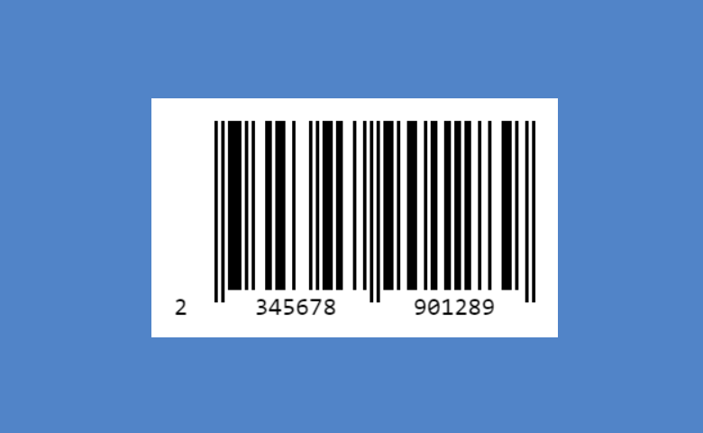

# Barcode

Barcode is the component for the Backendless [UI-Builder](https://backendless.com/developers/#ui-builder), based on the
[JsBarcode](https://github.com/lindell/JsBarcode) library. It allows generating a wide range of barcodes in your application, including Code39, Code128 and other standards.

<p align="center">
  
</p>

## Properties

| Property         | Type                                                                                                                                                                                    | Default value  | Logic            | Data Binding | UI Setting | Description                                                     |
|------------------|-----------------------------------------------------------------------------------------------------------------------------------------------------------------------------------------|----------------|------------------|--------------|------------|-----------------------------------------------------------------|
| Format           | *Select* <br/> "CODE128" \| "EAN13" \| "EAN8" \| "EAN5" \| "EAN2" \| "UPC" \| "CODE39" \| "ITF14" \| "MSI" \| "MSI10" \| "MSI11" \| "MSI1010" \| "MSI1110" \| "Pharmacode" \| "Codabar" | "CODE128"      |                  | NO           | YES        | Controls the format of the barcode.                             |
| Value            | *Text*                                                                                                                                                                                  | "Example 1234" | Value Logic      | YES          | YES        | Controls the value of the barcode.                              |
| Value Visibility | *Checkbox*                                                                                                                                                                              | `true`         |                  | NO           | YES        | Enables showing the value of the barcode.                       |
| Line Color       | *Color*                                                                                                                                                                                 | "#000000"      |                  | NO           | YES        | Controls the color of the bars and the label.                   |
| Background       | *Color*                                                                                                                                                                                 | "#FFFFFF"      | Background Logic | NO           | YES        | Controls the background of the barcode.                         |
| Bar Width        | *Range*                                                                                                                                                                                 | 2              |                  | NO           | YES        | Controls the width of a single bar.                             |
| Height           | *Range*                                                                                                                                                                                 | 80             |                  | NO           | YES        | Controls the height of the barcode.                             |
| Margin           | *Range*                                                                                                                                                                                 | 10             |                  | NO           | YES        | Controls the space margin around the barcode.                   |
| Font             | *Select* <br/> "Monospace" \| "Sans-serif" \| "Serif" \| "Fantasy" \| "Cursive"                                                                                                         | "Monospace"    |                  | NO           | YES        | Specifies the font used for the label in the generated barcode. |
| Font Size        | *Range*                                                                                                                                                                                 | 20             |                  | NO           | YES        | Controls the size of the label.                                 |
| Font Options     | *Select* <br/> "Unset" \| "Bold" \| "Italic" \| "Bold & Italic"                                                                                                                         | "Unset"        |                  | NO           | YES        | Specifies the bold or italic font for the barcode label.        |
| Label            | *Text*                                                                                                                                                                                  |                | Label Logic      | NO           | YES        | Overrides the displayed value.                                  |
| Label Align      | *Select* <br/> "Left" \| "Center" \| "Right"                                                                                                                                            | "Center"       |                  | NO           | YES        | Controls the horizontal alignment of the label.                 |
| Label Position   | *Select* <br/> "Top" \| "Bottom"                                                                                                                                                        | "Bottom"       |                  | NO           | YES        | Controls the vertical position of the label.                    |
| Label Margin     | *Range*                                                                                                                                                                                 | 0              |                  | NO           | YES        | Controls the space between the barcode and the label.           |

## Events

| Name                | Triggers                                             | Context Blocks       |
|---------------------|------------------------------------------------------|----------------------|
| On Click Event      | when the user clicks the mouse or taps the barcode   | Event: `Object`      |
| On Mouse Over Event | when the mouse pointer hovers over the barcode       | Event: `Object`      |
| On Mouse Out Event  | when the mouse pointer leaves the barcode boundaries | Event: `Object`      |

## Actions

| Action               | Inputs          | Returns |
|----------------------|-----------------|---------|
| Set Value to Barcode | value: `String` |         |

## Styles

**Dimensions**

````
@bl-customComponent-barcode-width: max-content;
@bl-customComponent-barcode-image-width: 100%;
````
