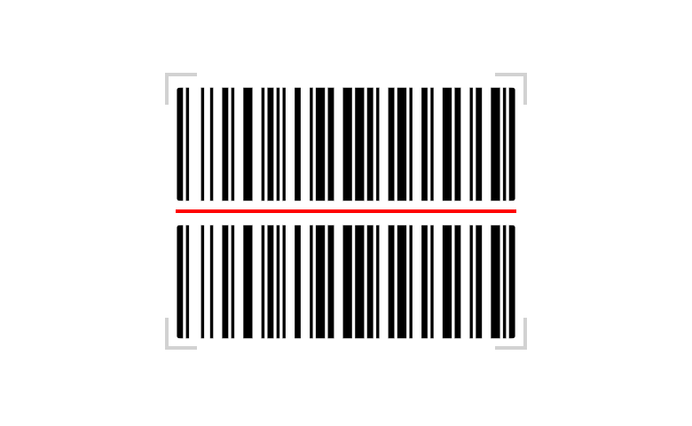

# Barcode Scanner

Barcode Scanner is a component for Backendless [UI-Builder](https://backendless.com/developers/#ui-builder) based on the
external [Html5-QRCode](https://github.com/mebjas/html5-qrcode) library. It allows scanning barcodes directly from a web
application. The component supports a variety of 2D and 1D code formats.

<p align="center">
  
</p>

## Properties

| Property                                               | Type                                    | Default value     | Logic | Data Binding | UI Setting | Description                                         |
|--------------------------------------------------------|-----------------------------------------|-------------------|-------|--------------|------------|-----------------------------------------------------|
| Full Screen <br> `fullScreen`                          | *Checkbox*                              | `false`           |       | NO           | YES        | Enables to set the scanner to the full window size. |
| Frame Per Second <br> `fps`                            | *Number*                                | 10                |       | NO           | YES        | Specifies the frame rate of the scanning.           |
| Scan Box Width <br> `width`                            | *Number*                                | 300               |       | NO           | YES        | Limits the width of the viewfinder area.            |
| Scan Box Height <br> `height`                          | *Number*                                | 150               |       | NO           | YES        | Limits the height of the viewfinder area.           |
| Hide After Scan <br> `hideAfterScan`                   | *Checkbox*                              | `true`            |       | NO           | YES        | Enables to hide the scanner on successful decoding. |
| Scan Button Visibility <br> `scanButtonVisibility`     | *Checkbox*                              | `true`            |       | NO           | YES        | Enables showing the scan button.                    |
| Scan Button Label <br> `scanButtonLabel`               | *Text*                                  | "Scan Barcode"    |       | NO           | YES        | Specifies the label of the scan button.             |
| Upload Button Visibility <br> `uploadButtonVisibility` | *Checkbox*                              | `true`            |       | NO           | YES        | Enables showing the scan image button.              |
| Upload Button Label <br> `uploadButtonLabel`           | *Text*                                  | "Scan Image File" |       | NO           | YES        | Specifies the label of the scan image button.       |
| Aspect Ratio <br> `aspectRatio`                        | *Select* <br/> "16:9" \| "4:3" \| "1:1" | "4:3"             |       | NO           | YES        | Controls the aspect ratio of the video feed.        |

## Events

| Name                       | Triggers                                           | Context Blocks         |
|----------------------------|----------------------------------------------------|------------------------|
| On Decode Error Event      | when decoding returns an error                     | Error: `String`        |
| On Decode Success Event    | when the decode is successful                      | Decoded Code: `String` |
| On Scanner Click Event     | when the user clicks the mouse on the scanner area |                        |
| On Start Scan Failed Event | when an error occurs while starting the scan       | Error: `String`        |

## Actions

| Action                               | Inputs | Returns |
|--------------------------------------|--------|---------|
| Start Scan with Barcode Scanner      |        |         |
| Stop Scan with Barcode Scanner       |        |         |
| Toggle Scan with Barcode Scanner     |        |         |
| Scan Image File with Barcode Scanner |        |         |

## Styles

**Theme**

````
@bl-customComponent-barcodeScanner-themeColor: @themePrimary;
@bl-customComponent-barcodeScanner-disabledColor: @disabledColor;
@bl-customComponent-barcodeScanner-shadowColor: @appComponentShadowColor;
@bl-customComponent-barcodeScanner-borderRadius: @appComponentBorderRadius;
````

**General**

````
@bl-customComponent-barcodeScanner-button-background: @bl-customComponent-barcodeScanner-themeColor;
@bl-customComponent-barcodeScanner-button-color: contrast(@bl-customComponent-barcodeScanner-button-background);
@bl-customComponent-barcodeScanner-button-disabledBackground: @bl-customComponent-barcodeScanner-disabledColor;
@bl-customComponent-barcodeScanner-button-disabledColor: contrast(@bl-customComponent-barcodeScanner-button-disabledBackground);
@bl-customComponent-barcodeScanner-modal-backgroundColor: rgba(0, 0, 0, 0.5);
@bl-customComponent-barcodeScanner-modal-zIndex: 10;
@bl-customComponent-barcodeScanner-button-cursor: pointer;
@bl-customComponent-barcodeScanner-button-userSelect: none;
````

**Dimensions**

````
@bl-customComponent-barcodeScanner-width: 100%;
@bl-customComponent-barcodeScanner-scanner-width: 100%;
@bl-customComponent-barcodeScanner-button-width: 100%;
@bl-customComponent-barcodeScanner-button-minWidth: 64px;
@bl-customComponent-barcodeScanner-button-margin: 20px 10px;
@bl-customComponent-barcodeScanner-button-padding: 6px 16px;
@bl-customComponent-barcodeScanner-video-maxWidth: 100%;
@bl-customComponent-barcodeScanner-video-maxHeight: 100%;
````

**Typography**

````
@bl-customComponent-barcodeScanner-button-lineHeight: 1.75;
@bl-customComponent-barcodeScanner-button-fontSize: 14px;
@bl-customComponent-barcodeScanner-button-textDecoration: none;
````

**Decoration**

````
@bl-customComponent-barcodeScanner-button-borderWidth: 0;
@bl-customComponent-barcodeScanner-button-borderRadius: @bl-customComponent-barcodeScanner-borderRadius;
@bl-customComponent-barcodeScanner-button-shadowColor: @bl-customComponent-barcodeScanner-shadowColor;
@bl-customComponent-barcodeScanner-button-shadowHover: 0px 2px 4px -1px fade(@bl-customComponent-barcodeScanner-button-shadowColor, 20%), 0px 4px 5px 0px fade(@bl-customComponent-barcodeScanner-button-shadowColor, 14%), 0px 1px 10px 0px fade(@bl-customComponent-barcodeScanner-button-shadowColor, 12%);
@bl-customComponent-barcodeScanner-button-shadowDisabled: none;
@bl-customComponent-barcodeScanner-button-outline: none;
````
