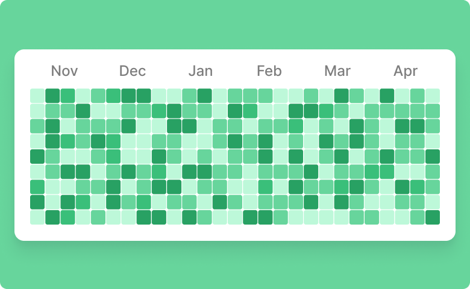

# Calendar Heatmap

This is a component for Backendless [UI-Builder](https://backendless.com/developers/#ui-builder) designer based on the [React Calendar Heatmap](https://github.com/kevinsqi/react-calendar-heatmap) library.

The component allows you to add calendar heatmaps to your UI-Builder application.

<p align="center">
  
</p>

## Properties

| Property                                | Type     | Default value                                          | Logic                           | Data Binding | UI Setting | Description                                                                                                                                                          |
|-----------------------------------------|----------|--------------------------------------------------------|---------------------------------|--------------|------------|----------------------------------------------------------------------------------------------------------------------------------------------------------------------|
| Calendar Data:`calendarData`            | JSON     | `[ { "date": "", "count": 0 } ]`                       | Calendar Data Logic             | YES          | YES        | Allows to specify an array of date and count for the calendar. Watch [Codeless Examples](#examples). Signature of Calendar Data: `{"date": string, "count": number}` |
| Max Count                               | Number   |                                                        | Max Count Logic                 | YES          | YES        | Allows to determine the max count. This is necessary to decide on the max gradation. If it is empty, the max count value  will be selected from the calendar data    |
| Min Count                               | Number   |                                                        | Min Count Logic                 | YES          | YES        | Allows to determine the min count. This is necessary to decide on the min gradation. If it is empty, the min count value  will be selected from the calendar data    |
| Number Days:`numberDays`                | Number   | 365                                                    | Number Days Logic               | YES          | YES        | Allows to determine the number of days on the calendar                                                                                                               |
| Show Month Labels:`showMonthLabels`     | Checkbox | `true`                                                 | Month Labels Visibility Logic   | NO           | YES        | Allows to choose whether or not to show month labels                                                                                                                 |
| Month Labels:`monthLabels`              | Text     | "Jan,Feb,Mar,Apr,May,Jun,<br> Jul,Aug,Sep,Oct,Nov,Dec" | Month Labels Logic              | YES          | YES        | Allows to write month labels                                                                                                                                         |
| Show Weekday Labels:`showWeekdayLabels` | Checkbox | `true`                                                 | Weekday Labels Visibility Logic | NO           | YES        | Allows to choose whether or not to show weekday labels                                                                                                               |
| Weekday Labels:`weekdayLabels`          | Text     | "Sun,Mon,Tues,Wed,Thurs,Fri,Sat"                       | Weekday Labels Logic            | YES          | YES        | Allows to write Weekday labels                                                                                                                                       |
| Color:`color`                           | Color    | "#224b98"                                              | Color Logic                     | YES          | YES        | Allows to select color                                                                                                                                               |
| Legend:`legend`                         | Text     |                                                        | Legend Logic                    | Yes          | YES        | Allows to write legend                                                                                                                                               |
| Height:`height`                         | Text     | "230px"                                                | Height Logic                    | YES          | YES        | Allows to determine component height                                                                                                                                 |
| Width:`width`                           | Text     | "auto"                                                 | Width Logic                     | YES          | YES        | Allows to determine component width                                                                                                                                  |

## Events

| Name                | Triggers                                                 | Context Blocks                 |
|---------------------|----------------------------------------------------------|--------------------------------|
| On Cell Click Event | when the user clicks the mouse or taps the heatmap cell. | count: `Number` date: `String` |

## Styles

**Theme**
````
@bl-customComponent-calendarHeatmap-themeColor: @themePrimary;
````

**Color**
````
@bl-customComponent-calendarHeatmap-textColor: #aaa;
@bl-customComponent-calendarHeatmap-cells-stroke-hover: #555;
````

**Others**
```
@bl-customComponent-calendarHeatmap-padding: 10px;
@bl-customComponent-calendarHeatmap-text: 10px;
@bl-customComponent-calendarHeatmap-cells-outline: 0;
@bl-customComponent-calendarHeatmap-cells-stroke-width-hover: 1px;
@bl-customComponent-calendarHeatmap-legend-container-padding: 0 0 0 100px;
@bl-customComponent-calendarHeatmap-legend-container-margin: 1em 0 1em auto;
```

## <a id="examples"></a> Codeless Examples

Addition  calendar data:


