# Calendar Heatmap

This is a component for Backendless [UI-Builder](https://backendless.com/developers/#ui-builder) designer based on the [Cal-Heatmap](https://cal-heatmap.com/) library.

The component allows you to add calendar heatmaps to your UI-Builder application.

<p align="center">
  
</p>

## Properties

| Property                                          | Type                                                                                                                                                                                                                                                                                                                                                                                                                  | Default Value    | Logic                          | Data Binding | UI Setting | Description                                                                                                                                                                                                                                           |
|---------------------------------------------------|-----------------------------------------------------------------------------------------------------------------------------------------------------------------------------------------------------------------------------------------------------------------------------------------------------------------------------------------------------------------------------------------------------------------------|------------------|--------------------------------|--------------|------------|-------------------------------------------------------------------------------------------------------------------------------------------------------------------------------------------------------------------------------------------------------|
| Source Data URL: `sourceDataUrl`                  | Text                                                                                                                                                                                                                                                                                                                                                                                                                  |                  | Source Data URL Logic          | YES          | YES        | Allows to determine the URL for fetching data from a remote source.                                                                                                                                                                                   |
| Data Type: `dataType`                             | Select [JSON: `json`, CSV: `csv`, TSV: `tsv`, TXT: `txt`]                                                                                                                                                                                                                                                                                                                                                             | JSON: `json`     | Data Type Logic                | YES          | YES        | Allows to select the type of data(JSON, CSV, TSV, TXT).                                                                                                                                                                                               |
| Data: `data`                                      | Json                                                                                                                                                                                                                                                                                                                                                                                                                  |                  | Data Logic                     | YES          | YES        | Allows to to determine data used to populate the calendar.                                                                                                                                                                                            |
| Date Property Name: `datePropName`                | Text                                                                                                                                                                                                                                                                                                                                                                                                                  | "date"           | Date Property Name Logic       | YES          | YES        | Allows to determine the property name of the date. Instruct the calendar how to extract the date property from your data.                                                                                                                             |
| Value Property Name: `valuePropName`              | Text                                                                                                                                                                                                                                                                                                                                                                                                                  | "value"          | Value Property Name Logic      | YES          | YES        | Allows to determine the property name of the value. Instruct the calendar how to extract the value property from your data.                                                                                                                           |
| Default Data Value: `defaultDataValue`            | Text                                                                                                                                                                                                                                                                                                                                                                                                                  |                  |                                | YES          | YES        | Allows to determine the default value when your dataset does not have a value for a date.                                                                                                                                                             |
| Start Date: `startDate`                           | Text                                                                                                                                                                                                                                                                                                                                                                                                                  |                  | Start Date Logic               | YES          | YES        | Allows to determine the start date of the calendar.                                                                                                                                                                                                   |
| Min Date: `minDate`                               | Text                                                                                                                                                                                                                                                                                                                                                                                                                  |                  | Min Date Logic                 | YES          | YES        | Allows to determine the minimum allowed date. Used on navigation, to set a lower bound when navigating backward.                                                                                                                                      |
| Max Date: `maxDate`                               | Text                                                                                                                                                                                                                                                                                                                                                                                                                  |                  | Max Date Logic                 | YES          | YES        | Allows to determine the maximum allowed date. Used on navigation, to set an upper bound when navigating forward.                                                                                                                                      |
| Highlight Date: `highlightDate`                   | Text                                                                                                                                                                                                                                                                                                                                                                                                                  |                  | Highlight Date Logic           | YES          | YES        | Allows to determine the array of dates to highlight. Highlighted subDomain cells are given a special class to make them stand out.                                                                                                                    |
| Range: `range`                                    | Range                                                                                                                                                                                                                                                                                                                                                                                                                 | 12               | Range Logic                    | YES          | YES        | Allows to determine the number of domains to show.                                                                                                                                                                                                    |
| Type: `type`                                      | Select [Year: `year`, Month: `month`, Week: `week`, Day: `day`, Hour: `hour`]                                                                                                                                                                                                                                                                                                                                         | Month: `month`   | Type Logic                     | YES          | YES        | Allows to select the domain's type, representing a time unit(year, month, week, day, hour).                                                                                                                                                           |
| Sub Type: `subType`                               | Select [Year: `year`, Month: `month`, Week: `week`, Day: `day`, Hour: `hour`, ghDay: `ghDay`, xDay: `xDay`]                                                                                                                                                                                                                                                                                                           | Day: `day`       | Sub Type Logic                 | YES          | YES        | Allows to select the SubDomain's type, representing a time unit. This is the time unit represented by each cell in the calendar. The subDomain should always be smaller than the domain type.                                                         |
| Sort: `sort`                                      | Select [ASC: `asc`, DESC: `desc`]                                                                                                                                                                                                                                                                                                                                                                                     | ASC: `asc`       | Sort Logic                     | YES          | YES        | Allows to select the sort order of the domains.                                                                                                                                                                                                       |
| Sub Sort: `subSort`                               | Select [Asc: `asc`, Desc: `desc`]                                                                                                                                                                                                                                                                                                                                                                                     | Asc: `asc`       | Sub Sort Logic                 | YES          | YES        | Allows to select the sort order of the subDomains.                                                                                                                                                                                                    |
| Group: `groupY`                                   | Select [Sum: `sum`, Count: `count`, Min: `min`, Max: `max`, Median: `median`]                                                                                                                                                                                                                                                                                                                                         | Sum: `sum`       |                                | YES          | YES        | Allows to select how to group all values from the same subDomain.                                                                                                                                                                                     |
| Scale Type: `scaleType`                           | Select [Ordinal: `ordinal`, Linear: `linear`, Pow: `pow`, Sqrt: `sqrt`, Log: `log`, Symlog: `symlog`, Categorical: `categorical`, Sequential: `sequential`, Cyclical: `cyclical`, Threshold: `threshold`, Quantile: `quantile`, Quantize: `quantize`, Diverging: `diverging`, Diverging-log: `diverging-log`, Diverging-pow: `diverging-pow`, Diverging-sqrt: `diverging-sqrt`, Diverging-symlog: `diverging-symlog`] | Linear: `linear` | Scale Type Logic               | NO           | YES        | Allows to select the scale type used to encode colors. The color scheme and legend also depend on it.                                                                                                                                                 |
| Scale Domain: `scaleDomain`                       | Text                                                                                                                                                                                                                                                                                                                                                                                                                  |                  | Scale Domain Logic             | YES          | YES        | Allows to determine an array of at least 2 values, specifying the minimum and maximum value of your dataset. By default min and max values of the specified dataset. When using the threshold's type, domain should be a list of different threshold. |
| Scale Opacity Base Color: `scaleOpacityBaseColor` | Color                                                                                                                                                                                                                                                                                                                                                                                                                 |                  | Scale Opacity Base Color Logic | YES          | YES        | Allows to determine the base color.                                                                                                                                                                                                                   |
| Scale Color Scheme: `scaleColorScheme`            | Text                                                                                                                                                                                                                                                                                                                                                                                                                  |                  | Scale Color Scheme Logic       | YES          | YES        | Allows to to determine the color scheme name from d3-scale-chromatic.                                                                                                                                                                                 |
| Scale Color Range: `scaleColorRange`              | Text                                                                                                                                                                                                                                                                                                                                                                                                                  |                  | Scale Color Range Logic        | YES          | YES        | Allows to determine the array of colors. Expects a minimum of 2 colors.                                                                                                                                                                               |
| Gutter: `gutter`                                  | Text                                                                                                                                                                                                                                                                                                                                                                                                                  |                  | Gutter Logic                   | YES          | YES        | Allows to determine the space between each domain, in pixel.                                                                                                                                                                                          |
| Sub Gutter: `subGutter`                           | Number                                                                                                                                                                                                                                                                                                                                                                                                                | 2                | Sub Gutter Logic               | YES          | YES        | Allows to determine the space between each subDomain, in pixel.                                                                                                                                                                                       |
| Vertical Orientation: `verticalOrientation`       | Checkbox                                                                                                                                                                                                                                                                                                                                                                                                              | `false`          | Vertical Orientation Logic     | YES          | YES        | Allows to determine whether the domains should be arranged on top of each other, or side by side.                                                                                                                                                     |
| Dynamic Dimension: `dynamicDimension`             | Checkbox                                                                                                                                                                                                                                                                                                                                                                                                              | `false`          | Dynamic Dimension Logic        | YES          | YES        | Allows to determine whether the domain's should be resized to fit its content.                                                                                                                                                                        |
| Legend: `legend`                                  | Select [None: `none`, Lite: `LegendLite`, Standard: `Legend`]                                                                                                                                                                                                                                                                                                                                                         | None: `none`     | Legend Logic                   | YES          | YES        | Allows to select the legend that will be displayed.                                                                                                                                                                                                   |
| Calendar Label: `calendarLabel`                   | Json                                                                                                                                                                                                                                                                                                                                                                                                                  |                  | Calendar Label Logic           | YES          | YES        | Allows to determine the calendar label.                                                                                                                                                                                                               |
| Cell Height: `cellHeight`                         | Number                                                                                                                                                                                                                                                                                                                                                                                                                | 20               | Cell Height Logic              | YES          | YES        | Allows to determine the height of each subDomain cell, in pixel.                                                                                                                                                                                      |
| Cell Width: `cellWidth`                           | Number                                                                                                                                                                                                                                                                                                                                                                                                                | 20               | Cell Width Logic               | YES          | YES        | Allows to determine the width of each subDomain cell, in pixel.                                                                                                                                                                                       |
| Cell Radius: `cellRadius`                         | Number                                                                                                                                                                                                                                                                                                                                                                                                                | 4                | Cell Radius Logic              | YES          | YES        | Allows to determine the border radius of each subDomain cell, in pixel.                                                                                                                                                                               |
| Label: `label`                                    | Text                                                                                                                                                                                                                                                                                                                                                                                                                  | "MMMM"           |                                | NO           | YES        | Allows to determine the label's content. Look all available format in [Day.js](https://day.js.org/docs/en/display/format).                                                                                                                            |
| Label Position: `labelPosition`                   | Select [Top: `top`, Right: `right`, Bottom: `bottom`, Left: `left`]                                                                                                                                                                                                                                                                                                                                                   | Bottom: `bottom` | Label Position Logic           | YES          | YES        | Allows to select the position of the label, relative to its domain.                                                                                                                                                                                   |
| Label Height: `labelHeight`                       | Number                                                                                                                                                                                                                                                                                                                                                                                                                | 20               | Label Height                   | YES          | YES        | Allows to determine the height of the label, in pixel.                                                                                                                                                                                                |
| Label Width: `labelWidth`                         | Number                                                                                                                                                                                                                                                                                                                                                                                                                | 20               | Label Width Logic              | YES          | YES        | Allows to determine the width of the label, in pixel.                                                                                                                                                                                                 |
| Label Rotation: `labelRotation`                   | Select [None: ``, Left: `left`, Right: `right`]                                                                                                                                                                                                                                                                                                                                                                       | None: ``         | Label Rotation Logic           | YES          | YES        | Allows to select the rotation to obtain a vertical label.                                                                                                                                                                                             |
| Text Align: `textAlign`                           | Select [Start: `start`, Middle: `middle`, End: `end`]                                                                                                                                                                                                                                                                                                                                                                 | Middle: `middle` | Text Align Logic               | YES          | YES        | Allows to select the horizontal alignment of the label.                                                                                                                                                                                               |
| Label Offset X: `labelOffsetX`                    | Number                                                                                                                                                                                                                                                                                                                                                                                                                | 0                | Label Offset X Logic           | YES          | YES        | Allows to determine the label placement along its x-axis.                                                                                                                                                                                             |
| Label Offset Y: `labelOffsetY`                    | Number                                                                                                                                                                                                                                                                                                                                                                                                                | 0                | Label Offset Y Logic           | YES          | YES        | Allows to determine the label placement along its y-axis.                                                                                                                                                                                             |
| Sub Label: `subLabel`                             | Text                                                                                                                                                                                                                                                                                                                                                                                                                  | "DD"             |                                | YES          | YES        | Allows to determine the label of the subDomain. Look all available format in [Day.js](https://day.js.org/docs/en/display/format).                                                                                                                     |
| Sub Color Label: `subColorLabel`                  | Color                                                                                                                                                                                                                                                                                                                                                                                                                 |                  |                                | YES          | YES        | Allows to determine the color of the subDomain's label.                                                                                                                                                                                               |
| Animation Duration: `animationDuration`           | Number                                                                                                                                                                                                                                                                                                                                                                                                                | 200              | Animation Duration Logic       | YES          | YES        | Allows to determine the duration of the various animations. Animation is used each time there is a change in the calendar UI, such as navigation, resize, etc...                                                                                      |
| Theme: `theme`                                    | Select [Light: `light`, Dark: `dark`]                                                                                                                                                                                                                                                                                                                                                                                 | Light: `light`   | Theme Logic                    | YES          | YES        | Allows to toggle between light and dark mode.                                                                                                                                                                                                         |

## Events

| Name                  | Triggers                                                                                                                                       | Context Blocks                                             |
|-----------------------|------------------------------------------------------------------------------------------------------------------------------------------------|------------------------------------------------------------|
| On Cell Click Event   | when on a subDomain cell click.                                                                                                                | event: `Object` timestamp: `String` value: `Any`           |
| Mouse Over Event      | when the mouse enter a subDomain cell.                                                                                                         |                                                            |
| Mouse Out             | when the mouse exit a subDomain cell.                                                                                                          |                                                            |
| Min Date Reached      | after a navigation event, and when the calendar has reached the min date, if set.                                                              |                                                            |
| Max Date Reached      | after a navigation event, and when the calendar has reached the max date, if set.                                                              |                                                            |
| Sub Color Label Logic | This is an event for logic to determine the color of the subDomain's label.                                                                    | timestamp: `String` value: `Any` backgroundColor: `String` |
| Sub Label Logic       | This is an event for the logic to determine the label of the subDomain.                                                                        | element: `Object` timestamp: `String` value: `Any`         |
| Group Logic           | This is an event for the logic to determine how to group all values from the same subDomain.                                                   | value: `Any`                                               |
| Label Logic           | This is an event for logic to determine the label's content. Look all available format in [Day.js](https://day.js.org/docs/en/display/format). | element: `Object` timestamp: `String`                      |

## Actions

| Action      | Inputs                        | Returns |
|-------------|-------------------------------|---------|
| Go Next     | Steps: `Number`               |         |
| Go Previous | Steps: `Number`               |         |
| Jump To     | Date: `Date` Reset: `Boolean` |         |

## Styles

**Domain**
````
@bl-customComponent-calendar-heatmap-domain-bg: transparent;
@bl-customComponent-calendar-heatmap-domain-text: currentColor;
@bl-customComponent-calendar-heatmap-domain-text-size: 10px;
````

**Subdomain**
````
@bl-customComponent-calendar-heatmap-subdomain-bg: #ededed;
@bl-customComponent-calendar-heatmap-subdomain-bg-stroke-hover: #000;
@bl-customComponent-calendar-heatmap-subdomain-bg-stroke-width-hover: 1px;
@bl-customComponent-calendar-heatmap-subdomain-bg-stroke-highlight: #444;
@bl-customComponent-calendar-heatmap-subdomain-bg-stroke-width-highlight: 1px;
@bl-customComponent-calendar-heatmap-subdomain-text-size: 8px;
@bl-customComponent-calendar-heatmap-subdomain-text-pointer-events: none;
````

**Dark Subdomain**
```
@bl-customComponent-calendar-heatmap-dark-subdomain-bg: #2d333b;
@bl-customComponent-calendar-heatmap-dark-subdomain-bg-stroke-hover: #636e7b;
@bl-customComponent-calendar-heatmap-dark-subdomain-bg-stroke-highlight: #768390;
```

**Legends**
```
@bl-customComponent-calendar-heatmap-legends-background: transparent;
@bl-customComponent-calendar-heatmap-legends-color: currentColor;
```

**Tooltip**
```
@bl-customComponent-calendar-heatmap-tooltip-background: #222;
@bl-customComponent-calendar-heatmap-tooltip-color: #bbb;
@bl-customComponent-calendar-heatmap-tooltip-font-size: 12px;
@bl-customComponent-calendar-heatmap-tooltip-line-height: 1.4;
@bl-customComponent-calendar-heatmap-tooltip-padding: 5px 10px;
@bl-customComponent-calendar-heatmap-tooltip-text-align: center;
@bl-customComponent-calendar-heatmap-tooltip-border-radius: 2px;
@bl-customComponent-calendar-heatmap-tooltip-box-shadow: 2px 2px 2px rgba(0, 0, 0, .2);
@bl-customComponent-calendar-heatmap-tooltip-arrow-background: inherit;
@bl-customComponent-calendar-heatmap-tooltip-arrow-height: 8px;
@bl-customComponent-calendar-heatmap-tooltip-arrow-width: 8px;
@bl-customComponent-calendar-heatmap-tooltip-arrow-before-transform-rotate: rotate(45deg);
```

**Dark Tooltip**
```
@bl-customComponent-calendar-heatmap-tooltip-dark-background: #636e7b;
@bl-customComponent-calendar-heatmap-tooltip-dark-color: #cdd9e5;
```

## <a id="examples"></a> Codeless Examples

Terminology:

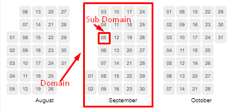

Addition  calendar data:

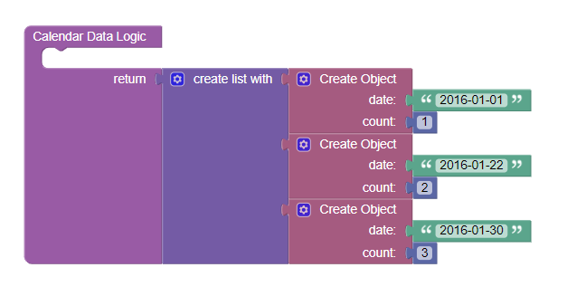

## Usage guide

1. Add the component to the page.

    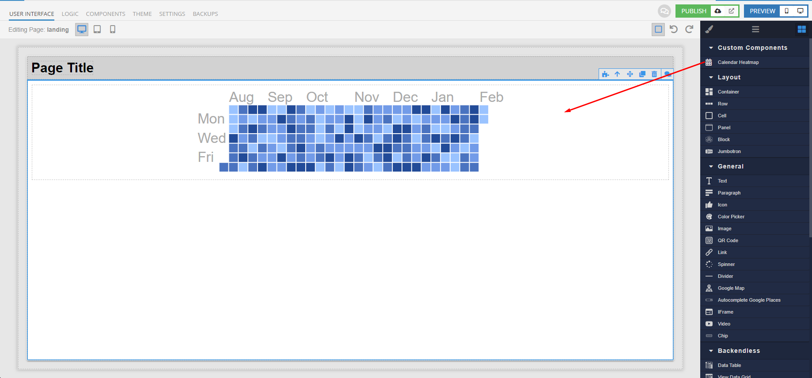

2. Set the data source URL in format JSON, CSV, TSV, and you need select appropriate `Data Type`. Or set JSON in `Data` by UI settings, Logic handler or Data binding.

    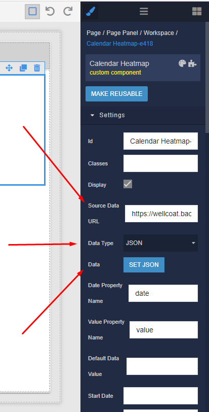

3. Set the `Date Property Name` and `Value Property Name` for component know how to extract the date and value property from your data.

    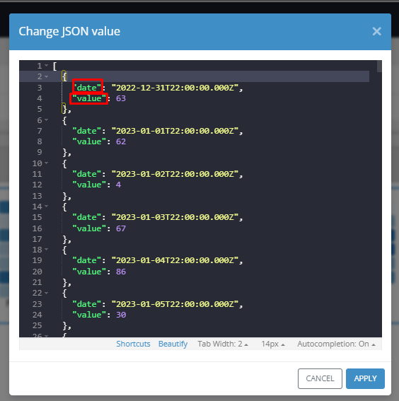
    

4. Set the `Start Date` to determine the calendar's start date. By default, the calendar will start from the current date.

    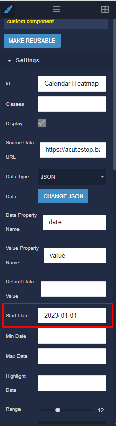

5. Now you can see a result in preview mode.

    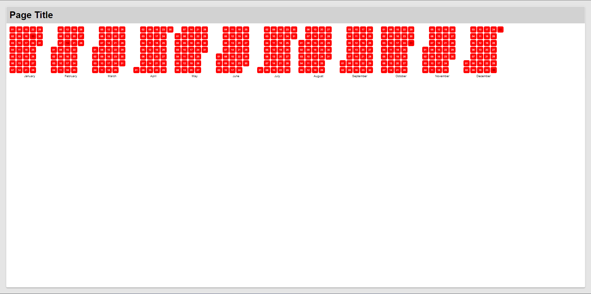

### Scaling the calendar:

1. Set the `Scale Type` to used to encode colors.

    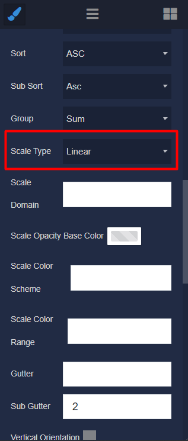

2. Set the min and max value in `Scale Domain`. By default, min and max values of the specified dataset, but if you use url for a data source, you need to set min and max value by your self. When using the threshold's `Scale Type`, domain should be a list of different threshold.

        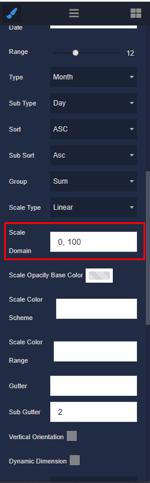

3. Set scheme name from [d3-scale-chromatic](https://github.com/d3/d3-scale-chromatic) in `Scale Color Scheme` or set the array of colors in `Scale Color Range`. Expect a minimum of two colors.

    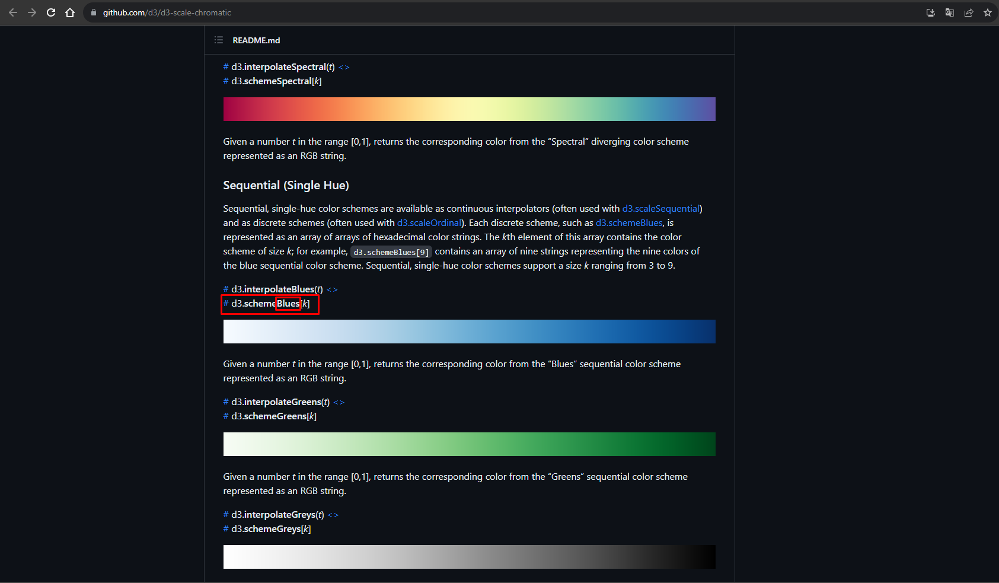
    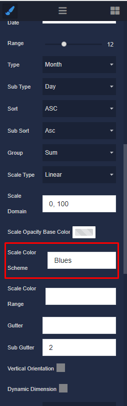

4. Now you can see a result in preview mode.

    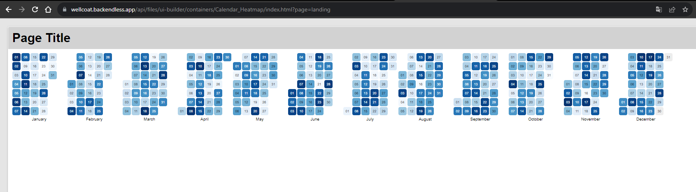
