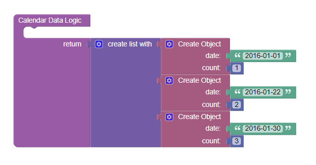

# Calendar Heatmap

This is a component for Backendless [UI-Builder](https://backendless.com/developers/#ui-builder) designer based on the [React Calendar Heatmap](https://github.com/kevinsqi/react-calendar-heatmap) library.

The component allows you to add calendar heatmaps to your UI-Builder application.

## Properties

| Property          | Type    | Default value                                     | Logic                           | Data Binding | UI Setting | Description                                                                                                                                                            |
| ----------------- | ------- | ------------------------------------------------- | ------------------------------- | ------------ | ---------- | ---------------------------------------------------------------------------------------------------------------------------------------------------------------------- |
| calendarData      | JSON    | `[ { "date": "", "count": 0 } ]`                  | Calendar Data Logic             | NO           | YES        | Allows you to specifies an array of date and count for calendar. Watch [Codeless Examples](#Examples). Signature of Calendar Data: `{"data": string, "count": number}` |
| showMonthLabels   | Boolean | `true`                                            | Month Labels Visibility Logic   | NO           | YES        | Allows you to choose whether or not to show month labels                                                                                                               |
| monthLabels       | String  | "Jan,Feb,Mar,Apr,May,Jun,Jul,Aug,Sep,Oct,Nov,Dec" | Month Labels Logic              | YES          | YES        | Allows you to write month labels                                                                                                                                       |
| showWeekdayLabels | Boolean | `true`                                            | Weekday Labels Visibility Logic | NO           | YES        | Allows you to choose whether or not to show weekday labels                                                                                                             |
| weekdayLabels     | String  | "Sun,Mon,Tues,Wed,Thurs,Fri,Sat"                  | Weekday Labels Logic            | YES          | YES        | Allows you to write Weekday labels                                                                                                                                     |
| color             | String  |                                                   | Color Logic                     | YES          | YES        | Allows you to selected color                                                                                                                                           |
| legend            | String  |                                                   | Legend Logic                    | Yes          | YES        | Allows you to write legend                                                                                                                                             |

## Events

| Name                | Triggers                                                   | Context Blocks                 |
| ------------------- | ---------------------------------------------------------- | ------------------------------ |
| On Cell Click Event | when the user clicks the mouse or taps the heat pamp cell. | count: `Number` date: `String` |

## Styles

**Theme**
````
@bl-customComponent-calendarHeatmap-themeColor: @themePrimary;
````

**Color**
````
@bl-customComponent-calendarHeatmap-textColor: #aaa;
````

## <a id="Examples"></a> Codeless Examples

Addition  calendar data:


