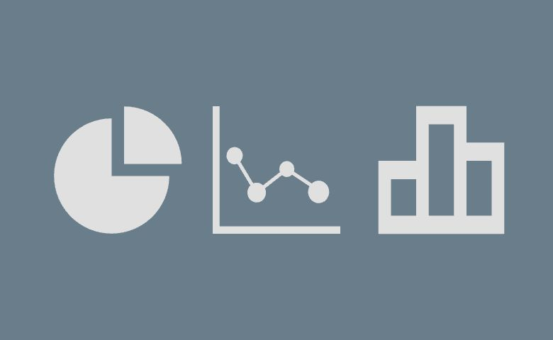
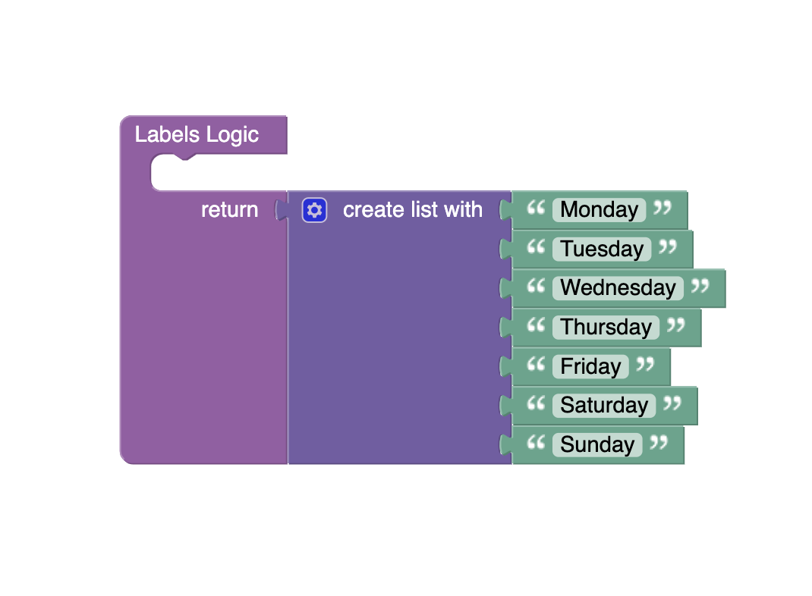
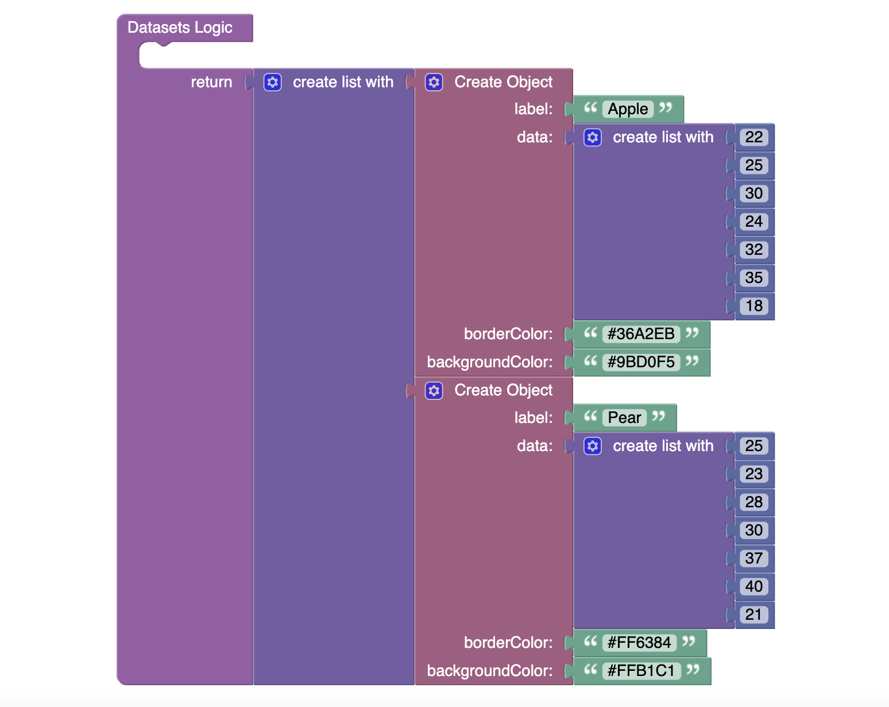
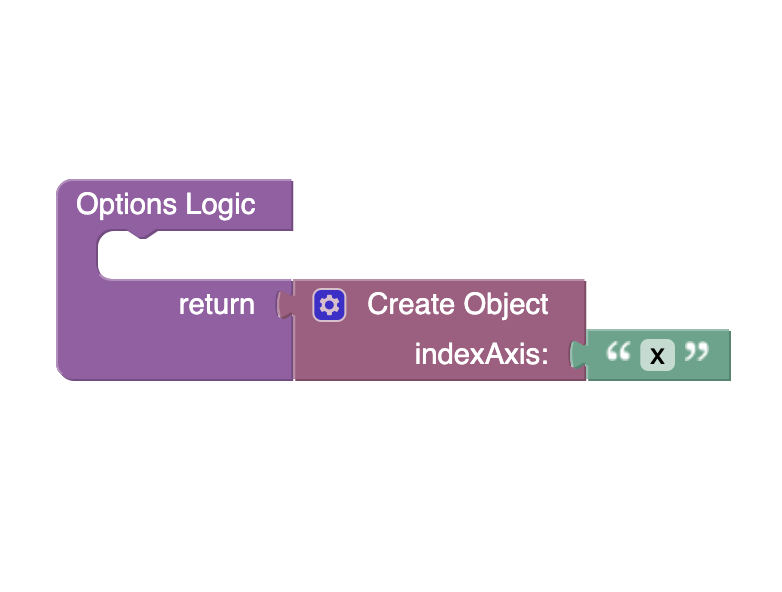

# Category Chart
The Category Chart component allows you to display data in the form of charts. You can also choose a chart type. Also, the [chart.js](https://www.chartjs.org/) library is used to create this component.

<p align="center">
  
</p>

## Demo

View an example of how to install this component and how it works in your UI [here](https://app.arcade.software/share/qeQLsr7t4M9JhBT5pTp9).

## Properties

| Property                                          | Type                                              | Default value                                                                                                                                                                                                                                                                                                     | Logic                  | Data Binding | UI Setting | Description                                                                                                                                                                                                                                                           |
|---------------------------------------------------|---------------------------------------------------|-------------------------------------------------------------------------------------------------------------------------------------------------------------------------------------------------------------------------------------------------------------------------------------------------------------------|------------------------|--------------|------------|-----------------------------------------------------------------------------------------------------------------------------------------------------------------------------------------------------------------------------------------------------------------------|
| Disabled <br> `disabled`                          | *Checkbox*                                        | `false`                                                                                                                                                                                                                                                                                                           | Disabled Logic         | YES          | YES        | This logic allows to disable the component.                                                                                                                                                                                                                           |
| Height <br> `height`                              | *Text*                                            | `400px`                                                                                                                                                                                                                                                                                                           | Height Logic           | YES          | YES        | This logic allows to determine the height of a component.                                                                                                                                                                                                             |
| Width <br> `width`                                | *Text*                                            | `500px`                                                                                                                                                                                                                                                                                                           | Width Logic            | YES          | YES        | This logic allows to determine the width of a component.                                                                                                                                                                                                              |
| Type <br> `type`                                  | *Select* <br> [Bar:`bar`, Line:`line`, Pie:`pie`] | Bar:`bar`                                                                                                                                                                                                                                                                                                         |                        | NO           | YES        | Controls the chart type of the component.                                                                                                                                                                                                                             |
| Title Visibility <br> `titleVisibility`           | *Checkbox*                                        | `true`                                                                                                                                                                                                                                                                                                            |                        | NO           | YES        | Controls whether the chart title is hidden or displayed by default.                                                                                                                                                                                                   |
| Title Font Size <br> `titleFontSize`              | *Number*                                          | 20                                                                                                                                                                                                                                                                                                                |                        | NO           | YES        | Controls the font size of the chart title.                                                                                                                                                                                                                            |
| Title <br> `title`                                | *Text*                                            | `Fruit sale`                                                                                                                                                                                                                                                                                                      | Title Logic            | Title Logic  | YES        | This logic allows to determine the title of the chart.                                                                                                                                                                                                                |
| Background Color <br> `backgroundColor`           | *Color*                                           | `rgba(163,182,218,0.13)`                                                                                                                                                                                                                                                                                          | Background Color Logic | YES          | YES        | This logic allows to determine the background color of the chart.                                                                                                                                                                                                     |
| Legend Visibility <br> `legendVisibility`         | *Checkbox*                                        | `true`                                                                                                                                                                                                                                                                                                            |                        | NO           | YES        | Controls whether the chart legend is hidden or displayed by default.                                                                                                                                                                                                  |
| Y Grid Line Visibility <br> `yGridLineVisibility` | *Checkbox*                                        | `true`                                                                                                                                                                                                                                                                                                            |                        | NO           | YES        | Controls whether the chart's vertical grid line is hidden or displayed by default.                                                                                                                                                                                    |
| X Grid Line Visibility <br> `xGridLineVisibility` | *Checkbox*                                        | `true`                                                                                                                                                                                                                                                                                                            |                        | NO           | YES        | Controls whether the chart's horizontal grid line is hidden or displayed by default.                                                                                                                                                                                  |
| Grid Lines Color <br> `gridLinesColor`            | *Color*                                           | `#a5adba`                                                                                                                                                                                                                                                                                                         |                        | NO           | YES        | Controls the color of the chart grid lines.                                                                                                                                                                                                                           |
| Grid Lines Width <br> `gridLinesWidth`            | *Number*                                          | 2                                                                                                                                                                                                                                                                                                                 |                        | NO           | YES        | Controls the thickness of the chart grid lines.                                                                                                                                                                                                                       |
| Labels <br> `labels`                              | *JSON*                                            | `["Monday", "Tuesday", "Wednesday", "Thursday", "Friday", "Saturday", "Sunday"]`                                                                                                                                                                                                                                  | Labels Logic           | YES          | YES        | This logic allows to set chart labels that are used to indicate the index axis (x-axis by default). Watch [Codeless Examples](#examples). <br> Signature of labels: list of strings `[String, String]`.                                                               |
| Datasets <br> `datasets`                          | *JSON*                                            | `[ {` <br> `"label": "Apple",` <br> `"data": [22, 25, 30, 24, 32, 35, 18],` <br> `"borderColor": "#36A2EB",` <br> `"backgroundColor": "#9BD0F5"` <br> `}, {` <br> `"label": "Pear",` <br> `"data": [25, 23, 28, 30, 37, 40, 21],` <br> `"borderColor": "#FF6384",` <br> `"backgroundColor": "#FFB1C1"` <br> `} ]` | Datasets Logic         | YES          | YES        | This logic allows to set datasets for drawing the chart. Watch [Codeless Examples](#examples). <br> Signature of datasets: list of objects `{label: String, data: Array, borderColor: String \| Array, backgroundColor: String \| Array}`.                            |
| Options <br> `options`                            | *JSON*                                            | `{ "indexAxis": "x" }`                                                                                                                                                                                                                                                                                            | Options Logic          | YES          | YES        | This logic allows to set additional chart options. Watch [Codeless Examples](#examples). <br> Signature of options: object `{indexAxis: x \| y}`. <br> More options in the [chart.js library documentation](https://www.chartjs.org/docs/4.3.0/general/options.html). |

## Styles

**Dimensions**
````
@bl-customComponent-categoryChart-disabled-opacity: 0.38;
````

## <a id="examples"></a> Codeless Examples

Add labels to component:



<details>
<summary>Codeless Block XML</summary>

```
<block xmlns="http://www.w3.org/1999/xhtml" type="lists_create_with" id="#z`n6!aH9])82aC?2ST;" x="300.3515625" y="246"><mutation items="7"></mutation><value name="ADD0"><block type="text" id="mWN~jwJXx)~b?|Za)qdC"><field name="TEXT">Monday</field></block></value><value name="ADD1"><block type="text" id="V)1X-g+ygILbSUbuuIeU"><field name="TEXT">Tuesday</field></block></value><value name="ADD2"><block type="text" id="$~/axmZ]$wD@cO9{{AKs"><field name="TEXT">Wednesday</field></block></value><value name="ADD3"><block type="text" id="%=`J|-*7`M^!g.HMVVOd"><field name="TEXT">Thursday</field></block></value><value name="ADD4"><block type="text" id="`MI!W!LW3GysELB@]#7@"><field name="TEXT">Friday</field></block></value><value name="ADD5"><block type="text" id="qDJwh%,Og48y$oo((qw)"><field name="TEXT">Saturday</field></block></value><value name="ADD6"><block type="text" id="(~/1Un7w:G$f{(6,%csb"><field name="TEXT">Sunday</field></block></value></block>
```
</details>

Add datasets to component:



<details>
<summary>Codeless Block XML</summary>

```
<block xmlns="http://www.w3.org/1999/xhtml" type="lists_create_with" id="`pUanX9j%oLGO}8eN[Db" x="241.0078125" y="56"><mutation items="3"></mutation><value name="ADD0"><block type="create_object" id="Q`cKX%ZTG:RY9}0H,x6%"><mutation><properties><item id="property" prop-name="label"></item><item id="property" prop-name="data"></item><item id="property" prop-name="borderColor"></item><item id="property" prop-name="backgroundColor"></item></properties></mutation><value name="create_object_mutator_container_properties_stack_property0"><block type="text" id="C3}o5Ts{FxT6rKw:/yJf"><field name="TEXT">Apple</field></block></value><value name="create_object_mutator_container_properties_stack_property1"><block type="lists_create_with" id="jg*jxpD3!6mR|cflmQgq"><mutation items="7"></mutation><value name="ADD0"><block type="math_number" id="Q`1#ZS:A:0jqq?UDXrub"><field name="NUM">22</field></block></value><value name="ADD1"><block type="math_number" id="zuo[`{t*yq@_7uEBhin~"><field name="NUM">25</field></block></value><value name="ADD2"><block type="math_number" id="B0nS#?{g%/R$-6IkVmzE"><field name="NUM">30</field></block></value><value name="ADD3"><block type="math_number" id="u4O{dRY+iasK7n5M54Lc"><field name="NUM">24</field></block></value><value name="ADD4"><block type="math_number" id="{}YC/l0dty4j3|{dg|(g"><field name="NUM">32</field></block></value><value name="ADD5"><block type="math_number" id="da!f+50W#/B]FymW?7]8"><field name="NUM">35</field></block></value><value name="ADD6"><block type="math_number" id="VEHus:CeNVY3Ghfn0m-X"><field name="NUM">18</field></block></value></block></value><value name="create_object_mutator_container_properties_stack_property2"><block type="text" id="(,yYFTpN8Pt}DL9~nEXa"><field name="TEXT">#36A2EB</field></block></value><value name="create_object_mutator_container_properties_stack_property3"><block type="text" id="l](iCnk2df!jJ[1-w0Td"><field name="TEXT">#9BD0F5</field></block></value></block></value><value name="ADD1"><block type="create_object" id="T8g:,X*qVI0m+O0tLHlZ"><mutation><properties><item id="property" prop-name="label"></item><item id="property" prop-name="data"></item><item id="property" prop-name="borderColor"></item><item id="property" prop-name="backgroundColor"></item></properties></mutation><value name="create_object_mutator_container_properties_stack_property0"><block type="text" id="y2AB(-$UDWvhl:4G5_G{"><field name="TEXT">Pear</field></block></value><value name="create_object_mutator_container_properties_stack_property1"><block type="lists_create_with" id="7,SaZD?;igd#eJ;JE)t5"><mutation items="7"></mutation><value name="ADD0"><block type="math_number" id="(uKoZ`=4%q0AsfuV4DQU"><field name="NUM">25</field></block></value><value name="ADD1"><block type="math_number" id="I9-kc2$}=rPgwa;L=^c5"><field name="NUM">23</field></block></value><value name="ADD2"><block type="math_number" id="ulqWak?YyF$W8/hgkcgu"><field name="NUM">28</field></block></value><value name="ADD3"><block type="math_number" id="8L.y#z)*Fx~{*xu{M5a`"><field name="NUM">30</field></block></value><value name="ADD4"><block type="math_number" id="!@,%RRjX:a.na?lBFeJ]"><field name="NUM">37</field></block></value><value name="ADD5"><block type="math_number" id="unx!*J%=^4*R9CIlG1AI"><field name="NUM">40</field></block></value><value name="ADD6"><block type="math_number" id="5{zS4pz;U4|rV2kGN0SA"><field name="NUM">21</field></block></value></block></value><value name="create_object_mutator_container_properties_stack_property2"><block type="text" id="eD,#8]HM-*7!9XoN-}[w"><field name="TEXT">#FF6384</field></block></value><value name="create_object_mutator_container_properties_stack_property3"><block type="text" id="HpYe[!V7v=k?,}s$WG#}"><field name="TEXT">#FFB1C1</field></block></value></block></value><value name="ADD2"><block type="create_object" id="xJjmQd{nQG-e2cTD=K4G"><mutation><properties><item id="property" prop-name="label"></item><item id="property" prop-name="data"></item><item id="property" prop-name="borderColor"></item><item id="property" prop-name="backgroundColor"></item></properties></mutation><value name="create_object_mutator_container_properties_stack_property0"><block type="text" id="xG3)`?N#Zjwgs(8^dyj/"><field name="TEXT">Mango</field></block></value><value name="create_object_mutator_container_properties_stack_property1"><block type="lists_create_with" id=":=^t`0ihNOPENO[KgkU?"><mutation items="7"></mutation><value name="ADD0"><block type="math_number" id="uft+Uok^1]g=$$JnnnTY"><field name="NUM">50</field></block></value><value name="ADD1"><block type="math_number" id="i-oetEkWe|wT5od74dR,"><field name="NUM">55</field></block></value><value name="ADD2"><block type="math_number" id=",g}~w*lxZ(ony^kFWZ[x"><field name="NUM">53</field></block></value><value name="ADD3"><block type="math_number" id="Fgu[]:*Hpz;CVu{aTR{C"><field name="NUM">49</field></block></value><value name="ADD4"><block type="math_number" id="!!@ls3YVN9zZZcZeeC2x"><field name="NUM">67</field></block></value><value name="ADD5"><block type="math_number" id="V9ges@GVkfFDnVvhLY0v"><field name="NUM">70</field></block></value><value name="ADD6"><block type="math_number" id="d`SE0d*`JubtrgJU/M2a"><field name="NUM">38</field></block></value></block></value><value name="create_object_mutator_container_properties_stack_property2"><block type="text" id="%7l)Dc~=BN!%jq/59Lp~"><field name="TEXT">orange</field></block></value><value name="create_object_mutator_container_properties_stack_property3"><block type="text" id="XwAfrUIYvzlU*h^vpkfA"><field name="TEXT">red</field></block></value></block></value></block>
```
</details>

Add options to component:



<details>
<summary>Codeless Block XML</summary>

```
<block xmlns="http://www.w3.org/1999/xhtml" type="create_object" id="796=**sBs]~tQ^,@/Y2C" x="185.6796875" y="231"><mutation><properties><item id="property" prop-name="indexAxis"></item></properties></mutation><value name="create_object_mutator_container_properties_stack_property0"><block type="text" id=":ZJPjrN6}~f`cc(W3)lf"><field name="TEXT">x</field></block></value></block>
```
</details>
