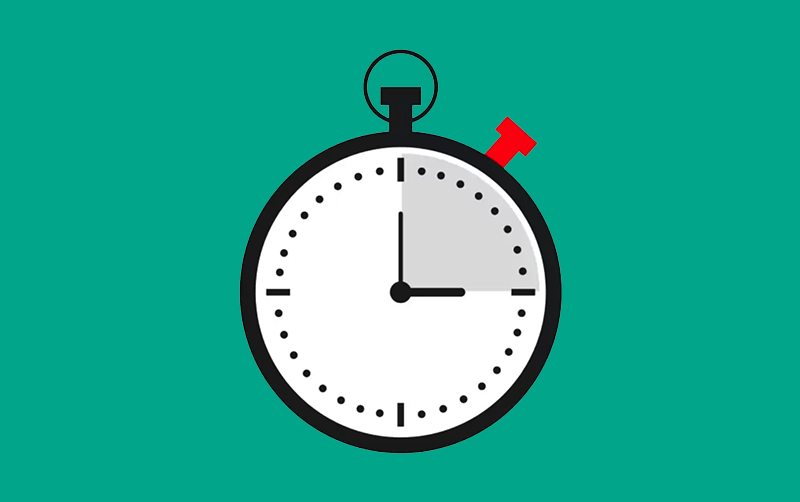

# Clock

This is a component for Backendless [UI-Builder](https://backendless.com/developers/#ui-builder). It allows display time, use stopwatch and timer.

<p align="center">
  
</p>

## Properties

| Property                                     | Type                                                            | Default Value      | Logic                    | Data Binding | UI Setting | Description                                                                                                       |
|----------------------------------------------|-----------------------------------------------------------------|--------------------|--------------------------|--------------|------------|-------------------------------------------------------------------------------------------------------------------|
| Type: `type`                                 | Select [Clock: `clock`, Stopwatch: `stopwatch`, Timer: `timer`] | Clock: `clock`     |                          | NO           | YES        | Allows to determine the function of the component                                                                 |
| Time Variant: `timeVariant`                  | Select [HH:MM:SS: `hhmmss`, HH:MM: `hhmm`, HH: `hh`]            | HH:MM:SS: `hhmmss` |                          | NO           | YES        | Allows to determine variant of displaying time                                                                    |
| Stopwatch Scale: `stopwatchScale`            | Number                                                          | 3                  |                          | NO           | YES        | Allows to determine the scale of stopwatch seconds                                                                |
| Timer Date: `timerDate`                      | Text                                                            |                    | Timer Date Logic         | YES          | YES        | Allows you to specify the date, time, and time zone when the timer will expire. Signature `MM.DD.YY HH:MM:SS UTC` |
| Animation Duration (ms): `animationDuration` | Number                                                          | 400                | Animation Duration Logic | YES          | YES        | Allows to determine the duration of the animation to change the time.                                             |

## Events

| Name         | Triggers            | Context Blocks |
|--------------|---------------------|----------------|
| On Timer End | when the timer ends |                |

## Actions

| Action          | Inputs | Returns |
|-----------------|--------|---------|
| Start Stopwatch |        |         |
| Stop Stopwatch  |        |         |
| Reset Stopwatch |        |         |

## Styles

**Dimensions**

```
@bl-customComponent-clock-font-size: 16px;
```

**Color**

```
@bl-customComponent-clock-text-color: @appTextColor;
```
