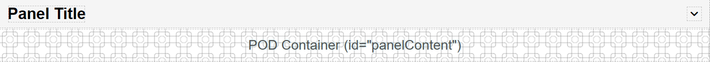
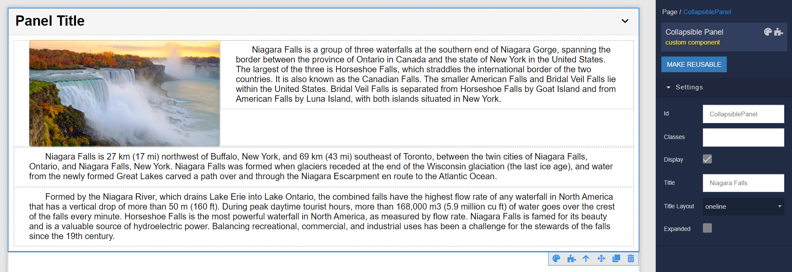
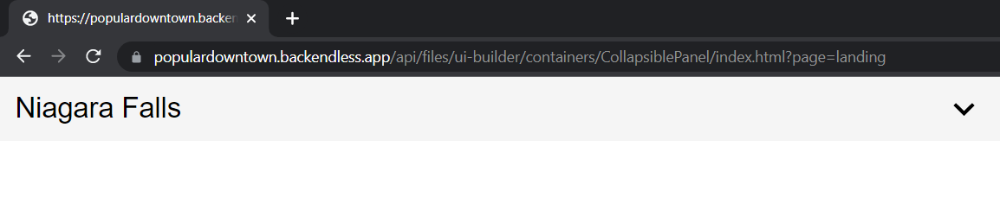
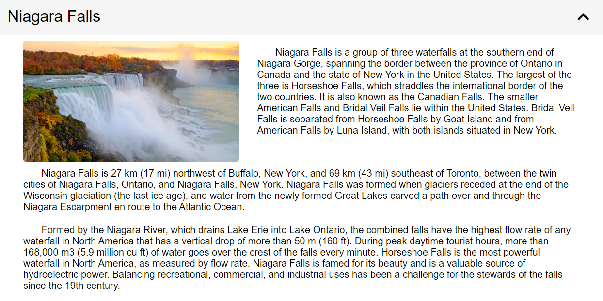

# Collapsible Panel

Collapsible Panel is the component that can be used in Backendless [UI-Builder](https://backendless.com/developers/#ui-builder). This component displays summary information and upon selecting the panel, it expands to display the full expansion panel.

<p align="center">
  
</p>

## Properties

| Property                          | Type       | Default value | Logic       | Data Binding | UI Setting | Description                                                                                                                               |
|-----------------------------------|------------|---------------|-------------|--------------|------------|-------------------------------------------------------------------------------------------------------------------------------------------|
| Title <br> `title`                | *Text*     | `Panel Title` | Title Logic | YES          | YES        | The logic to determine the title of the panel.                                                                                            |
| Multi-line Title <br> `multiline` | *Checkbox* | `false`       |             | NO           | YES        | Controls whether the title layout 'multi-line' for multiple lines with word wrapping or 'one-line' for a single line without line breaks. |
| Expanded <br> `isExpanded`        | *Checkbox* | `false`       |             | NO           | YES        | Controls whether the component is expanded or collapsed.                                                                                  |

## Events

| Name              | Triggers                                | Context Blocks |
|-------------------|-----------------------------------------|----------------|
| On Expand Event   | when the user opens the panel section.  |                |
| On Collapse Event | when the user closes the panel section. |                |

## Actions

| Action           | Inputs | Returns |
|------------------|--------|---------|
| Expand Content   |        |         |
| Collapse Content |        |         |

## Styles

**Theme**
````
@bl-customComponent-collapsiblePanel-theme: @themePrimary;
@bl-customComponent-collapsiblePanel-themeTextColor: @appTextColor;
````

**Dimensions**
```
@bl-customComponent-collapsiblePanel-width: 100%;
@bl-customComponent-collapsiblePanel-padding: 10px 14px;
@bl-customComponent-collapsiblePanel-content-open-maxHeight: 1000px;
@bl-customComponent-collapsiblePanel-title-fontSize: 26px;
@bl-customComponent-collapsiblePanel-title-icon-width: 1.5em;
@bl-customComponent-collapsiblePanel-title-icon-height: 1.5em;
```

**Colors**
````
@bl-customComponent-collapsiblePanel-background-color: if(@isLightTheme, rgba(0, 0, 0, 0.04), rgba(255, 255, 255, 0.04));
@bl-customComponent-collapsiblePanel-hover-background-color: fade(@bl-customComponent-collapsiblePanel-background-color, 20%);
@bl-customComponent-collapsiblePanel-title-icon-color: @bl-customComponent-collapsiblePanel-themeTextColor;
````

**Other**
````
@bl-customComponent-collapsiblePanel-content-animationName-open: collapsiblePanel-animation-open;
@bl-customComponent-collapsiblePanel-content-animationName-close: collapsiblePanel-animation-close;
@bl-customComponent-collapsiblePanel-content-animationDuration: 0.3s;
@bl-customComponent-collapsiblePanel-title-icon-transition: all 0.3s ease-in-out;
@bl-customComponent-collapsiblePanel-title-icon-transform: rotateZ(180deg);
@bl-customComponent-collapsiblePanel-cursor: pointer;
````

## Examples

Below is an Example highlighting how to use the Collapsible Panel component:

<p align="center">
  
</p>

<p align="center">
  
  <br>
  
</p>
