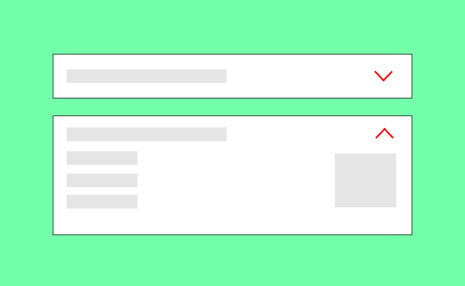
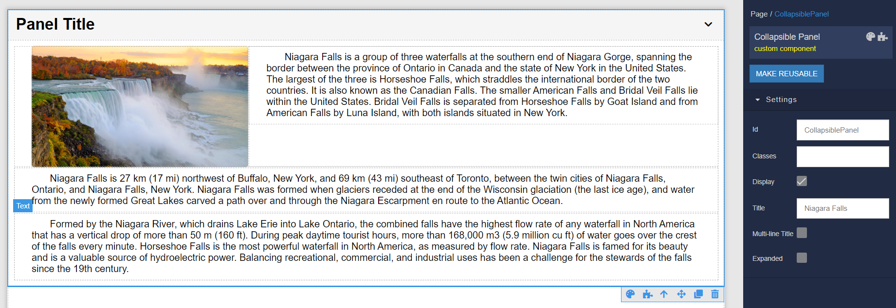

# Collapsible Panel

Collapsible Panel acts as a container for different elemenets that can be used in the Backendless [UI-Builder](https://backendless.com/developers/#ui-builder). By default, this component always loads in the nonexpanded state, and when it is clicked, the panel gets expanded. Once the panel is expanded it displays the content that must be set in the UI-Builder.

<p align="center">
  
</p>

You can add any elements supported in the UI-Builder to the component by dragging-and-dropping them to the content area of the Collapsible Panel. Those elements can be text, images, and even other custom components. For instance, the example below contains two elements(**Text** and **Color Picker**) added to the Collapsible Panel:

<p align="center">
  
</p>

As you can see, once the page is loaded and the panel is expanded, elements added to the container are visible and fully functional:

<p align="center">
  
</p>

## Properties

| Property                        | Type   | Default value | Logic              | Data Binding | UI Setting | Description                                           |
|---------------------------------|--------|---------------|--------------------|--------------|------------|-------------------------------------------------------|
| Title <br> `title`              | *Text* | `Panel Title` | Title Logic        | YES          | YES        | Sets the title for the panel.        |

## Events

| Name              | Triggers                                | Context Blocks |
|-------------------|-----------------------------------------|----------------|
| On Expand Event   | when the user opens the panel section.  |                |
| On Collapse Event | when the user closes the panel section. |                |

## Actions

| Action           | Inputs | Returns |
|------------------|--------|---------|
| Expand Content   |        |         |
| Collapse Content |        |         |

## Styles

**Theme**
````
@bl-customComponent-collapsiblePanel-theme: @themePrimary;
@bl-customComponent-collapsiblePanel-themeTextColor: @appTextColor;
````

**Dimensions**
```
@bl-customComponent-collapsiblePanel-width: 100%;
@bl-customComponent-collapsiblePanel-padding: 10px 14px;
@bl-customComponent-collapsiblePanel-content-open-maxHeight: 1000px;
@bl-customComponent-collapsiblePanel-title-fontSize: 26px;
@bl-customComponent-collapsiblePanel-title-icon-width: 1.5em;
@bl-customComponent-collapsiblePanel-title-icon-height: 1.5em;
```

**Colors**
````
@bl-customComponent-collapsiblePanel-background-color: if(@isLightTheme, rgba(0, 0, 0, 0.04), rgba(255, 255, 255, 0.04));
@bl-customComponent-collapsiblePanel-hover-background-color: fade(@bl-customComponent-collapsiblePanel-background-color, 20%);
@bl-customComponent-collapsiblePanel-title-icon-color: @bl-customComponent-collapsiblePanel-themeTextColor;
````

**Other**
````
@bl-customComponent-collapsiblePanel-content-animationName-open: collapsiblePanel-animation-open;
@bl-customComponent-collapsiblePanel-content-animationName-close: collapsiblePanel-animation-close;
@bl-customComponent-collapsiblePanel-content-animationDuration: 0.3s;
@bl-customComponent-collapsiblePanel-title-icon-transition: all 0.3s ease-in-out;
@bl-customComponent-collapsiblePanel-title-icon-transform: rotateZ(180deg);
@bl-customComponent-collapsiblePanel-cursor: pointer;
````

## Examples

Below is an Example highlighting how to use the Collapsible Panel component:

<p align="center">
  
</p>

<p align="center">
  
  <br>
  
</p>
