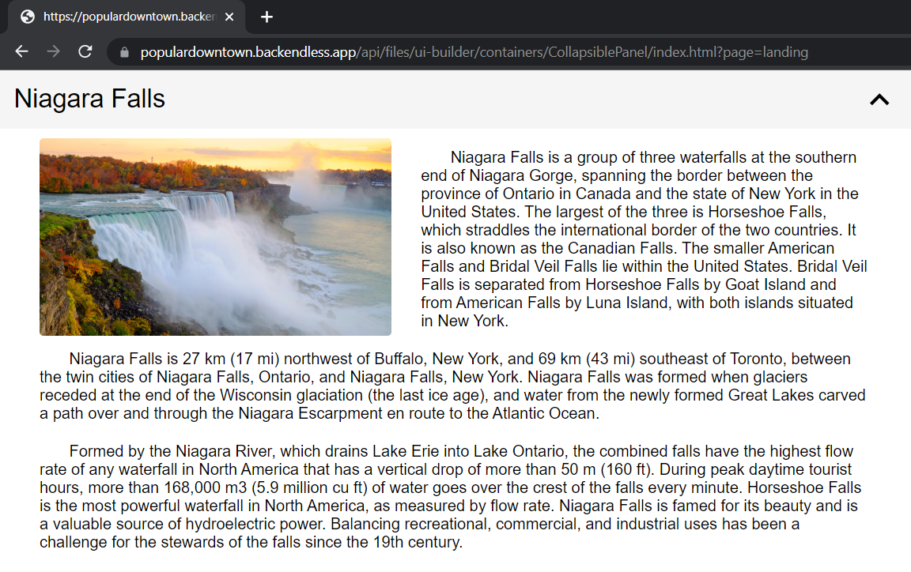

# CollapsiblePanel

CollapsiblePanel is the component that can be used in Backendless [UI-Builder](https://backendless.com/developers/#ui-builder). This component displays summary information and upon selecting the panel, it expands to display the full expansion panel.

<p align="center">
  
</p>

## Properties

| Property                           | Type    | Default value | Logic                         | Data Binding | UI Setting | Description                                           |
|------------------------------------|---------|---------------|-------------------------------|--------------|------------|-------------------------------------------------------|
| Width <br> `width`                 | *Text*  |               |                               | NO           | YES        | Controls the width of the panel.                      |
| Title <br> `titleDefault`          | *Text*  | `Panel Title` | Title Logic                   | YES          | YES        | The logic to determine the title of the panel.        |
| Title On Open <br> `titleOpen`     | *Text*  |               | On Open The Panel Title Logic | YES          | YES        | The logic to determine the title on opened the panel. |
| Title Background <br> `background` | *Color* |               |                               | NO           | YES        | Controls the background color of the panel title.     |
| Title Color <br> `color`           | *Color* |               |                               | NO           | YES        | Controls the color of the panel title.                |
| Title Font Size <br> `fontSize`    | *Text*  |               |                               | NO           | YES        | Controls the font size of the panel title.            |
| Title Padding <br> `padding`       | *Text*  |               |                               | NO           | YES        | Controls the padding of the panel title.              |
| Icon Color <br> `iconColor`        | *Color* |               |                               | NO           | YES        | Controls the color of the panel title icon.           |

## Events

| Name                 | Triggers                                          | Context Blocks |
|----------------------|---------------------------------------------------|----------------|
| On Open Panel Event  | Triggered when the user opens the panel section.  |                |
| On Close Panel Event | Triggered when the user closes the panel section. |                |

## Actions

| Action                           | Inputs | Returns |
|----------------------------------|--------|---------|
| Show Content Of CollapsiblePanel |        |         |
| Hide Content Of CollapsiblePanel |        |         |

## Styles

**Theme**
````
@bl-customComponent-collapsiblePanel-theme: @themePrimary;
@bl-customComponent-collapsiblePanel-themeTextColor: @appTextColor;
````

**Dimensions**
```
@bl-customComponent-collapsiblePanel-width: 100%;
@bl-customComponent-collapsiblePanel-padding: 10px 14px;
@bl-customComponent-collapsiblePanel-content-open-maxHeight: 100%;
@bl-customComponent-collapsiblePanel-title-fontSize: 26px;
@bl-customComponent-collapsiblePanel-title-icon-width: 1.5em;
@bl-customComponent-collapsiblePanel-title-icon-height: 1.5em;
```

**Colors**
````
@bl-customComponent-collapsiblePanel-background-color: if(@isLightTheme, rgba(0, 0, 0, 0.04), rgba(255, 255, 255, 0.04));
@bl-customComponent-collapsiblePanel-hover-background-color: fade(@bl-customComponent-collapsiblePanel-background-color, 20%);
@bl-customComponent-collapsiblePanel-title-icon-color: @bl-customComponent-collapsiblePanel-themeTextColor;
````

**Other**
````
@bl-customComponent-collapsiblePanel-content-animationName-open: collapsiblePanel-animation-open;
@bl-customComponent-collapsiblePanel-content-animationName-close: collapsiblePanel-animation-close;
@bl-customComponent-collapsiblePanel-content-animationDuration: 0.3s;
@bl-customComponent-collapsiblePanel-title-icon-transition: all 0.3s ease-in-out;
@bl-customComponent-collapsiblePanel-title-icon-transform: rotateZ(180deg);
@bl-customComponent-collapsiblePanel-cursor: pointer;
````

## Examples

Below is an Example highlighting how to use the CollapsiblePanel component:

<p align="center">
  
</p>

<p align="center">
  
  <br>
  
</p>
