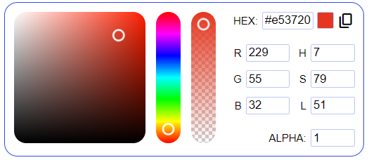

# Color Picker

Color picker is the component for the Backendless [UI-Builder](https://backendless.com/developers/#ui-builder) based on the
[iro.js](https://github.com/jaames/iro.js) library.

<p align="center">
  
</p>


The component allows specifying a color, either by using a visual color picker interface or by entering the color code(HEX, RGB or HSL format) in the corresponding input fields. Also, the Color Picker provides functionality to select the alpha channel, whose intensity can be adjusted using the slider or the input field. 

All component's settings are described in the table below:

## Properties

| Property                  | Type       | Default value | Logic                | Data Binding | UI Setting | Description                                                                                                                                                                             |
|---------------------------|------------|---------------|----------------------|--------------|------------|-----------------------------------------------------------------------------------------------------------------------------------------------------------------------------------------|
| Picker Trigger Visibility | *Checkbox* | `true`        |                      | NO           | YES        | When this parameter is set to **true**, the Color Picker will be loaded on the page in the collapsed form. Otherwise, once the page is loaded the component's interface will be hidden. |
| Circle Color Picker       | *Checkbox* | `false`       |                      | NO           | YES        | Enables the wheel layout for the Color Picker.                                                                                                                                          |
| Vertical Color Picker     | *Checkbox* | `false`       |                      | NO           | YES        | When set to **false**, the component is loaded horizontally, otherwise vertically.                                                                                                      |
| Opacity Slider Visibility | *Checkbox* | `true`        |                      | NO           | YES        | Enables the opacity slider in the color picker menu.                                                                                                                                    |
| Opacity Input Visibility  | *Checkbox* | `true`        |                      | NO           | YES        | Enables the opacity input in the color picker menu.                                                                                                                                     |
| RGB Format Visibility     | *Checkbox* | `true`        |                      | NO           | YES        | Enables the RGB color input fields in the Color Picker menu.                                                                                                                            |
| HSL Format Visibility     | *Checkbox* | `true`        |                      | NO           | YES        | Enables the HSL color input fields in the Color Picker menu.                                                                                                                            |
| Selected Color            | *Color*    | "#ff0000"     | Selected Color Logic | YES          | YES        | Controls the default color of the Color Picker.                                                                                                                                         |

## Events

| Name                  | Triggers                                                     | Context Blocks           |
|-----------------------|--------------------------------------------------------------|--------------------------|
| On Change Color Event | when the user changes the selected color in the color picker | `Selected Color: string` |

## Actions

| Action             | Inputs | Returns |
|--------------------|--------|---------|
| Open Color Picker  |        |         |
| Close Color Picker |        |         |

## Styles

**Theme**

````
@bl-customComponent-colorPicker-themeColor: @themePrimary;
@bl-customComponent-colorPicker-backgroundColor: @appBackgroundColor;
@bl-customComponent-colorPicker-textColor: @appTextColor;
@bl-customComponent-colorPicker-shadowColor: @appComponentShadowColor;
````

**Dimensions**

````
@bl-customComponent-colorPicker-trigger-width: 50px;
@bl-customComponent-colorPicker-trigger-height: 27px;
@bl-customComponent-colorPicker-trigger-margin: 3px;
@bl-customComponent-colorPicker-trigger-padding: 5px;
@bl-customComponent-colorPicker-container-margin: 10px;
@bl-customComponent-colorPicker-currentColor-width: 19px;
@bl-customComponent-colorPicker-currentColor-height: 19px;
@bl-customComponent-colorPicker-currentColor-margin: 0 2px;
@bl-customComponent-colorPicker-hexInput-width: 58px;
@bl-customComponent-colorPicker-input-width: 50px;
@bl-customComponent-colorPicker-input-marginLeft: 5px;
````

**Typography**

````
@bl-customComponent-colorPicker-fontSize: 12px;
@bl-customComponent-colorPicker-copyButton-fontSize: 20px;
````

**Decoration**

````
@bl-customComponent-colorPicker-shadowHover: 0px 2px 4px -1px fade(@bl-customComponent-colorPicker-shadowColor, 20%), 0px 4px 5px 0px fade(@bl-customComponent-colorPicker-shadowColor, 14%), 0px 1px 10px 0px fade(@bl-customComponent-colorPicker-shadowColor, 12%);
@bl-customComponent-colorPicker-trigger-borderRadius: 4px;
@bl-customComponent-colorPicker-trigger-border: 1px solid contrast(@bl-customComponent-colorPicker-backgroundColor);
@bl-customComponent-colorPicker-container-border: 1px solid @bl-customComponent-colorPicker-themeColor;
@bl-customComponent-colorPicker-container-borderRadius: 15px;
@bl-customComponent-colorPicker-currentColor-border: 1px solid lighten(@bl-customComponent-colorPicker-themeColor, 30%);
@bl-customComponent-colorPicker-currentColor-borderRadius: 2px;
@bl-customComponent-colorPicker-input-border: 1px solid lighten(@bl-customComponent-colorPicker-themeColor, 30%);
@bl-customComponent-colorPicker-input-borderRadius: 2px;
@bl-customComponent-colorPicker-input-focus-borderColor: lighten(@bl-customComponent-colorPicker-themeColor, 10%);
````
