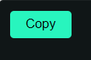

# Copy Button

Copy Button is a component of Backendless UI-Builder designer. This allows you click on button and copied content.

  

## Usage

### Styles and Settings

<dl>
<dt>Disabled</dt>
<dd>Allows disabled or not disabled copy button</dd>
<dt>Content</dt>
<dd>Allows write content that be copied</dd>
<dt>Copy Label</dt>
<dd>Allows write label for copy button.</dd>
<dt>Copied Label</dt>
<dd>Allows write label for copied button.</dd>
<dt>Copy Button Visibility</dt>
<dd>Allows display or not display copy icon</dd>
<dt>Copied Button Visibility</dt>
<dd>Allows display or not display copied icon</dd>
<dt>Copied Duration</dt>
<dd>Allows to specify duration copied button. Default value 1000</dd>
</dl>

### Event Handlers and Bindable Properties

<dl>
<dt>Disabled Logic</dt>
<dd>Allows to specify disabled or not disabled copy button in Backendless logic</dd>
<dt>Content Logic</dt>
<dd>Allows to specify content for copy button in Backendless logic</dt>
<dt>Copy Label Logic</dt>
<dd>Allows to specify label for copy button in Backendless Logic</dd>
<dt>Copied Button Logic</dt>
<dd>Allows to specify label for copied button in Backendless logic</dd>
<dt>On Copy</dt>
<dd>Triggered when the user click on copy button</dd>
</dl>

### Action
<dl>
<dt>Copy</dt>
<dd>An action that copy content to clipboard</dd>
</dl>
