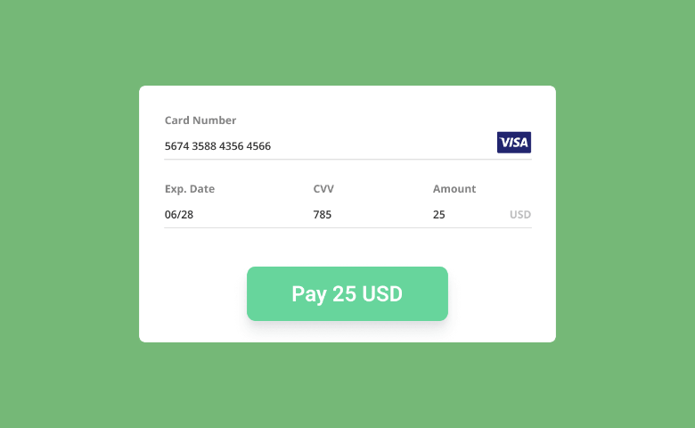

# Credit Card

Credit Card is the component that can be used in Backendless [UI-Builder](https://backendless.com/developers/#ui-builder). It allows you to create a payment form with a nice interface of credit cards.

<p align="center">
  
</p>

## Demo

View an example of how to install this component and how it works in your UI [here](https://app.arcade.software/share/w3usCWCTpy2dpXSH3yuY).

## Properties

| Property                          | Type                                                                  | Default value     | Logic | Data Binding | UI Setting | Description                                                   |
|-----------------------------------|-----------------------------------------------------------------------|-------------------|-------|--------------|------------|---------------------------------------------------------------|
| Card Preview Visibility           | *Checkbox*                                                            | `true`            |       | NO           | YES        | Enables showing preview of the credit card.                   |
| CVC Visibility                    | *Checkbox*                                                            | `true`            |       | NO           | YES        | Enables showing CVC numbers of the credit card.               |
| Direction                         | *Select* <br/> "Row" \| "Row reverse" \| "Column" \| "Column reverse" | "Column"          |       | NO           | YES        | Controls the direction of the component.                      |
| Labels Visibility                 | *Checkbox*                                                            | `true`            |       | NO           | YES        | Enables showing labels of the form fields.                    |
| Submit Button Label               | *Text*                                                                | "Pay"             |       | NO           | YES        | Controls the label of the submit button.                      |
| Card Number Field Placeholder     | *Text*                                                                | "Card Number"     |       | NO           | YES        | Controls the placeholder for the card number entry field.     |
| Cardholder Name Field Placeholder | *Text*                                                                | "Cardholder Name" |       | NO           | YES        | Controls the placeholder for the cardholder name entry field. |
| Expiry Field Placeholder          | *Text*                                                                | "MM / YY"         |       | NO           | YES        | Controls the placeholder for the card expiration entry field. |
| CVC Field Placeholder             | *Text*                                                                | "CVC"             |       | NO           | YES        | Controls the placeholder for the CVC entry field.             |
| Cardholder Name Field Visibility  | *Checkbox*                                                            | `true`            |       | NO           | YES        | Enables showing Cardholder Name field in the card form.       |

## Events

| Name             | Triggers                        | Context Blocks                       |
|------------------|---------------------------------|--------------------------------------|
| On Submit Event  | when the card form is submitted | Сard Details: `Object`               |
| On Success Event | when the payment is complete    | Сard Details: `Object`               |
| On Reject Event  | when the payment fails          | Error: `String`                      |
| On Focus Event   | when the card form gains focus  | Event: `Object`, Form Data: `Object` |
| On Blur Event    | when the card form loses focus  | Event: `Object`, Form Data: `Object` |

## Actions

| Action                         | Inputs | Returns   |
|--------------------------------|--------|-----------|
| Clear Form of Credit Card      |        |           |
| Validate Number of Credit Card |        | `Boolean` |
| Validate Expiry of Credit Card |        | `Boolean` |
| Validate CVC of Credit Card    |        | `Boolean` |

## Styles

**Theme**

````
@bl-customComponent-creditCard-themeColor: @themePrimary;
@bl-customComponent-creditCard-backgroundColor: @appBackgroundColor;
@bl-customComponent-creditCard-textColor: @appTextColor;
@bl-customComponent-creditCard-shadowColor: @appComponentShadowColor;
@bl-customComponent-creditCard-disabledColor: @disabledColor;
@bl-customComponent-creditCard-borderRadius: @appComponentBorderRadius;
````

**General**

````
@bl-customComponent-creditCard-paymentForm-flexWrap: wrap;
@bl-customComponent-creditCard-button-color: contrast(@bl-customComponent-creditCard-button-backgroundColor);
@bl-customComponent-creditCard-button-disabledColor: contrast(@bl-customComponent-creditCard-button-disabledBackground);
@bl-customComponent-creditCard-label-color: @bl-customComponent-creditCard-textColor;
@bl-customComponent-creditCard-input-color: @bl-customComponent-creditCard-textColor;
@bl-customComponent-creditCard-card-cvc-color: #222;
@bl-customComponent-creditCard-card-light-text-color: #fff;
@bl-customComponent-creditCard-card-dark-text-color: #555;
@bl-customComponent-creditCard-card-stripe-bg-color: #2a1d16;
````

**Background**

````
@bl-customComponent-creditCard-button-backgroundColor: @bl-customComponent-creditCard-themeColor;
@bl-customComponent-creditCard-button-disabledBackground: @bl-customComponent-creditCard-disabledColor;
@bl-customComponent-creditCard-input-backgroundColor: transparent;
@bl-customComponent-creditCard-card-signature-background: repeating-linear-gradient(0.1deg, #fff 20%, #fff 40%, #fea 40%, #fea 44%, #fff 44%);
@bl-customComponent-creditCard-card-default-background: linear-gradient(25deg, #939393, #717171);
@bl-customComponent-creditCard-card-unknown-background: linear-gradient(25deg, #999, #999);
@bl-customComponent-creditCard-card-amex-background: linear-gradient(25deg, #308c67, #a3f2cf);
@bl-customComponent-creditCard-card-dankort-background: linear-gradient(25deg, #ccc, #999);
@bl-customComponent-creditCard-card-dinersclub-background: linear-gradient(25deg, #fff, #eee);
@bl-customComponent-creditCard-card-discover-background: linear-gradient(25deg, #fff, #eee);
@bl-customComponent-creditCard-card-mastercard-background: linear-gradient(25deg, #fbfbfb, #e8e9e5);
@bl-customComponent-creditCard-card-visa-background: linear-gradient(25deg, #0f509e, #1399cd);
@bl-customComponent-creditCard-card-elo-background: linear-gradient(25deg, #211c18, #aaa7a2);
@bl-customComponent-creditCard-card-hipercard-background: linear-gradient(25deg, #8b181b, #de1f27);
@bl-customComponent-creditCard-card-troy-background: linear-gradient(25deg, #01adba, #1fb8c4);
@bl-customComponent-creditCard-card-jcb-background: @bl-customComponent-creditCard-card-default-background;
@bl-customComponent-creditCard-card-laser-background: @bl-customComponent-creditCard-card-default-background;
@bl-customComponent-creditCard-card-maestro-background: @bl-customComponent-creditCard-card-mastercard-background;
@bl-customComponent-creditCard-card-unionpay-background: @bl-customComponent-creditCard-card-default-background;
@bl-customComponent-creditCard-card-visaelectron-background: @bl-customComponent-creditCard-card-visa-background;
````

**Dimensions**

````
@bl-customComponent-creditCard-width: 100%;
@bl-customComponent-creditCard-minWidth: min-content;
@bl-customComponent-creditCard-padding: 15px;
@bl-customComponent-creditCard-gap: 10px;
@bl-customComponent-creditCard-paymentForm-minWidth: 290px;
@bl-customComponent-creditCard-paymentForm-gap: 10px;
@bl-customComponent-creditCard-paymentForm-formField-width: 100%;
@bl-customComponent-creditCard-paymentForm-lastFields-width: calc(~'50% - 5px');
@bl-customComponent-creditCard-button-padding: 6px 16px;
@bl-customComponent-creditCard-button-marginTop: 10px;
@bl-customComponent-creditCard-button-width: @bl-customComponent-creditCard-paymentForm-formField-width;
@bl-customComponent-creditCard-label-padding: 11px 0;
@bl-customComponent-creditCard-input-padding: 11px 8px;
@bl-customComponent-creditCard-input-width: 100%;
@bl-customComponent-creditCard-card-margin: 0 auto;
@bl-customComponent-creditCard-card-ratio: 1.5858;
@bl-customComponent-creditCard-card-size: 290px;
@bl-customComponent-creditCard-card-height: calc(@bl-customComponent-creditCard-card-size / @bl-customComponent-creditCard-card-ratio);
@bl-customComponent-creditCard-card-name-width: 60%;
@bl-customComponent-creditCard-card-valid-marginBottom: 5px;
@bl-customComponent-creditCard-card-chip-height: calc(@bl-customComponent-creditCard-card-size / 11);
@bl-customComponent-creditCard-card-chip-width: calc(@bl-customComponent-creditCard-card-size / 7);
@bl-customComponent-creditCard-card-issuer-width: 40%;
@bl-customComponent-creditCard-card-issuer-height: 23%;

````

**Typography**

````
@bl-customComponent-creditCard-fontSize: 16px;
@bl-customComponent-creditCard-button-lineHeight: 1.75;
@bl-customComponent-creditCard-button-fontWeight: 600;
@bl-customComponent-creditCard-button-fontSize: @bl-customComponent-creditCard-fontSize;
@bl-customComponent-creditCard-label-fontSize: 13px;
@bl-customComponent-creditCard-input-fontSize: @bl-customComponent-creditCard-fontSize;
@bl-customComponent-creditCard-card-font: 'Consolas', 'Courier', monospace;
@bl-customComponent-creditCard-card-field-focused-fontWeight: 700;
@bl-customComponent-creditCard-card-name-fontSize: 17px;
@bl-customComponent-creditCard-card-name-fontFamily: @bl-customComponent-creditCard-card-font;
@bl-customComponent-creditCard-card-number-fontSize: 20px;
@bl-customComponent-creditCard-card-number-large-fontSize: @bl-customComponent-creditCard-card-number-fontSize * 0.85;
@bl-customComponent-creditCard-card-number-fontFamily: @bl-customComponent-creditCard-card-font;
@bl-customComponent-creditCard-card-valid-fontSize: 10px;
@bl-customComponent-creditCard-card-expiry-fontSize: 16px;
@bl-customComponent-creditCard-card-expiry-fontFamily: @bl-customComponent-creditCard-card-font;
@bl-customComponent-creditCard-card-cvc-fontSize: 14px;
@bl-customComponent-creditCard-card-cvc-front-fontSize: @bl-customComponent-creditCard-card-cvc-fontSize * 0.85;
@bl-customComponent-creditCard-card-cvc-fontFamily: @bl-customComponent-creditCard-card-font;
````

**Decoration**

````
@bl-customComponent-creditCard-border: 1px solid @bl-customComponent-creditCard-themeColor;
@bl-customComponent-creditCard-button-borderWidth: 0;
@bl-customComponent-creditCard-button-borderRadius: @bl-customComponent-creditCard-borderRadius;
@bl-customComponent-creditCard-button-shadowColor: @bl-customComponent-creditCard-shadowColor;
@bl-customComponent-creditCard-button-shadowHover: 0px 2px 4px -1px fade(@bl-customComponent-creditCard-button-shadowColor, 20%), 0px 4px 5px 0px fade(@bl-customComponent-creditCard-button-shadowColor, 14%), 0px 1px 10px 0px fade(@bl-customComponent-creditCard-button-shadowColor, 12%);
@bl-customComponent-creditCard-button-shadowDisabled: none;
@bl-customComponent-creditCard-input-border: 1px solid @bl-customComponent-creditCard-textColor;
@bl-customComponent-creditCard-input-focus-borderColor: @bl-customComponent-creditCard-themeColor;
@bl-customComponent-creditCard-card-perspective: 1000px;
@bl-customComponent-creditCard-card-transformStyle: preserve-3d;
@bl-customComponent-creditCard-card-transition: all 0.4s linear;
@bl-customComponent-creditCard-card-background-transition: all 0.5s ease-out;
@bl-customComponent-creditCard-card-background-transform: rotate(25deg);
@bl-customComponent-creditCard-card-borderRadius: calc(@bl-customComponent-creditCard-card-size / 20);
@bl-customComponent-creditCard-card-transform: rotateY(180deg);
@bl-customComponent-creditCard-card-back-issuer-transform: translateX(-50%);
@bl-customComponent-creditCard-card-field-filled-opacity: 0.8 !important;
@bl-customComponent-creditCard-card-field-focused-opacity: 1 !important;
@bl-customComponent-creditCard-card-field-opacity: 0.5;
@bl-customComponent-creditCard-card-field-transition: opacity 0.3s;
@bl-customComponent-creditCard-card-name-textTransform: uppercase;
@bl-customComponent-creditCard-card-name-textOverflow: ellipsis;
@bl-customComponent-creditCard-card-shadow: 0 0 20px rgba(#000, 0.2);
````

**Images**

````
@bl-customComponent-creditCard-card-chip-image: <!-- a base 64 image -->;
@bl-customComponent-creditCard-card-amex-logo: <!-- a base 64 image -->;
@bl-customComponent-creditCard-card-dankort-logo: <!-- a base 64 image -->;
@bl-customComponent-creditCard-card-dinersclub-logo: <!-- a base 64 image -->;
@bl-customComponent-creditCard-card-discover-logo: <!-- a base 64 image -->;
@bl-customComponent-creditCard-card-elo-logo: <!-- a base 64 image -->;
@bl-customComponent-creditCard-card-hipercard-logo: <!-- a base 64 image -->;
@bl-customComponent-creditCard-card-jcb-logo: <!-- a base 64 image -->;
@bl-customComponent-creditCard-card-laser-logo: <!-- a base 64 image -->;
@bl-customComponent-creditCard-card-maestro-logo: <!-- a base 64 image -->;
@bl-customComponent-creditCard-card-mastercard-logo: <!-- a base 64 image -->;
@bl-customComponent-creditCard-card-unionpay-logo: <!-- a base 64 image -->;
@bl-customComponent-creditCard-card-visa-logo: <!-- a base 64 image -->;
@bl-customComponent-creditCard-card-visaelectron-logo: <!-- a base 64 image -->;
@bl-customComponent-creditCard-card-troy-logo: <!-- a base 64 image -->;
````
