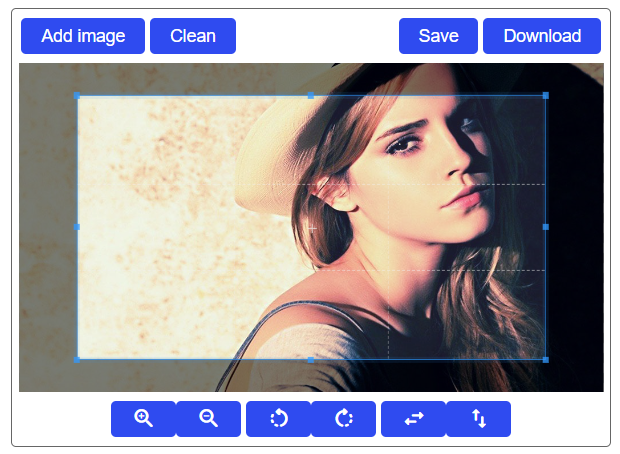

# Cropper

This is a component for Backendless [UI-Builder](https://backendless.com/developers/#ui-builder) designer based on the
[Cropper.js](https://github.com/fengyuanchen/cropperjs) library.

The component allows you to select any area of the image and then download it as a separate file or save it to the server.

<p align="center">
  
</p>

## Properties

| Property                     | Type                                                                                                   | Default value                        | Logic                             | Data Binding | UI Setting | Description                                                                              |
|------------------------------|--------------------------------------------------------------------------------------------------------|--------------------------------------|-----------------------------------|--------------|------------|------------------------------------------------------------------------------------------|
| Image Url                    | *Text*                                                                                                 |                                      | Image Url Logic                   | NO           | YES        | controls the image of the cropper                                                        |
| Initial Label                | *Text*                                                                                                 | "Drop image here or click to select" |                                   | NO           | YES        | controls the initial label of the cropper                                                |
| Toolbar Visibility           | *Checkbox*                                                                                             | `true`                               | Toolbar Visibility Logic          | NO           | YES        | enables showing the toolbar of the cropper                                               |
| Add Image Button Visibility  | *Checkbox*                                                                                             | `true`                               | Add Image Button Visibility Logic | NO           | YES        | enables showing the Add Image button                                                     |
| Clean Button Visibility      | *Checkbox*                                                                                             | `true`                               | Clean Button Visibility Logic     | NO           | YES        | enables showing the Clean button                                                         |
| Save Button Visibility       | *Checkbox*                                                                                             | `true`                               | Save Button Visibility Logic      | NO           | YES        | enables showing the Save button                                                          |
| Download Button Visibility   | *Checkbox*                                                                                             | `true`                               | Download Button Visibility Logic  | NO           | YES        | enables showing the Download button                                                      |
| Aspect Ratio                 | *Select* <br/> "free" \| "16:9" \| "4:3" \| "1:1" \| "2:3"                                             | "free"                               |                                   | NO           | YES        | controls the aspect ratio of the crop box                                                |
| Drag Mode                    | *Select* <br/> "crop" \| "move" \| "none"                                                              | "move"                               |                                   | NO           | YES        | controls the dragging mode of the cropper                                                |
| Crop Box Modal               | *Checkbox*                                                                                             | `true`                               |                                   | NO           | YES        | enables showing the black modal above the image and under the crop box                   |
| Crop Box Guides              | *Checkbox*                                                                                             | `true`                               |                                   | NO           | YES        | enables showing the dashed lines above the crop box                                      |
| Center Indicator             | *Checkbox*                                                                                             | `true`                               |                                   | NO           | YES        | enables showing the center indicator above the crop box                                  |
| Crop Box Highlight           | *Checkbox*                                                                                             | `true`                               |                                   | NO           | YES        | enables showing the white modal above the crop box                                       |
| Background Grid              | *Checkbox*                                                                                             | `true`                               |                                   | NO           | YES        | enables showing the grid background of the container                                     |
| Auto Crop                    | *Checkbox*                                                                                             | `true`                               |                                   | NO           | YES        | enables to crop the image automatically when initialized                                 |
| Auto Crop Area               | *Select* <br/> "10%" \| "20%" \| "30%" \| "40%" \| "50%" \| "60%" \| "70%" \| "80%" \| "90%" \| "100%" | "80%"                                |                                   | NO           | YES        | controls the automatic cropping area size                                                |
| Movable Image                | *Checkbox*                                                                                             | `true`                               |                                   | NO           | YES        | enables to move the image                                                                |
| Rotatable Image              | *Checkbox*                                                                                             | `true`                               |                                   | NO           | YES        | enables to rotate the image                                                              |
| Scalable Image               | *Checkbox*                                                                                             | `true`                               |                                   | NO           | YES        | enables to scale the image                                                               |
| Zoomable Image               | *Checkbox*                                                                                             | `true`                               |                                   | NO           | YES        | enables to zoom the image                                                                |
| Zoom On Touch                | *Checkbox*                                                                                             | `true`                               |                                   | NO           | YES        | enables to zoom the image by dragging touch                                              |
| Zoom On Wheel                | *Checkbox*                                                                                             | `true`                               |                                   | NO           | YES        | enables to zoom the image by mouse wheeling                                              |
| Crop Box Movable             | *Checkbox*                                                                                             | `true`                               |                                   | NO           | YES        | enables to move the crop box by dragging                                                 |
| Crop Box Resizable           | *Checkbox*                                                                                             | `true`                               |                                   | NO           | YES        | enables to resize the crop box by dragging                                               |
| Toggle Drag Mode On Dblclick | *Checkbox*                                                                                             | `true`                               |                                   | NO           | YES        | enables to toggle drag mode between `crop` and `move` when clicking twice on the cropper |
| Min Container Width          | *Number*                                                                                               | 200                                  |                                   | NO           | YES        | controls the minimum width of the cropper container                                      |
| Min Container Height         | *Number*                                                                                               | 100                                  |                                   | NO           | YES        | controls the minimum height of the cropper container                                     |
| Min Canvas Width             | *Number*                                                                                               | 0                                    |                                   | NO           | YES        | controls the minimum width of the canvas (image wrapper)                                 |
| Min Canvas Height            | *Number*                                                                                               | 0                                    |                                   | NO           | YES        | controls the minimum height of the canvas (image wrapper)                                |
| Min Crop Box Width           | *Number*                                                                                               | 0                                    |                                   | NO           | YES        | controls the minimum width of the crop box                                               |
| Min Crop Box Height          | *Number*                                                                                               | 0                                    |                                   | NO           | YES        | controls the minimum height of the crop box                                              |

## Events

| Name                | Triggers                                  | Context Blocks       |
|---------------------|-------------------------------------------|----------------------|
| On Ready Event      | when the cropper is fully rendered        |                      |
| On Crop Event       | when the crop area is changed             | Details: `Object`    |
| On Crop Start Event | when the user starts cropping the image   |                      |
| On Crop Move Event  | when the user moves the crop area         |                      |
| On Crop End Event   | when the user finishes cropping the image |                      |
| On Zoom Event       | when the user zooms the image             |                      |
| On Save Event       | when the user click on the Save button    | File Content: `Blob` |

## Actions

| Action             | Inputs                                                                                                                                                                                                                                   | Returns                                                     |
|--------------------|------------------------------------------------------------------------------------------------------------------------------------------------------------------------------------------------------------------------------------------|-------------------------------------------------------------|
| Crop               |                                                                                                                                                                                                                                          |                                                             |
| Reset              |                                                                                                                                                                                                                                          |                                                             |
| Clear              |                                                                                                                                                                                                                                          |                                                             |
| Replace            | url: `String`                                                                                                                                                                                                                            |                                                             |
| Enable Cropper     |                                                                                                                                                                                                                                          |                                                             |
| Disable Cropper    |                                                                                                                                                                                                                                          |                                                             |
| Destroy            |                                                                                                                                                                                                                                          |                                                             |
| Move               | offsetX: `Number`, offsetY: `Number`                                                                                                                                                                                                     |                                                             |
| Move To            | x: `Number`, y: `Number`                                                                                                                                                                                                                 |                                                             |
| Zoom               | ratio: `Number`                                                                                                                                                                                                                          |                                                             |
| Zoom To            | ratio: `Number`, x: `Number`, y: `Number`                                                                                                                                                                                                |                                                             |
| Rotate             | degree: `Number`                                                                                                                                                                                                                         |                                                             |
| Rotate To          | degree: `Number`                                                                                                                                                                                                                         |                                                             |
| Scale              | scaleX: `Number`, scaleY: `Number`                                                                                                                                                                                                       |                                                             |
| Get Data           | rounded: `Boolean`                                                                                                                                                                                                                       | `Object`: the final cropped area position and size data     |
| Set Data           | x: `Number`, y: `Number`, width: `Number`, height: `Number`, rotate: `Number`, scaleX: `Number`, scaleY: `Number`                                                                                                                        |                                                             |
| Get Container Data |                                                                                                                                                                                                                                          | `Object`: the container size data                           |
| Get Image Data     |                                                                                                                                                                                                                                          | `Object`: the image position, size, and other related data  |
| Get Canvas Data    |                                                                                                                                                                                                                                          | `Object`: the canvas (image wrapper) position and size data |
| Set Canvas Data    | left: `Number`, top: `Number`, width: `Number`, height: `Number`                                                                                                                                                                         |                                                             |
| Get Crop Box Data  |                                                                                                                                                                                                                                          | `Object`: the crop box position and size data               |
| Set Crop Box Data  | left: `Number`, top: `Number`, width: `Number`, height: `Number`                                                                                                                                                                         |                                                             |
| Get Cropped Canvas | width: `Number`, height: `Number`, minWidth: `Number`, minHeight: `Number`, maxWidth: `Number`, maxHeight: `Number`, fillColor: `String`, imageSmoothingEnabled: `Boolean`, imageSmoothingQuality: "low" (default) \| "medium" \| "high" | `HTMLCanvasElement`: a canvas drawn the cropped image       |
| Set Aspect Ratio   | ratio: `Number`                                                                                                                                                                                                                          |                                                             |
| Set Drag Mode      | model: "none" \| "crop" \| "move"                                                                                                                                                                                                        |                                                             |

## Styles

**Theme**

````
@bl-customComponent-cropper-themeColor: @themePrimary;
@bl-customComponent-cropper-backgroundColor: @appBackgroundColor;
@bl-customComponent-cropper-textColor: @appTextColor;
@bl-customComponent-cropper-disabledColor: @disabledColor;
@bl-customComponent-cropper-shadowColor: @appComponentShadowColor;
````

**General**

````
@bl-customComponent-cropper-button-background: @bl-customComponent-cropper-themeColor;
@bl-customComponent-cropper-button-color: contrast(@bl-customComponent-cropper-button-background);
@bl-customComponent-cropper-button-disabledBackground: @bl-customComponent-cropper-disabledColor;
@bl-customComponent-cropper-button-disabledColor: contrast(@bl-customComponent-cropper-button-disabledBackground);
@bl-customComponent-cropper-browseButton-color: @bl-customComponent-cropper-themeColor;
````

**Dimensions**

````
@bl-customComponent-cropper-width: 100%;
@bl-customComponent-cropper-maxHeight: 80vh;
@bl-customComponent-cropper-padding: 5px;
@bl-customComponent-cropper-image-maxWidth: 100%;
@bl-customComponent-cropper-image-maxHeight: 100%;
@bl-customComponent-cropper-buttonsGroup-margin: 2px;
@bl-customComponent-cropper-button-margin: 2px;
@bl-customComponent-cropper-button-padding: 6px 16px;
@bl-customComponent-cropper-icon-margin: 0;
@bl-customComponent-cropper-icon-padding: 4.4px 16px;
@bl-customComponent-cropper-dropImageArea-width: 100%;
@bl-customComponent-cropper-dropImageArea-height: 100%;
@bl-customComponent-cropper-browseButton-width: 100%;
@bl-customComponent-cropper-browseButton-height: 100%;
@bl-customComponent-cropper-gap: 5px;
````

**Typography**

````
@bl-customComponent-cropper-button-fontSize: 14px;
@bl-customComponent-cropper-icon-fontSize: 20px;
````

**Decoration**

````
@bl-customComponent-cropper-border: 1px solid fade(@bl-customComponent-cropper-textColor, 60%);
@bl-customComponent-cropper-borderRadius: 4px;
@bl-customComponent-cropper-button-borderWidth: 0;
@bl-customComponent-cropper-button-borderRadius: 4px;
@bl-customComponent-cropper-button-shadowColor: @bl-customComponent-cropper-shadowColor;
@bl-customComponent-cropper-button-shadowHover: 0px 2px 4px -1px fade(@bl-customComponent-cropper-button-shadowColor, 20%), 0px 4px 5px 0px fade(@bl-customComponent-cropper-button-shadowColor, 14%), 0px 1px 10px 0px fade(@bl-customComponent-cropper-button-shadowColor, 12%);
@bl-customComponent-cropper-button-shadowDisabled: none;
````
