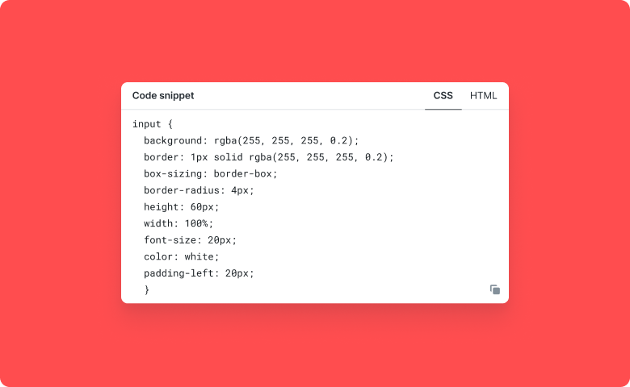

# Custom HTML

Custom HTML is a component of Backendless UI-Builder designer. This allows you writing your custom HTML.

  

## Demo

View an example of how to install this component and how it works in your UI [here](https://app.arcade.software/share/3eoVKwlISXDkVbhJ3SLQ).

## Properties

| Property | Type   | Default Value | Logic      | Data Binding | UI Setting | Description            |
|----------|--------|---------------|------------|--------------|------------|------------------------|
| html     | String |               | HTML Logic | YES          | YES        | Allows write your HTML |

## Actions

| Action                   | Inputs         | Returns |
|--------------------------|----------------|---------|
| Set HTML for Custom HTML | `HTML: string` |         |
