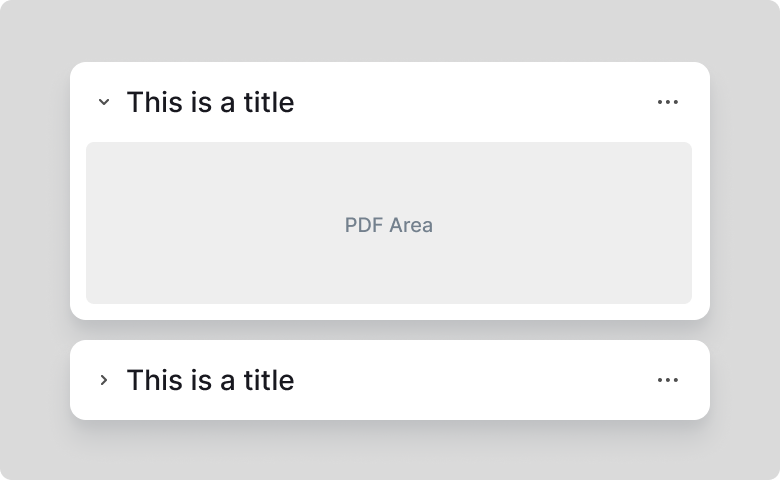
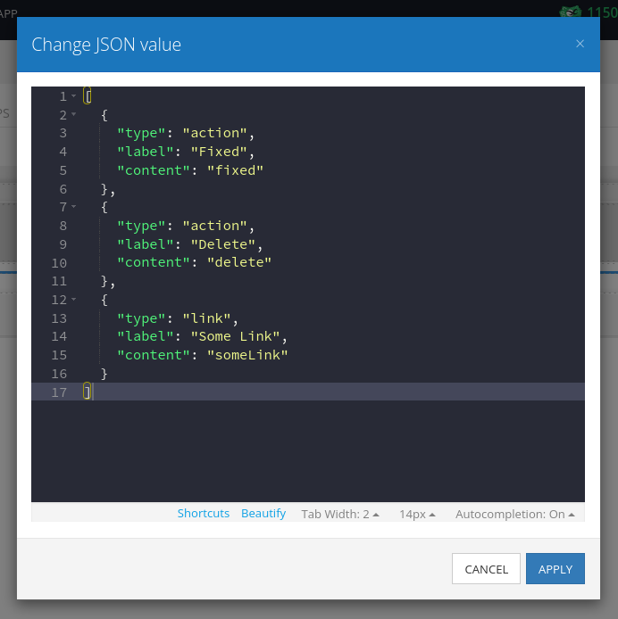
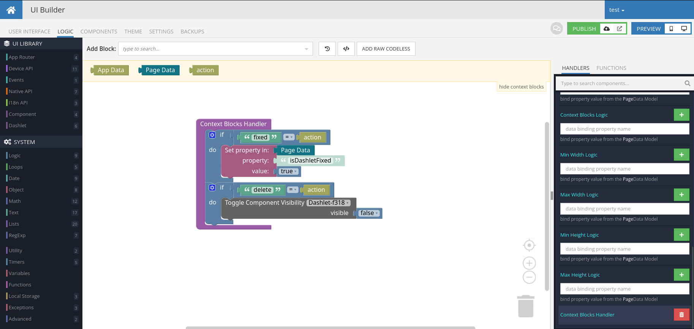

# Dashlet

This is a component for Backendless [UI-Builder](https://backendless.com/developers/#ui-builder) designer.

The component allows you to add a dashlet to your UI-Builder application.

<p align="center">
  
</p>

## Properties

| Property            | Type                              | Default Value | Logic                       | Data Binding | UI Setting | Description                                                                                                                                                                                                  |
|---------------------|-----------------------------------|---------------|-----------------------------|--------------|------------|--------------------------------------------------------------------------------------------------------------------------------------------------------------------------------------------------------------|
| title               | Text                              |               | Title Logic                 | YES          | YES        | Allows to determine the title for the dashlet.                                                                                                                                                               |
| styleVariant        | Select ["default", "alternative"] | "default"     |                             | NO           | YES        | Allows to determine the variety of styles for dashlet.                                                                                                                                                       |
| height              | Number                            | 400           | Height Logic                | YES          | YES        | Allows to determine the height.                                                                                                                                                                              |
| width               | Number                            | 600           | Width Logic                 | YES          | YES        | Allows to determine the width.                                                                                                                                                                               |
| localStorageEnabled | Checkbox                          | `false`       | Local Storage Enabled Logic | YES          | YES        | Allows to determine whether the state (size, position, closed or open) of a dashlet is allowed to be stored in [Local Storage](https://developer.mozilla.org/en-US/docs/Web/API/Window/localStorage) or not. |
| resizing            | Checkbox                          | `false`       | Resizing Logic              | YES          | YES        | Allows to determine whether resizing is allowed or not.                                                                                                                                                      |
| dragging            | Checkbox                          | `false`       | Dragging Logic              | YES          | YES        | Allows to determine whether dragging is allowed or not.                                                                                                                                                      |
| contextBlock        | JSON                              | `[]`          | Context Block Logic         | YES          | YES        | Allows to determine context block. [Codeless Examples](#examples). Signature of context block: `{type, label, content}`.                                                                                     |
| minWidth            | Number                            | 300           | Min Width Logic             | YES          | YES        | Allows to determine the min-width.                                                                                                                                                                           |
| maxWidth            | Number                            | 900           | Max Width Logic             | YES          | YES        | Allows to determine the max-width.                                                                                                                                                                           |
| minHeight           | Number                            | 300           | Min Height Logic            | YES          | YES        | Allows to determine the min-height.                                                                                                                                                                          |
| maxHeight           | Number                            | 900           | Max Height Logic            | YES          | YES        | Allows to determine the max-height.                                                                                                                                                                          |

## Events

| Name                  | Triggers                                                 | Context Blocks   |
|-----------------------|----------------------------------------------------------|------------------|
| Context Block Handler | when the user clicks on some action in the context block | action: `String` |

## Actions

| Action       | Inputs                                    | Return                                |
|--------------|-------------------------------------------|---------------------------------------|
| Get Position |                                           | { x: `Number`, y: `Number`}           |
| Get Size     |                                           | { height: `Number`, width: `Number` } |
| Get Is Open  |                                           | `Bollean`                             |
| Set Position | Position: `{ x: Number y: Number}`        |                                       |
| Set Size     | Size: `{ height: Number, width: Number }` |                                       |
| Set Is Open  | Is Open: `Bollean`                        |                                       |

## Styles

**Default**
```
@bl-customComponent-dashlet-background-color: @appBackgroundColor;

@bl-customComponent-dashlet-text-color: @appTextColor;
@bl-customComponent-dashlet-context-block-icon-size: 15px;
@bl-customComponent-dashlet-context-block-item-icon-size: 12px;
@bl-customComponent-dashlet-context-block-item-background-hover: @themePrimary;

@bl-customComponent-dashlet-border-padding: 5px;
@bl-customComponent-dashlet-border-radius: 4px;
@bl-customComponent-dashlet-close-border-radius: 5px;
@bl-customComponent-dashlet-border-color: if((@isLightTheme), rgba(0, 0, 0, 0.12), rgba(255, 255, 255, 0.12));
@bl-customComponent-dashlet-border: 1px solid @bl-customComponent-dashlet-border-color;

@bl-customComponent-dashlet-body-background-color: if((@isLightTheme), darken(@bl-customComponent-dashlet-background-color, 7%), lighten(@bl-customComponent-dashlet-background-color, 7%));
@bl-customComponent-dashlet-body-border-top-left-radius: 0;
@bl-customComponent-dashlet-body-border-top-right-radius: 0;
@bl-customComponent-dashlet-body-overflow: auto;

@bl-customComponent-dashlet-resize-icon-size: 20px;
@bl-customComponent-dashlet-collapse-icon-size: 20px;

@bl-customComponent-dashlet-header-height: 25px;
@bl-customComponent-dashlet-header-dragging-cursor: move;

@bl-customComponent-dashlet-title-margin: 0 0 0 5px;
```

**Alternative**
```
@bl-customComponent-dashlet-alternative-padding: 0;

@bl-customComponent-dashlet-header-alternative-height: 35px;
@bl-customComponent-dashlet-header-alternative-background-color: @themePrimary;
@bl-customComponent-dashlet-header-alternative-padding: 0 10px;

@bl-customComponent-dashlet-title-alternative-text-color: contrast(@themePrimary);
```

## <a id="examples"></a> Codeless Examples

Addition of context block in UI Setting:



Use context block actions in event Context Block Handler:


