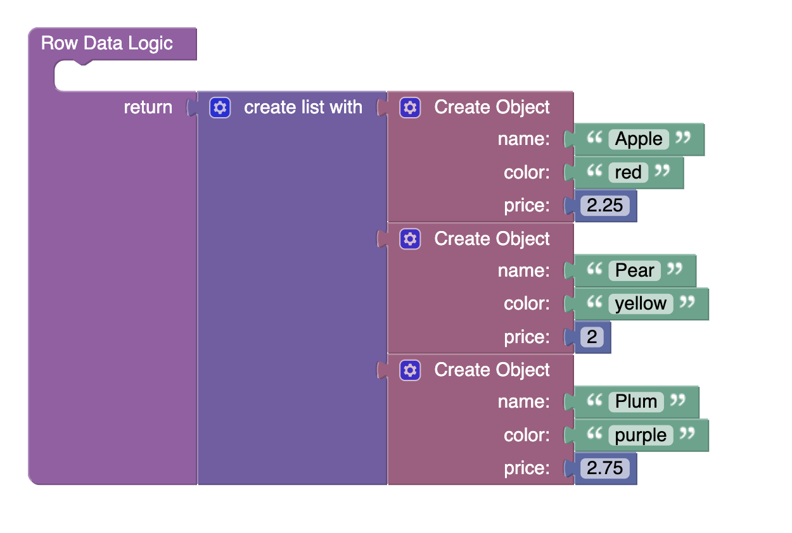
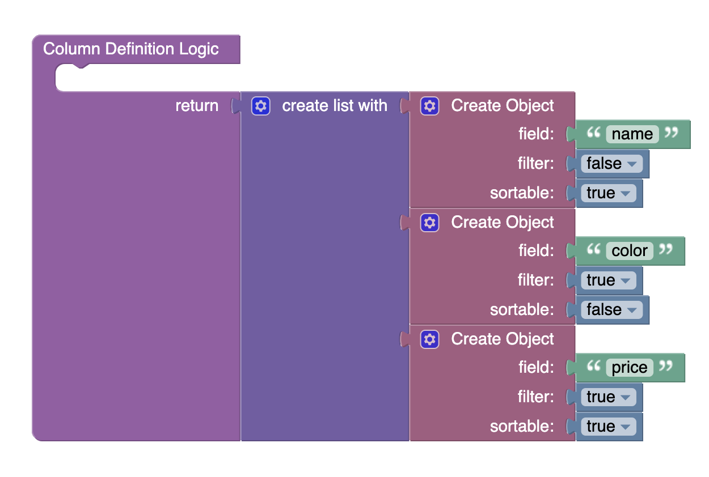

# Data Grid

Data Grid is a component of Backendless UI-Builder designer. The main purpose of the component is to display data, and this data can be sorted and filtered.
If you want to know more about this component, you can [follow the link.](https://www.ag-grid.com/example/)

## Properties

| Property                             | Type                                                                                                                                  | Default Value                                                                                                                                                             | Logic                   | Data Binding | UI Setting | Description                                                                                                                                                                                   |
|--------------------------------------|---------------------------------------------------------------------------------------------------------------------------------------|---------------------------------------------------------------------------------------------------------------------------------------------------------------------------|-------------------------|--------------|------------|-----------------------------------------------------------------------------------------------------------------------------------------------------------------------------------------------|
| Disabled `disabled`              | Checkbox                                                                                                                              | `false`                                                                                                                                                                   | Disabled Logic          | YES          | YES        | This handler allows you to disable a component.                                                                                                                                               |
| Sortable `sortable`              | Checkbox                                                                                                                              | `true`                                                                                                                                                                    | Sortable Logic          | YES          | YES        | This handler allows you to specify the sorting option for all grid columns.                                                                                                                   |
| Filter `filter`                  | Checkbox                                                                                                                              | `true`                                                                                                                                                                    | Filter Logic            | YES          | YES        | This handler allows you to add filtering capability to all grid columns.                                                                                                                      |
| Floating Filter `floatingFilter` | Checkbox                                                                                                                              | `true`                                                                                                                                                                    | Floating Filter Logic   | YES          | YES        | This handler allows you to specify whether or not the floating filter is displayed.                                                                                                           |
| Column Definition `columnDefs`   | JSON                                                                                                                                  | `[` `{"field": "name"},` `{"field": "age"},` `{"field": "city"}` `]`                                                                                      | Column Definition Logic | YES          | YES        | This handler allows you to define columns for the component. Watch [Codeless Examples](#Examples). Signature of column: List of object `{field: String, sortable: Boolean, filter: Boolean}`. |
| Row Data `rowData`               | JSON                                                                                                                                  | `[` `{"name": "Jack", "age": 26, "city": "London"},` `{"name": "Kate", "age": 22, "city": "New York"},` `{"name": "Nick", "age": 28, "city": "Kyiv"}` `]` | Row Data Logic          | YES          | YES        | This handler allows you to set data to the component. Watch [Codeless Examples](#Examples). Signature of data: List of object `{field: String \| Number}`.                                    |
| Height `height`                  | Number                                                                                                                                | 500                                                                                                                                                                       | Height Logic            | YES          | YES        | This handler allows you to specify the height of the component in pixels.                                                                                                                     |
| Width `width`                    | Number                                                                                                                                | 750                                                                                                                                                                       | Width Logic             | YES          | YES        | This handler allows you to specify the width of the component in pixels.                                                                                                                      |
| Theme `theme`                    | Select  [Alpine:`alpine` Alpine Dark:`alpine-dark` Balham:`balham` Balham Dark:`balham-dark` Material:`material`] | Alpine:`alpine`                                                                                                                                                           | Theme Logic             | YES          | YES        | This handler allows you to specify the theme of the component.                                                                                                                                |

### Events

| Name                | Triggers                                                                  | Context Blocks              |
|---------------------|---------------------------------------------------------------------------|---------------------------- |
| On Cell Click Event | This event is fired when the user clicks the mouse or taps the grid cell. | Cell Params: `{key: value}` |

##  Codeless Examples

Adding row data to the component:

Adding columns to the component:

