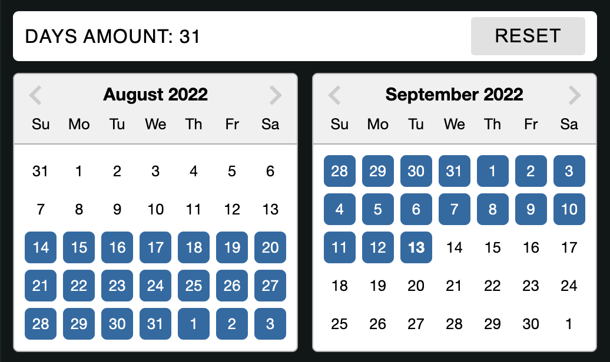

# Double Calendar
Double Calendar is a component of Backendless UI-Builder designer. The component is designed to select a start date and an end date. And you can also choose `Specific date range` mode to select a specific date. Also, if you wish, you can view the documentation of the used library here at [the link.](https://reactdatepicker.com/)

  

## Properties

| Property            | Type       | Default value | Logic                     | Data Binding | UI Setting | Description
|---------------------|------------|---------------|---------------------------|--------------|------------|-----------------------------------------------------------
| Disable             | *Checkbox* | false         | Disable logic             | YES          | YES        | This handler allows you to disable the component.
| Specific date range | *Checkbox* | false         | Specific date range logic | YES          | YES        | The `Specific date range` handler allows you to select the date selection mode in a range.
| Selection range     | *Number*   | 7             | Selection range logic     | YES          | YES        | This handler allows you to specify a date selection range. This will work if you select a 'Specific date range' mode.
| Selected date       | *Text*     |               | Selected date logic       | YES          | YES        | This handler allows you to specify the default selected date. Date format to be specified "year/month/day".
| Display header      | *Checkbox* | true          | Display header logic      | NO           | YES        | This handler allows you to control the display of the header.
| Date from           | *Text*     |               | Date from logic           | YES          | YES        | This handler allows you to specify a start date. Date format to be specified "year/month/day".
| Date to             | *Text*     |               | Date to logic             | YES          | YES        | This handler allows you to specify an end date. Date format to be specified "year/month/day".

## Events

| Name                 | Triggers                                           | Context Blocks                            |
|----------------------|----------------------------------------------------|-------------------------------------------|
| On start date change | when the user selects a start date                 | `Start date: string, Days amount: number` |
| On end date change   | when the user selects an end date                  | `End date: string, Days amount: number`   |
| On date select       | when the user selects a specific date in the range | `Selected date: string`                   |
| On date reset        | when the user clicks the reset button              |                                           |
