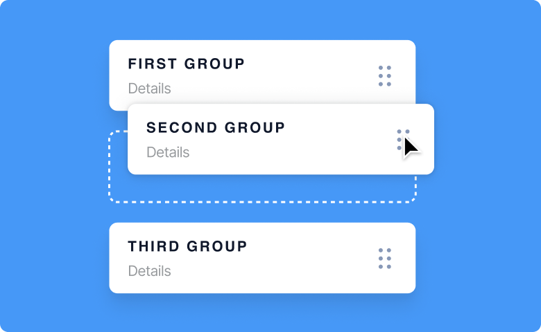

# Draggable List

This is a component for Backendless [UI-Builder](https://backendless.com/developers/#ui-builder) designer.

This allows the list to be displayed. List items can also be dragged, modified, removed, and added.
The component is customizable, you can enable or disable actions with it.

<p align="center">
  
</p>

## Properties

| Property    | Type       | Default value | Logic              | Data Binding | UI Setting | Description                                                                                                        |
|-------------|------------|---------------|--------------------|--------------|------------|--------------------------------------------------------------------------------------------------------------------|
| itemsList   | *text*     |               | Items List Logic   | YES          | NO         | This is a handler for the logic to determine items list. Signature of list item: `{label: string, value: string}`. |
| title       | *text*     | "List"        | Title Logic        | YES          | YES        | This is a handler for the logic to determine title.                                                                |
| allowDelete | *checkbox* | `true`        | Allow Delete Logic | YES          | YES        | This is a handler for the logic to determine if the item is allowed to delete.                                     |
| allowEdit   | *checkbox* | `true`        | Allow Edit Logic   | YES          | YES        | This is a handler for the logic to determine if the item is allowed to edit.                                       |
| allowAdd    | *checkbox* | `true`        | Allow Add Logic    | YES          | YES        | This is a handler for the logic to determine if the item is allowed to add.                                        |
| showValues  | *checkbox* | `true`        | Show Values Logic  | YES          | YES        | This is a handler for the logic to determine if show the value of the item.                                        |

## Events

| Name            | Triggers                          | Context Blocks                                                                                                                                                                        |
|-----------------|-----------------------------------|---------------------------------------------------------------------------------------------------------------------------------------------------------------------------------------|
| On Drag Event   | when the user drags a list item   | Current list: `[{label: string, value: string}, {...}, ...]` <br/> Dragged item: `{label: string, value: string}` <br/>Previous list: `[{label: string, value: string}, {...}, ...]`  |
| On Delete Event | when the user deletes a list item | Current list: `[{label: string, value: string}, {...}, ...]` <br/> Deleted item: `{label: string, value: string}`                                                                     |
| On Edit Event   | when the user edits a list item   | Current list: `[{label: string, value: string}, {...}, ...]` <br/> Current item: `{label: string, value: string}` <br/> Previous list: `[{label: string, value: string}, {...}, ...]` |
| On Add Event    | when the user adds a list item    | Current list: `[{label: string, value: string}, {...}, ...]` <br/> Added item: `{label: string, value: string}`                                                                       |

## Styles

**Theme**
````
@bl-customComponent-draggableList-themeColor: @themePrimary;
@bl-customComponent-draggableList-backgroundColor: @appBackgroundColor;
@bl-customComponent-draggableList-textColor: @appTextColor;
@bl-customComponent-draggableList-disabledColor: @disabledColor;
@bl-customComponent-draggableList-blockBorder: @appBlockBorder;
@bl-customComponent-draggableList-borderRadius: @appComponentBorderRadius;
````

**Dimensions**
````
@bl-customComponent-draggableList-fontSize: 12px;
@bl-customComponent-draggableList-margin: 20px;
````

**Title**
````
@bl-customComponent-draggableList-title-fontSize: calc(@bl-customComponent-draggableList-fontSize * 2);
@bl-customComponent-draggableList-title-margin: 20px;
````

**Input**
````
@bl-customComponent-draggableList-input-border: @bl-customComponent-draggableList-blockBorder;
@bl-customComponent-draggableList-input-borderRadius: @bl-customComponent-draggableList-borderRadius;
@bl-customComponent-draggableList-input-backgroundColor: @bl-customComponent-draggableList-backgroundColor;
@bl-customComponent-draggableList-input-focus-borderColor: @bl-customComponent-draggableList-themeColor;
@bl-customComponent-draggableList-input-color: contrast(@bl-customComponent-draggableList-input-backgroundColor);
@bl-customComponent-draggableList-input-padding: 5px;
````

**List**
````
@bl-customComponent-draggableList-list-backgroundColor: @bl-customComponent-draggableList-backgroundColor;
@bl-customComponent-draggableList-list-textColor: @bl-customComponent-draggableList-textColor;
@bl-customComponent-draggableList-list-border: @bl-customComponent-draggableList-blockBorder;
@bl-customComponent-draggableList-list-borderRadius: @bl-customComponent-draggableList-borderRadius;
@bl-customComponent-draggableList-list-padding: 0;
````

**List Item**
````
@bl-customComponent-draggableList-listItem-backgroundColor: @bl-customComponent-draggableList-backgroundColor;
@bl-customComponent-draggableList-listItem-textColor: @bl-customComponent-draggableList-textColor;
@bl-customComponent-draggableList-listItem-border: @bl-customComponent-draggableList-blockBorder;
@bl-customComponent-draggableList-listItem-borderRadius: @bl-customComponent-draggableList-borderRadius;
@bl-customComponent-draggableList-listItem-width: 100%;
@bl-customComponent-draggableList-listItem-padding: 10px;
@bl-customComponent-draggableList-listItem-marginBottom: 10px;
````
