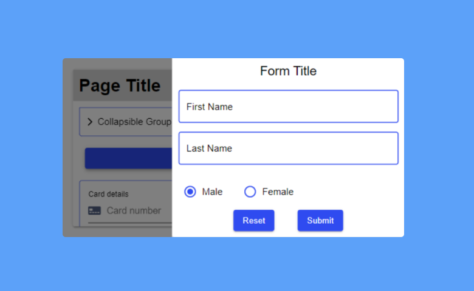

# Drawer

Drawer is the component for Backendless [UI-Builder](https://backendless.com/developers/#ui-builder). It allows the user
to open a panel that is overlaid on top of a page and slides in from the edge of the screen.

<p align="center">
  
</p>

## Demo

View an example of how to install this component and how it works in your UI [here](https://app.arcade.software/share/mUUJNgy1rFmjXlX57Fqo).

## Properties

| Property                | Type                                                  | Default value | Logic              | Data Binding | UI Setting | Description                                                      |
|-------------------------|-------------------------------------------------------|---------------|--------------------|--------------|------------|------------------------------------------------------------------|
| Control Visibility      | *Checkbox*                                            | `true`        |                    | NO           | YES        | Enables showing the Open Drawer button.                          |
| Control Label           | *Text*                                                | "Open Drawer" |                    | NO           | YES        | Controls the label of the Open Drawer button.                    |
| Placement               | *Select* <br/> "Top" \| "Right" \| "Bottom" \| "Left" | "Right"       |                    | NO           | YES        | Controls the placement of the drawer window.                     |
| Size                    | *Text*                                                | "40%"         | Size Logic         | NO           | YES        | Controls the size of the drawer window.                          |
| Backdrop Visibility     | *Checkbox*                                            | `true`        |                    | NO           | YES        | Enables showing the backdrop when the drawer window is opened.   |
| Close On Click Outside  | *Checkbox*                                            | `true`        |                    | NO           | YES        | Enables closing the drawer window by clicking outside it.        |
| Close On Escape         | *Checkbox*                                            | `true`        |                    | NO           | YES        | Enables closing the drawer window by pressing the Escape button. |
| Animation Duration (ms) | *Range*                                               | 300           |                    | NO           | YES        | Specifies how long the drawer window opens and closes.           |
| Is Open                 | *Checkbox*                                            | `false`       | Is Open Logic      | NO           | YES        | Controls whether the drawer window is open or closed.            |

## Events

| Name               | Triggers                          | Context Blocks |
|--------------------|-----------------------------------|----------------|
| On Open Event      | when the drawer window has opened |                |
| On Close Event     | when the drawer window has closed |                |

## Actions

| Action       | Inputs          | Returns |
|--------------|-----------------|---------|
| Open Drawer  | Event: `Object` |         |
| Close Drawer | Event: `Object` |         |

## Styles

**Theme**

````
@bl-customComponent-drawer-themeColor: @themePrimary;
@bl-customComponent-drawer-backgroundColor: @appBackgroundColor;
@bl-customComponent-drawer-textColor: @appTextColor;
@bl-customComponent-drawer-shadowColor: @appComponentShadowColor;
@bl-customComponent-drawer-borderRadius: @appComponentBorderRadius;
````

**General**

````
@bl-customComponent-drawer-container-zIndex: 10;
@bl-customComponent-drawer-container-backdrop-backgroundColor: #00000080;
@bl-customComponent-drawer-content-backgroundColor: @bl-customComponent-drawer-backgroundColor;
@bl-customComponent-drawer-button-backgroundColor: @bl-customComponent-drawer-themeColor;
@bl-customComponent-drawer-button-color: contrast(@bl-customComponent-drawer-button-backgroundColor);
@bl-customComponent-drawer-button-userSelect: none;
@bl-customComponent-drawer-button-cursor: pointer;
````

**Dimensions**

````
@bl-customComponent-drawer-button-width: 100%;
@bl-customComponent-drawer-button-minWidth: 64px;
@bl-customComponent-drawer-button-margin: 20px 10px;
@bl-customComponent-drawer-button-padding: 6px 16px;
````

**Typography**

````
@bl-customComponent-drawer-button-lineHeight: 1.75;
@bl-customComponent-drawer-button-fontSize: 14px;
@bl-customComponent-drawer-button-textDecoration: none;
````

**Decoration**

````
@bl-customComponent-drawer-container-transitionProperty: background;
@bl-customComponent-drawer-container-transitionTimingFunction: linear;
@bl-customComponent-drawer-content-transitionProperty: transform;
@bl-customComponent-drawer-content-transitionTimingFunction: linear;
@bl-customComponent-drawer-button-borderWidth: 0;
@bl-customComponent-drawer-button-borderRadius: @bl-customComponent-drawer-borderRadius;
@bl-customComponent-drawer-button-shadowColor: @bl-customComponent-drawer-shadowColor;
@bl-customComponent-drawer-button-shadowHover: 0px 2px 4px -1px fade(@bl-customComponent-drawer-button-shadowColor, 20%), 0px 4px 5px 0px fade(@bl-customComponent-drawer-button-shadowColor, 14%), 0px 1px 10px 0px fade(@bl-customComponent-drawer-button-shadowColor, 12%);
@bl-customComponent-drawer-button-outline: none;
````
