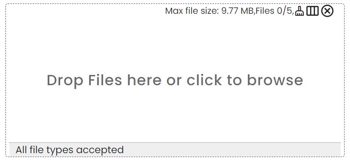

# Dropzone

This is a component for Backendless [UI-Builder](https://backendless.com/developers/#ui-builder) designer based on the
[Dropzone UI](https://github.com/dropzone-ui/dropzone-ui-react) library.

The component covers all the main features of the library and provides a way to upload files to a server.

<p align="center">
  
</p>

## Properties

| Property                | Type                                                                                                                                | Default value                        | Logic                  | Data Binding | UI Setting | Description                                                                              |
|-------------------------|-------------------------------------------------------------------------------------------------------------------------------------|--------------------------------------|------------------------|--------------|------------|------------------------------------------------------------------------------------------|
| Accepted File Types     | *Text*                                                                                                                              | "image/*"                            |                        | NO           | YES        | controls the file types that dropzone should accept                                      |
| Target Directory        | *Text*                                                                                                                              |                                      | Target Directory Logic | NO           | YES        | controls the path of the directory where the file(s) will be uploaded to                 |
| Max Files               | *Number*                                                                                                                            | 5                                    |                        | NO           | YES        | controls maximum number of files to be accepted                                          |
| Max File Size           | *Number*                                                                                                                            | 102400                               |                        | NO           | YES        | controls maximum file size allowed in bytes                                              |
| Overwrite Files         | *Checkbox*                                                                                                                          | `false`                              |                        | NO           | YES        | enables overwriting an existing file                                                     |
| Label                   | *Text*                                                                                                                              | "Drop Files here or click to browse" |                        | NO           | YES        | controls the label to place when no files selected                                       |
| Header Visibility       | *Checkbox*                                                                                                                          | `true`                               |                        | NO           | YES        | enables showing the header in the dropzone                                               |
| Footer Visibility       | *Checkbox*                                                                                                                          | `true`                               |                        | NO           | YES        | enables showing the footer in the dropzone                                               |
| Language                | *Select* <br/> "English" \| "Spanish" \| "Portuguese" \| "French" \| "Russian" \| "Chinese (simplified)" \| "Chinese (traditional)" | "English"                            |                        | NO           | YES        | controls the language to present labels                                                  |
| On Drop Behaviour       | *Select* <br/> "add" \| "replace"                                                                                                   | "add"                                |                        | NO           | YES        | controls the behaviour on drop files                                                     |
| Clickable               | *Checkbox*                                                                                                                          | `true`                               |                        | NO           | YES        | enables opening the file dialog after the dropzone is clicked                            |
| Min Height              | *Text*                                                                                                                              | "280px"                              |                        | NO           | YES        | controls the minimum height of the dropzone container, excluding header and footer space |
| Max Height              | *Text*                                                                                                                              | "450px"                              |                        | NO           | YES        | controls the maximum height of the dropzone container, excluding header and footer space |
| View Mode               | *Select* <br/> "unset" \| "grid" \| "list"                                                                                          | "unset"                              |                        | NO           | YES        | controls the view mode for dropzone content                                              |
| Clean Button Visibility | *Checkbox*                                                                                                                          | `true`                               |                        | NO           | YES        | enables showing the button for cleaning not valid files                                  |
| Upload On Drop          | *Checkbox*                                                                                                                          | `false`                              |                        | NO           | YES        | enables uploading on drop file(s)                                                        |
| Disable Scrollbar       | *Checkbox*                                                                                                                          | `false`                              |                        | NO           | YES        | enables removing scrolls and setting the dropzone content in a grid view                 |
| Theme Color             | *Color*                                                                                                                             |                                      |                        | NO           | YES        | controls the theme color for the dropzone                                                |
| Show Info Layer         | *Checkbox*                                                                                                                          | `true`                               |                        | NO           | YES        | enables showing the info layer and the info button for dropzone items                    |
| Always Active Items     | *Checkbox*                                                                                                                          | `false`                              |                        | NO           | YES        | enables showing all actions and buttons for dropzone items                               |
| Preview                 | *Checkbox*                                                                                                                          | `true`                               |                        | NO           | YES        | enables the preview of valid dropzone items                                              |
| Border Width            | *Text*                                                                                                                              | "1px"                                |                        | NO           | YES        | controls the width of the dropzone border                                                |
| Border Style            | *Select* <br/> "none" \| "solid" \| "dotted" \| "dashed" \| "double"                                                                | "dashed"                             |                        | NO           | YES        | controls the style of the dropzone border                                                |
| Border Color            | *Color*                                                                                                                             |                                      |                        | NO           | YES        | controls the color of the dropzone border                                                |

## Events

| Name                   | Triggers                                                                | Context Blocks           |
|------------------------|-------------------------------------------------------------------------|--------------------------|
| File Name Logic        | when the user upload file to the server                                 | File: `Object`           |
| On Change Event        | when the value of the file list is changed                              | Files List: `Array`      |
| On Drop Event          | when files are dropped inside the dropzone or selected from file dialog | Files List: `Array`      |
| On Change View Event   | when view mode is changed                                               | View Mode: `String`      |
| On Delete Event        | when the user clicks the mouse or taps the Close button                 | File ID: `Number`        |
| On Clean Event         | when the user clicks the mouse or taps the Clean button                 | Validated Files: `Array` |
| On Upload Event        | when the user starts uploading files                                    | File: `Object`           |
| On Upload Failed Event | when the upload of the file(s) results in an error                      | Error: `Object`          |

## Styles

**Theme**

````
@bl-customComponent-dropzone-backgroundColor: @appBackgroundColor;
@bl-customComponent-dropzone-textColor: @appTextColor;
````

**General**

````
@bl-customComponent-dropzone-color: fade(@bl-customComponent-dropzone-textColor, 85%);
@bl-customComponent-dropzone-labelColor: fade(@bl-customComponent-dropzone-textColor, 60%);
@bl-customComponent-dropzone-fileName-color: @bl-customComponent-dropzone-textColor;
````

**Dimensions**

````
@bl-customComponent-dropzone-minWidth: 436px;
@bl-customComponent-dropzone-header-gap: 3px;
@bl-customComponent-dropzone-header-paddingRight: 0;
@bl-customComponent-dropzone-header-paddingTop: 5px;
@bl-customComponent-dropzone-footer-width: 100%;
````
