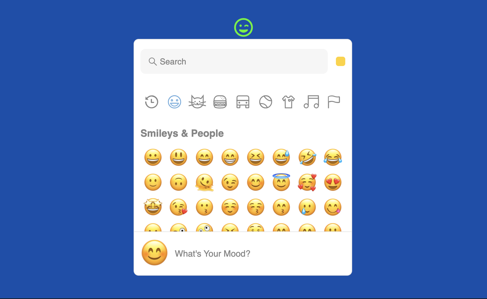

# Emoji

Emoji is a component of Backendless UI-Builder designer. The component is designed to select and use emojis.

<p align="center">
  
</p>

## Properties

| Property                                      | Type                                                               | Default Value   | Logic                        | Data Binding | UI Setting | Description                                                            |
|-----------------------------------------------|--------------------------------------------------------------------|-----------------|------------------------------|--------------|------------|------------------------------------------------------------------------|
| Disabled<br/>`disabled`                       | Checkbox                                                           | `false`         | Disabled Logic               | YES          | YES        | This handler allows you to disable a component.                        |
| Button Color<br/>`buttonColor`                | Color                                                              | `#000000`       | Button Color Logic           | YES          | YES        | This handler allows you to specify the button color.                   |
| Button Size<br/>`buttonSize`                  | Text                                                               | "24px"          | Button Size Logic            | YES          | YES        | This handler allows you to specify the button size.                    |
| Dropdown List Height<br/>`dropdownHeight`     | Text                                                               | "500px"         | Dropdown List Height Logic   | YES          | YES        | This handler allows you to specify the dropdown list height.           |
| Dropdown List Width<br/>`dropdownWidth`       | Text                                                               | "400px"         | Dropdown List Width Logic    | YES          | YES        | This handler allows you to specify the dropdown list width.            |
| Dropdown List Position<br/>`dropdownPosition` | Select [Left:`left`<br/>Center:`center`<br/>Right:`right`]         | Center:`center` | Dropdown List Position Logic | YES          | YES        | This handler allows you to select the position of the dropdown.        |
| Theme<br/>`theme`                             | Select [Light:`light`<br/>Dark:`dark`<br/>Auto:`auto`]             | Light:`light`   | Theme Logic                  | YES          | YES        | This handler allows you to select a theme for the emoji dropdown list. |
| Emoji Style<br/>`emojiStyle`                  | Select [Apple:`apple`<br/>Google:`google`<br/>Facebook:`facebook`] | Apple:`apple`   | Emoji Style Logic            | YES          | YES        | This handler allows you to select an emoji style.                      |
| Search Disabled<br/>`searchDisabled`          | Checkbox                                                           | `true`          | Search Disabled Logic        | YES          | YES        | This handler allows you to disable the emoji search field.             |

## Events

| Name                  | Triggers                  | Context Blocks                                     |
|-----------------------|---------------------------|----------------------------------------------------|
| On Emoji Select Event | when an emoji is selected | Emoji: `String`, Emoji Names: [`String`, `String`] |

## Styles

**Theme**
````
@bl-customComponent-emoji-themeColor: @themePrimary;
@bl-customComponent-emoji-backgroundColor: @appBackgroundColor;
@bl-customComponent-emoji-textColor: @appTextColor;
````

**Dimensions**
````
@bl-customComponent-emoji-disabled-opacity: 0.38;
@bl-customComponent-emoji-button-transform-onHover: scale(1.2);
@bl-customComponent-emoji-button-transition-onHover: transform .3s;
@bl-customComponent-emoji-emojiPicker-zIndex: 100;
@bl-customComponent-emoji-dropdownPosition-left: -93%;
@bl-customComponent-emoji-dropdownPosition-center: -46%;
@bl-customComponent-emoji-dropdownPosition-right: 0%;
````
