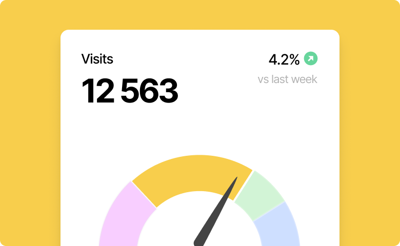

# Gauge Chart

Gauge Chart is a component of Backendless UI-Builder designer. This is a chart whose purpose is to show the goal and the progress that has already been made.

<p align="center">
  
</p>

## Properties

| Property | Type       | Default Value | Logic          | Data Binding | UI Setting | Description                                     |
|----------|------------|---------------|----------------|--------------|------------|-------------------------------------------------|
| Disabled | *Checkbox* | `false`       | Disabled Logic | YES          | YES        | This handler allows you to disable a component. |
| Goal     | *Number*   |               | Goal Logic     | YES          | YES        | This handler allows you to specify a goal.      |
| Progress | *Number*   |               | Progress Logic | YES          | YES        | This handler allows you to specify a progress.  |

## Actions

| Action                  | Inputs                             | Returns                             |
|-------------------------|------------------------------------|-------------------------------------|
| Set Goal                | Goal: `Number`                     |                                     |
| Get Goal                |                                    | `Number`: current goal              |
| Set Progress            | Progress: `Number`                 |                                     |
| Get Progress            |                                    | `Number`: current progress          |

## Styles

**Theme**
````
@bl-customComponent-gaugeChart-themeColor: @themePrimary;
@bl-customComponent-gaugeChart-backgroundColor: @appBackgroundColor;
@bl-customComponent-gaugeChart-textColor: @appTextColor;
@bl-customComponent-gaugeChart-gaugeChartCover-backgroundColor: @bl-customComponent-gaugeChart-backgroundColor;
````

**Dimensions**
````
@bl-customComponent-gaugeChart-width: 100%;
@bl-customComponent-gaugeChart-maxWidth: 301px;
````
