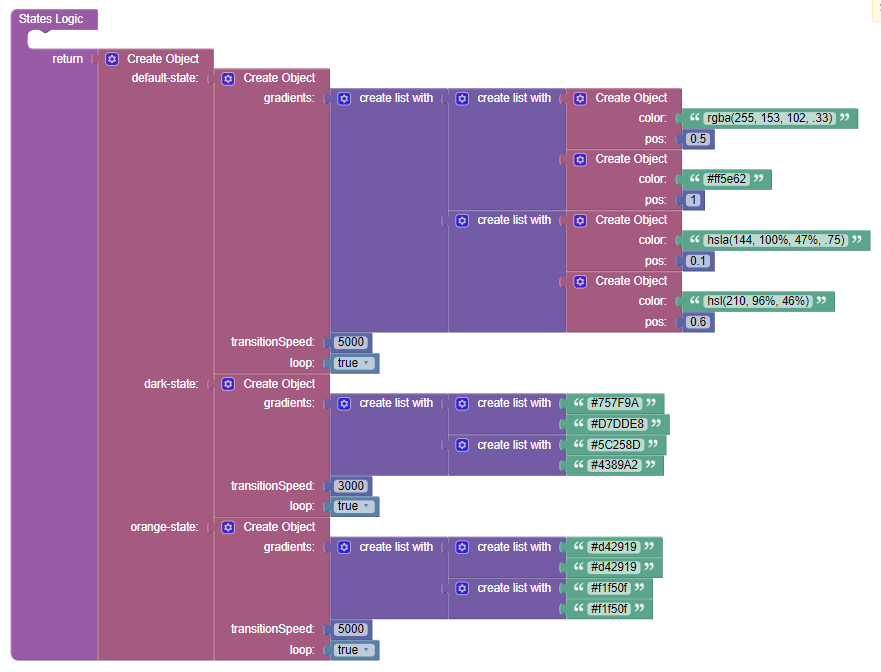
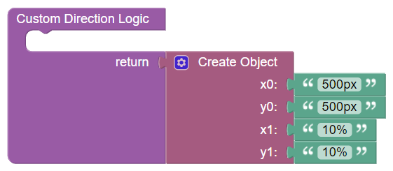

# Granim

Granim is the component that can be used in Backendless [UI-Builder](https://backendless.com/developers/#ui-builder). It allows you to create fluid and interactive gradient animations in your application. You will be able to apply your own animation settings to any of the blocks of your own application or leave as default. In any case you will get more colors and interactant on the pages of your application.
More information about granim you can find in the [Granim](https://github.com/sarcadass/granim.js) library.

<p align="center">
  
</p>

## Properties

| Property                                                 | Type                                                                                                                                                                                                                      | Default value                                                                                                                                                                                                                                 | Logic                  | Data Binding | UI Setting | Description                                                                                                                                                                                                                                  |
|----------------------------------------------------------|---------------------------------------------------------------------------------------------------------------------------------------------------------------------------------------------------------------------------|-----------------------------------------------------------------------------------------------------------------------------------------------------------------------------------------------------------------------------------------------|------------------------|--------------|------------|----------------------------------------------------------------------------------------------------------------------------------------------------------------------------------------------------------------------------------------------|
| States <br> `states`                                     | *JSON*                                                                                                                                                                                                                    | `{"default-state": {"gradients": [["#834d9b","#d04ed6"], ["#1CD8D2","#93EDC7"]], "transitionSpeed": 5000, "loop": true}, "dark-state": {"gradients": [["#757F9A","#D7DDE8"], ["#5C258D","#4389A2"]], "transitionSpeed": 5000, "loop": true}}` | States Logic           | YES          | YES        | Specifies a JSON object containing all the states data. Signature of states in [Signature Example](#States). Watch [Codeless Examples](#Examples).                                                                                           |
| Direction <br> `direction`                               | *Select* <br> [`left-right`, `diagonal`, `top-bottom`, `radial`, `custom`]                                                                                                                                                | `left-right`                                                                                                                                                                                                                                  |                        | NO           | YES        | Controls the orientation of the gradient.                                                                                                                                                                                                    |
| Custom Direction <br> `customDirection`                  | *JSON*                                                                                                                                                                                                                    | `{}`                                                                                                                                                                                                                                          | Custom Direction Logic | YES          | NO         | This is a handler for the logic to determine the custom direction of the gradient. Signature of custom direction with pixels or percentage values: `{x0: String, y0: String, x1: String, y1: String}`. Watch [Codeless Examples](#Examples). |
| State Transition Speed <br> `stateTransitionSpeed`       | *Number*                                                                                                                                                                                                                  |                                                                                                                                                                                                                                               |                        | NO           | YES        | Controls the duration of the animation when changing state(in ms).                                                                                                                                                                           |
| Offscreen Pause <br> `isPausedWhenNotInView`             | *Checkbox*                                                                                                                                                                                                                | `false`                                                                                                                                                                                                                                       |                        | NO           | YES        | Controls the animation stops when it's not in window view.                                                                                                                                                                                   |
| Scroll Debounce Threshold <br> `scrollDebounceThreshold` | *Number*                                                                                                                                                                                                                  |                                                                                                                                                                                                                                               |                        | NO           | YES        | Controls the scroll debounce threshold(in ms).                                                                                                                                                                                               |
| Image Source <br> `imageSource`                          | *Text*                                                                                                                                                                                                                    |                                                                                                                                                                                                                                               | Image Source Logic     | YES          | YES        | Controls the source of the image(URL).                                                                                                                                                                                                       |
| Image Pos X <br> `imagePosX`                             | *Select* <br> [`center`, `left`, `right`]                                                                                                                                                                                 | `center`                                                                                                                                                                                                                                      |                        | NO           | YES        | Controls the x-position of the image in the canvas.                                                                                                                                                                                          |
| Image Pos Y <br> `imagePosY`                             | *Select* <br> [`center`, `top`, `bottom`]                                                                                                                                                                                 | `center`                                                                                                                                                                                                                                      |                        | NO           | YES        | Controls the y-position of the image in the canvas.                                                                                                                                                                                          |
| Stretch Mode X <br> `stretchModeX`                       | *Select* <br> [`none`, `stretch`, `stretch-if-smaller`, `stretch-if-bigger`]                                                                                                                                              | `none`                                                                                                                                                                                                                                        |                        | NO           | YES        | Controls the stretching the image horizontally.                                                                                                                                                                                              |
| Stretch Mode Y <br> `stretchModeY`                       | *Select* <br> [`none`, `stretch`, `stretch-if-smaller`, `stretch-if-bigger`]                                                                                                                                              | `none`                                                                                                                                                                                                                                        |                        | NO           | YES        | Controls the stretching the image vertically.                                                                                                                                                                                                |
| Blending Mode <br> `blendingMode`                        | *Select* <br> [`multiply`, `screen`, `normal`, `overlay`, `darken`, `lighten`, `lighter`, `color-dodge`, `color-burn`, `hard-light`, `soft-light`, `difference`, `exclusion`, `hue`, `saturation`, `color`, `luminosity`] | `multiply`                                                                                                                                                                                                                                    |                        | NO           | YES        | Controls the options for blending images with a gradient.                                                                                                                                                                                    |

## Events

| Name               | Triggers                         | Context Blocks |
|--------------------|----------------------------------|----------------|
| On Start           | when the animation start.        |                |
| On Gradient Change | when a gradient change and loop. |                |
| On End             | when the animation end.          |                |

## Actions

| Action               | Inputs                     | Returns |
|----------------------|----------------------------|---------|
| Change State         | `stateName: String`        |         |
| Change Blending Mode | `blendingModeName: String` |         |
| Change Direction     | `directionName: String`    |         |
| Play                 |                            |         |
| Pause                |                            |         |
| Clear                |                            |         |
| Destroy              |                            |         |

## Styles

**Dimensions**
```
@bl-customComponent-granim-size: 100%;
```

**Other**
```
@bl-customComponent-granim-z-index-canvas: 1;
@bl-customComponent-granim-z-index-content: 2;
```

## States

Bellow is an example of signature of states:

```
{
    "default-state": {
        "gradients": [
            ["#834d9b", "#d04ed6"],
            ["#1CD8D2", "#93EDC7"]
        ],
        "transitionSpeed": 5000,
        "loop": true
    },
    "dark-state": {
        "gradients": [
            ["#757F9A", "#D7DDE8"],
            ["#5C258D", "#4389A2"]
        ],
        "transitionSpeed": 5000,
        "loop": true
    },
    "light-state": {
        "gradients": [
            ["rgba(252, 228, 236, .33)", "#E8EAF6", "#E0F7FA"],
            ["hsla(88, 50%, 76%, .75)", "hsl(53, 100%, 73%)", "rgb(255, 138, 101)"]
        ],
        "transitionSpeed": 5000,
        "loop": true
    },
    "complex-state": {
        "gradients": [
            [
                { "color": "rgba(255, 153, 102, .33)", "pos": 0.5 },
                { "color": "#ff5e62", "pos": 1 }
            ], [
                { "color": "hsla(144, 100%, 47%, .75)", "pos": 0.1 },
                { "color": "hsl(210, 96%, 46%)", "pos": 0.6 }
            ]
        ],
        "transitionSpeed": 5000,
        "loop": true
    }
}
```

## Examples

Below is a Codeless Example highlighting how to use the Granim component:

<p align="center">
  
</p>

<details>
<summary>Try yourself with this states</summary>

```
<block xmlns="http://www.w3.org/1999/xhtml" type="create_object" id="or_i.!Z3UpTaKuRlVRsX" x="129.7125015258789" y="100"><mutation><properties><item id="property" prop-name="default-state"></item><item id="property" prop-name="dark-state"></item><item id="property" prop-name="orange-state"></item></properties></mutation><value name="create_object_mutator_container_properties_stack_property0"><block type="create_object" id="B,X@M9F%HlR4u8~rfP=w"><mutation><properties><item id="property" prop-name="gradients"></item><item id="property" prop-name="transitionSpeed"></item><item id="property" prop-name="loop"></item></properties></mutation><value name="create_object_mutator_container_properties_stack_property0"><block type="lists_create_with" id="T~t7Qf,cI%STX3Q97#1|"><mutation items="2"></mutation><value name="ADD0"><block type="lists_create_with" id="gWUu^1kvJay@4Uz97{o0"><mutation items="2"></mutation><value name="ADD0"><block type="create_object" id="(k4Fdr.L-hHS)!pw1fJ+"><mutation><properties><item id="property" prop-name="color"></item><item id="property" prop-name="pos"></item></properties></mutation><value name="create_object_mutator_container_properties_stack_property0"><block type="text" id=";7OjqxpT+LJnl+nW^Q$+"><field name="TEXT">rgba(255, 153, 102, .33)</field></block></value><value name="create_object_mutator_container_properties_stack_property1"><block type="math_number" id="iU)wSl+fS8tWntmU;BS|"><field name="NUM">0.5</field></block></value></block></value><value name="ADD1"><block type="create_object" id="JGM#?IroU-d.W@!+4#4R"><mutation><properties><item id="property" prop-name="color"></item><item id="property" prop-name="pos"></item></properties></mutation><value name="create_object_mutator_container_properties_stack_property0"><block type="text" id="kT.%sA{1.5-=)3RxL_f0"><field name="TEXT">#ff5e62</field></block></value><value name="create_object_mutator_container_properties_stack_property1"><block type="math_number" id=",.eJytzNQj((Tu*yn2n0"><field name="NUM">1</field></block></value></block></value></block></value><value name="ADD1"><block type="lists_create_with" id="6Gap)wK7b`8E]d?K1znu"><mutation items="2"></mutation><value name="ADD0"><block type="create_object" id="vdB7KwsGA{i]{}5GCZJ~"><mutation><properties><item id="property" prop-name="color"></item><item id="property" prop-name="pos"></item></properties></mutation><value name="create_object_mutator_container_properties_stack_property0"><block type="text" id="x8[;don1U|M_wsaA2ibu"><field name="TEXT">hsla(144, 100%, 47%, .75)</field></block></value><value name="create_object_mutator_container_properties_stack_property1"><block type="math_number" id=",`CR.o@$5:KqoSIp3{;+"><field name="NUM">0.1</field></block></value></block></value><value name="ADD1"><block type="create_object" id="@xsXOIsn/RhRH,J96BE)"><mutation><properties><item id="property" prop-name="color"></item><item id="property" prop-name="pos"></item></properties></mutation><value name="create_object_mutator_container_properties_stack_property0"><block type="text" id="7ouMwlD}_r+SW4Er(Rmh"><field name="TEXT">hsl(210, 96%, 46%)</field></block></value><value name="create_object_mutator_container_properties_stack_property1"><block type="math_number" id="e;[~f=CYhLg8KqIsJ^C}"><field name="NUM">0.6</field></block></value></block></value></block></value></block></value><value name="create_object_mutator_container_properties_stack_property1"><block type="math_number" id="5xt`@D1ue$ltduwIV5h/"><field name="NUM">5000</field></block></value><value name="create_object_mutator_container_properties_stack_property2"><block type="logic_boolean" id="H=i+EIt!e.M4nxgc0ZtU"><field name="BOOL">TRUE</field></block></value></block></value><value name="create_object_mutator_container_properties_stack_property1"><block type="create_object" id="{eo_}vaXK3vabu[P$($!"><mutation><properties><item id="property" prop-name="gradients"></item><item id="property" prop-name="transitionSpeed"></item><item id="property" prop-name="loop"></item></properties></mutation><value name="create_object_mutator_container_properties_stack_property0"><block type="lists_create_with" id=";~[}!-!!?#t@ToVZO7q+"><mutation items="2"></mutation><value name="ADD0"><block type="lists_create_with" id="poLa^#G*^=}$JUPIKgJI"><mutation items="2"></mutation><value name="ADD0"><block type="text" id="vzMKAA~Ly5DC7B8TTkI%"><field name="TEXT">#757F9A</field></block></value><value name="ADD1"><block type="text" id="=/=s{-ig!pE2`Y@Hd`n]"><field name="TEXT">#D7DDE8</field></block></value></block></value><value name="ADD1"><block type="lists_create_with" id="+fKX};}^G:Lf0*0fLp+A"><mutation items="2"></mutation><value name="ADD0"><block type="text" id="(2=%u27?U!;^Ox}I_d+-"><field name="TEXT">#5C258D</field></block></value><value name="ADD1"><block type="text" id="wv=pG`{/+Vr[!xc/zuda"><field name="TEXT">#4389A2</field></block></value></block></value></block></value><value name="create_object_mutator_container_properties_stack_property1"><block type="math_number" id="J/zu(lzeE+mKG}-lw?mH"><field name="NUM">3000</field></block></value><value name="create_object_mutator_container_properties_stack_property2"><block type="logic_boolean" id="9tvm8m[F?C!`$RSELdQ5"><field name="BOOL">TRUE</field></block></value></block></value><value name="create_object_mutator_container_properties_stack_property2"><block type="create_object" id="2r6WT?ZvCv_9L:8w-k)+"><mutation><properties><item id="property" prop-name="gradients"></item><item id="property" prop-name="transitionSpeed"></item><item id="property" prop-name="loop"></item></properties></mutation><value name="create_object_mutator_container_properties_stack_property0"><block type="lists_create_with" id="s9;~wfQ|0dBS,gM^-_CJ"><mutation items="2"></mutation><value name="ADD0"><block type="lists_create_with" id="xZ_#aje~+PQ_JueW^3_u"><mutation items="2"></mutation><value name="ADD0"><block type="text" id="Hb+|FX**}LGh),uG^K]A"><field name="TEXT">#d42919</field></block></value><value name="ADD1"><block type="text" id="D+zq~/OMo3-t1gISQh`I"><field name="TEXT">#d42919</field></block></value></block></value><value name="ADD1"><block type="lists_create_with" id="4xe-RM(p|{$?y^u`A51z"><mutation items="2"></mutation><value name="ADD0"><block type="text" id="vvHLRoNCNwd`oW6],sO@"><field name="TEXT">#f1f50f</field></block></value><value name="ADD1"><block type="text" id="+W;.O|mI3Cg!WRV70F^v"><field name="TEXT">#f1f50f</field></block></value></block></value></block></value><value name="create_object_mutator_container_properties_stack_property1"><block type="math_number" id="*7,3B[TCpHogHKUi)nzY"><field name="NUM">5000</field></block></value><value name="create_object_mutator_container_properties_stack_property2"><block type="logic_boolean" id="((h?QNS/$v%#eXN}^FXd"><field name="BOOL">TRUE</field></block></value></block></value></block>
```
</details>

<p align="center">
  
</p>
<p align="center">
  
</p>

<details>
<summary>Try yourself with custom direction</summary>

```
<block xmlns="http://www.w3.org/1999/xhtml" type="create_object" id="k[5U{6A+4h+3UJ*`.J;E" x="200.58749389648438" y="100"><mutation><properties><item id="property" prop-name="x0"></item><item id="property" prop-name="y0"></item><item id="property" prop-name="x1"></item><item id="property" prop-name="y1"></item></properties></mutation><value name="create_object_mutator_container_properties_stack_property0"><block type="text" id="K.ku`O@],8TQ6#U3Z3Tl"><field name="TEXT">500px</field></block></value><value name="create_object_mutator_container_properties_stack_property1"><block type="text" id="I@Hd{]PsA$-c|oIh,!{}"><field name="TEXT">500px</field></block></value><value name="create_object_mutator_container_properties_stack_property2"><block type="text" id="o6`#ADy9wt@~PA!wn=Uy"><field name="TEXT">10%</field></block></value><value name="create_object_mutator_container_properties_stack_property3"><block type="text" id="NEA(T;%O]wwv-QXZPkQ?"><field name="TEXT">10%</field></block></value></block>
```
</details>
