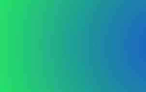
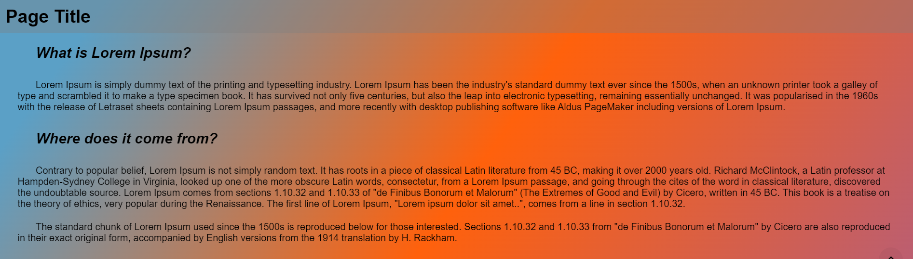
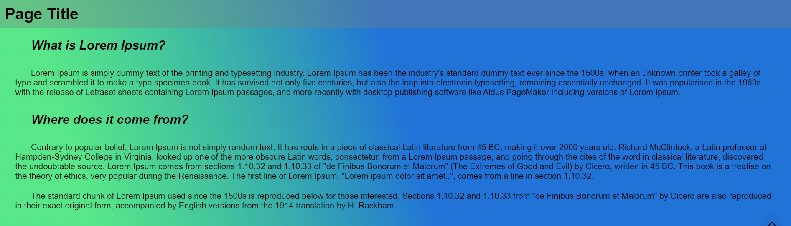

# Granim

Granim is the component that can be used in Backendless [UI-Builder](https://backendless.com/developers/#ui-builder). It allows you to create fluid and interactive gradient animations in your application. You will be able to apply your own animation settings to any of the blocks of your own application or leave as default. In any case you will get more colors and interactant on the pages of your application.
More information about granim you can find in the [Granim](https://github.com/sarcadass/granim.js) library.

<p align="center">
  
</p>

## Properties

| Property                | Type                                                                                                                                                                                                                      | Default value | Logic | Data Binding | UI Setting | Description                                                                                           |
|-------------------------|---------------------------------------------------------------------------------------------------------------------------------------------------------------------------------------------------------------------------|---------------|-------|--------------|------------|-------------------------------------------------------------------------------------------------------|
| direction               | *Select* <br> [`left-right`, `diagonal`, `top-bottom`, `radial`, `custom`]                                                                                                                                                | `left-right`  |       | NO           | YES        | Controls the orientation of the gradient.                                                             |
| x0                      | *Text*                                                                                                                                                                                                                    |               |       | NO           | YES        | Starting x-coordinate for custom direction.                                                           |
| y0                      | *Text*                                                                                                                                                                                                                    |               |       | NO           | YES        | Starting y-coordinate for custom direction.                                                           |
| x1                      | *Text*                                                                                                                                                                                                                    |               |       | NO           | YES        | End x-coordinate for custom direction.                                                                |
| y1                      | *Text*                                                                                                                                                                                                                    |               |       | NO           | YES        | End y-coordinate for custom direction.                                                                |
| colors                  | *JSON*                                                                                                                                                                                                                    | `[]`          |       | NO           | YES        | Specifies a JSON array containing the colors for the gradient. Watch [Codeless Examples](#Examples). |
| imageSource             | *Text*                                                                                                                                                                                                                    |               |       | NO           | YES        | The source of the image(URL).                                                                         |
| imagePosX               | *Select* <br> [`center`, `left`, `right`]                                                                                                                                                                                 | `center`      |       | NO           | YES        | The x-position of the image in the canvas.                                                            |
| imagePosY               | *Select* <br> [`center`, `top`, `bottom`]                                                                                                                                                                                 | `center`      |       | NO           | YES        | The y-position of the image in the canvas.                                                            |
| stretchModeX            | *Select* <br> [`none`, `stretch`, `stretch-if-smaller`, `stretch-if-bigger`]                                                                                                                                              | `none`        |       | NO           | YES        | Stretching the image horizontally.                                                                    |
| stretchModeY            | *Select* <br> [`none`, `stretch`, `stretch-if-smaller`, `stretch-if-bigger`]                                                                                                                                              | `none`        |       | NO           | YES        | Stretching the image vertically.                                                                      |
| blendingMode            | *Select* <br> [`multiply`, `screen`, `normal`, `overlay`, `darken`, `lighten`, `lighter`, `color-dodge`, `color-burn`, `hard-light`, `soft-light`, `difference`, `exclusion`, `hue`, `saturation`, `color`, `luminosity`] | `multiply`    |       | NO           | YES        | Options for blending images with a gradient.                                                          |
| isPausedWhenNotInView   | *Checkbox*                                                                                                                                                                                                                | `false`       |       | NO           | YES        | Stop the animation when it's not in window view.                                                      |
| scrollDebounceThreshold | *Number*                                                                                                                                                                                                                  |               |       | NO           | YES        | The scroll debounce threshold (in ms).                                                                |
| transitionSpeed         | *Number*                                                                                                                                                                                                                  |               |       | NO           | YES        | Transition duration between each gradient (in ms).                                                    |
| loop                    | *Checkbox*                                                                                                                                                                                                                | `true`        |       | NO           | YES        | The animation loop.                                                                                   |

## Events

| Name               | Triggers                                   | Context Blocks                                                                                |
|--------------------|--------------------------------------------|-----------------------------------------------------------------------------------------------|
| On Start           | Triggered when the animation start.        |                                                                                               |
| On Gradient Change | Triggered when a gradient change and loop. | ColorDetails: `{activeState: String, colorsFrom: Array, colorsTo: Array, isLooping: Boolean}` |
| On End             | Triggered when the animation end.          |                                                                                               |

## Examples

Below is a Codeless Example highlighting how to use the Granim component:

<p align="center">
  
</p>

<details>
<summary>Try yourself with this colors</summary>

```
[
  [{
    "color": "#833ab4",
    "pos": 0.2
  },
    {
      "color": "#fd1d1d",
      "pos": 0.8
    },
    {
      "color": "#38ef7d",
      "pos": 1
    }], [{
      "color": "#40e0d0",
      "pos": 0
    },
    {
      "color": "#ff8c00",
      "pos": 0.2
    },
    {
      "color": "#ff0080",
      "pos": 0.75
    }]
]
```
</details>

Or another example:

<p align="center">
  
</p>
<p align="center">
  
</p>

<details>
<summary>Try yourself</summary>

```
[
  ["rgba(255, 153, 102, .33)", "#ff5e62"],
  ["hsla(144, 100%, 47%, .75)", "hsl(210, 96%, 46%)"]
]
```
</details>
