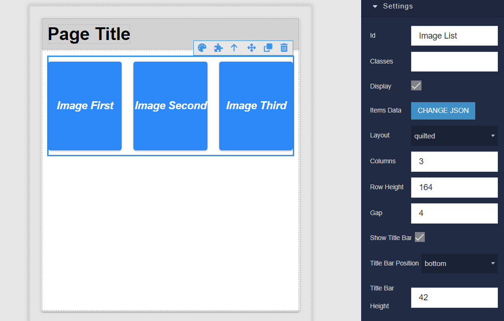
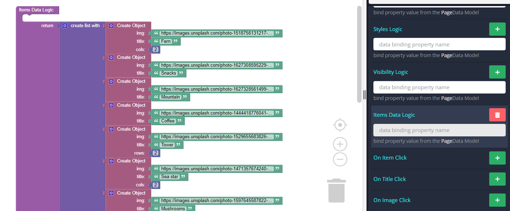
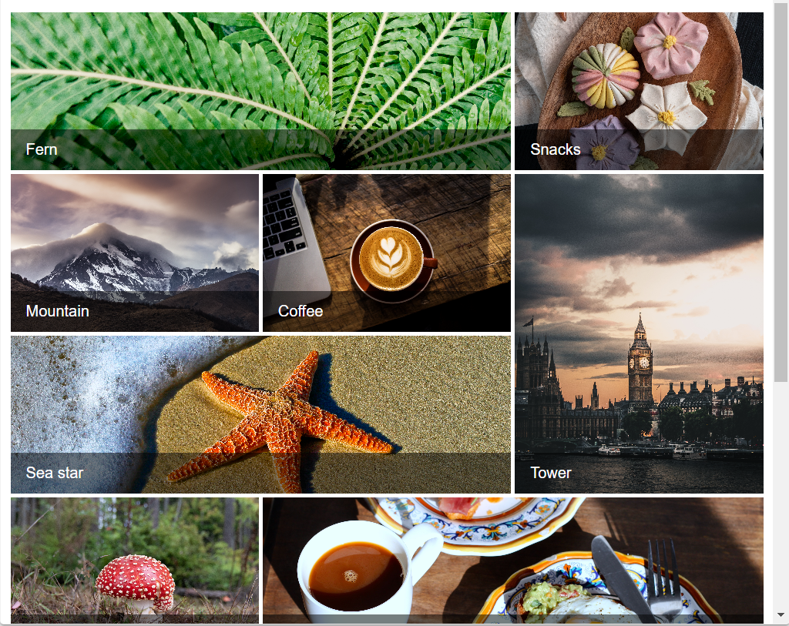

# Image List

Image List is the component that can be used in Backendless [UI-Builder](https://backendless.com/developers/#ui-builder). This component displays a collection of images in an organized grid.

<p align="center">
  
</p>

## Properties

| Property                                   | Type                                                      | Default value | Logic           | Data Binding | UI Setting | Description                                                                                                                                                                            |
|--------------------------------------------|-----------------------------------------------------------|---------------|-----------------|--------------|------------|----------------------------------------------------------------------------------------------------------------------------------------------------------------------------------------|
| Item Data <br> `itemData`                  | *JSON*                                                    | `[]`          | Item Data Logic | YES          | YES        | Specifies a JSON array containing data of the image list items.  Signature of items list: `[ <Item> ]` Signature of item: `{ img: String, title: String, rows: Number, cols: Number }` |
| Variant <br> `listVariant`                 | *Select* <br> [`standard`, `quilted`, `woven`, `masonry`] | `standard`    |                 | NO           | YES        | Controls the variant of image list to use.                                                                                                                                             |
| Columns <br> `cols`                        | *Number*                                                  | 3             |                 | NO           | YES        | Controls the number of columns of the image list.                                                                                                                                      |
| Row Height <br> `rowHeight`                | *Number*                                                  | 164           |                 | NO           | YES        | Controls the height of one row of the image list in px. Ignored with masonry variant.                                                                                                  |
| Gap <br> `gap`                             | *Number*                                                  | 4             |                 | NO           | YES        | Controls the gap between list items in px.                                                                                                                                             |
| Show Title Bar <br> `showTitleBar`         | *Checkbox*                                                | `false`       |                 | NO           | YES        | Controls whether the title bar is shown or hidden by default.                                                                                                                          |
| Title Bar Position <br> `titleBarPosition` | *Select* <br> [`below`, `bottom`, `top`]                  | `bottom`      |                 | NO           | YES        | Controls the position of the title bar.                                                                                                                                                |
| Title Bar Height <br> `titleBarHeight`     | *Number*                                                  | 42            |                 | NO           | YES        | Controls the height of the title bar in px.                                                                                                                                            |

## Events

| Name           | Triggers                                                                        | Context Blocks                                       |
|----------------|---------------------------------------------------------------------------------|------------------------------------------------------|
| On Item Click  | when the user clicks the mouse or taps the item of the image list               | Event: `Object`, Item: `Object`                      |
| On Title Click | when the user clicks the mouse or taps the title of the item of the image list. | Event: `Object`, Title: `String`, Item: `Object`     |
| On Image Click | when the user clicks the mouse or taps the image of the item of the image list. | Event: `Object`, Image URL: `String`, Item: `Object` |

## Styles

````
@bl-customComponent-image-list-width: 100%;
@bl-customComponent-image-list-height: auto;
@bl-customComponent-image-list-overflow: unset;
@bl-customComponent-image-list-background: transparent;

@bl-customComponent-image-list-bar-fontFamily: Roboto, Helvetica, Arial, sans-serif;
@bl-customComponent-image-list-bar-background: rgba(0, 0, 0, 0.5);
@bl-customComponent-image-list-bar-below-background: transparent;
@bl-customComponent-image-list-bar-titleWrap-padding: 12px 16px;
@bl-customComponent-image-list-bar-titleWrap-overflow: hidden;
@bl-customComponent-image-list-bar-titleWrap-color: rgb(255, 255, 255);
@bl-customComponent-image-list-bar-below-titleWrap-padding: 6px 0px 12px;
@bl-customComponent-image-list-bar-below-titleWrap-overflow: hidden;
@bl-customComponent-image-list-bar-below-titleWrap-color: rgb(0, 0, 0);
@bl-customComponent-image-list-bar-title-fontSize: 1rem;
@bl-customComponent-image-list-bar-title-lineHeight: 24px;
@bl-customComponent-image-list-bar-title-textOverflow: ellipsis;
@bl-customComponent-image-list-bar-title-overflow: hidden;
@bl-customComponent-image-list-bar-title-whiteSpace: nowrap;
````

## Usage Examples

Below is an example of using the Image List component.

For example, consider the quilted variant. Quilted image lists emphasize certain items over others in a collection. They create hierarchy using varied container sizes and ratios.

Let's add a component to the page and select the necessary settings on the right.

<p align="center">
  
</p>

Now we need to add content to display.
We can do this step right there in the settings on the right by adding json:

````
[
  {
    "img": "https://images.unsplash.com/photo-1518756131217-31eb79b20e8f",
    "title": "Fern",
    "cols": 2
  },
  {
    "img": "https://images.unsplash.com/photo-1627308595229-7830a5c91f9f",
    "title": "Snacks"
  },
  {
    "img": "https://images.unsplash.com/photo-1627328561499-a3584d4ee4f7",
    "title": "Mountain"
  },
  {
    "img": "https://images.unsplash.com/photo-1444418776041-9c7e33cc5a9c",
    "title": "Coffee"
  },
  {
    "img": "https://images.unsplash.com/photo-1529655683826-aba9b3e77383",
    "title": "Tower",
    "rows": 2
  },
  {
    "img": "https://images.unsplash.com/photo-1471357674240-e1a485acb3e1",
    "title": "Sea star",
    "cols": 2
  },
  {
    "img": "https://images.unsplash.com/photo-1597645587822-e99fa5d45d25",
    "title": "Mushrooms"
  },
  {
    "img": "https://images.unsplash.com/photo-1551963831-b3b1ca40c98e",
    "title": "Breakfast",
    "cols": 2
  },
  {
    "img": "https://images.unsplash.com/photo-1627328715728-7bcc1b5db87d",
    "title": "Tree",
    "rows": 2
  },
  {
    "img": "https://images.unsplash.com/photo-1551782450-a2132b4ba21d",
    "title": "Burger"
  },
  {
    "img": "https://images.unsplash.com/photo-1522770179533-24471fcdba45",
    "title": "Camera"
  },
  {
    "img": "https://images.unsplash.com/photo-1558642452-9d2a7deb7f62",
    "title": "Honey"
  },
  {
    "img": "https://images.unsplash.com/photo-1516802273409-68526ee1bdd6",
    "title": "Basketball"
  }
]
````
or in the component logic:

<p align="center">
  
</p>

Please note that for each item in the list, the required parameters are `img` and `title` , while `rows` and `cols` are optional and are only needed to configure the quilted display option.

<details>
<summary>Try yourself</summary>

```
<block xmlns="http://www.w3.org/1999/xhtml" type="lists_create_with" id="N0*!Z;PP.g$~,3le?wet" x="151.6999969482422" y="100"><mutation items="13"></mutation><value name="ADD0"><block type="create_object" id="fVLlt!D~5GaSg[$s8tT4"><mutation><properties><item id="property" prop-name="img"></item><item id="property" prop-name="title"></item><item id="property" prop-name="cols"></item></properties></mutation><value name="create_object_mutator_container_properties_stack_property0"><block type="text" id="q?|~6}0blW9-qiBgOXVJ"><field name="TEXT">https://images.unsplash.com/photo-1518756131217-31eb79b20e8f</field></block></value><value name="create_object_mutator_container_properties_stack_property1"><block type="text" id="H#jKV[@+XiZ8+a1)w`hw"><field name="TEXT">Fern</field></block></value><value name="create_object_mutator_container_properties_stack_property2"><block type="math_number" id="l`%/CM]eF+sx3@5]NU%6"><field name="NUM">2</field></block></value></block></value><value name="ADD1"><block type="create_object" id="ulj:V}7M*F(D@*e=Hfw*"><mutation><properties><item id="property" prop-name="img"></item><item id="property" prop-name="title"></item></properties></mutation><value name="create_object_mutator_container_properties_stack_property0"><block type="text" id="BD191r4NSwPTFG9{CfRX"><field name="TEXT">https://images.unsplash.com/photo-1627308595229-7830a5c91f9f</field></block></value><value name="create_object_mutator_container_properties_stack_property1"><block type="text" id="DMEPrJIoD^e#U(rWE*U`"><field name="TEXT">Snacks</field></block></value></block></value><value name="ADD2"><block type="create_object" id="SXlxC:DiLp9z~1vNh*]="><mutation><properties><item id="property" prop-name="img"></item><item id="property" prop-name="title"></item></properties></mutation><value name="create_object_mutator_container_properties_stack_property0"><block type="text" id="dyHM;%bfr%#fg]=9{$J@"><field name="TEXT">https://images.unsplash.com/photo-1627328561499-a3584d4ee4f7</field></block></value><value name="create_object_mutator_container_properties_stack_property1"><block type="text" id="XJF#{IjTkq60dZ/^`17f"><field name="TEXT">Mountain</field></block></value></block></value><value name="ADD3"><block type="create_object" id="uCykg}=T]tRJWow0~nDa"><mutation><properties><item id="property" prop-name="img"></item><item id="property" prop-name="title"></item></properties></mutation><value name="create_object_mutator_container_properties_stack_property0"><block type="text" id="NON!/{Uw@Im)o6iAOwvr"><field name="TEXT">https://images.unsplash.com/photo-1444418776041-9c7e33cc5a9c</field></block></value><value name="create_object_mutator_container_properties_stack_property1"><block type="text" id="=ie:=f~FTi4|~`WB-@?d"><field name="TEXT">Coffee</field></block></value></block></value><value name="ADD4"><block type="create_object" id="3/J.RCIx+gDe3)D4D?3;"><mutation><properties><item id="property" prop-name="img"></item><item id="property" prop-name="title"></item><item id="property" prop-name="rows"></item></properties></mutation><value name="create_object_mutator_container_properties_stack_property0"><block type="text" id="V74d3Ph!`)54Rx;1xB?5"><field name="TEXT">https://images.unsplash.com/photo-1529655683826-aba9b3e77383</field></block></value><value name="create_object_mutator_container_properties_stack_property1"><block type="text" id="[!Dx3/M`|}Z2kNf0;BQE"><field name="TEXT">Tower</field></block></value><value name="create_object_mutator_container_properties_stack_property2"><block type="math_number" id="v#$mZ.(@t5H;bv1IJ9Sf"><field name="NUM">2</field></block></value></block></value><value name="ADD5"><block type="create_object" id="!.%1=|nq2^iUC8!Fy3qQ"><mutation><properties><item id="property" prop-name="img"></item><item id="property" prop-name="title"></item><item id="property" prop-name="cols"></item></properties></mutation><value name="create_object_mutator_container_properties_stack_property0"><block type="text" id="{[;Rw`LO4hKK,VcQA,1J"><field name="TEXT">https://images.unsplash.com/photo-1471357674240-e1a485acb3e1</field></block></value><value name="create_object_mutator_container_properties_stack_property1"><block type="text" id="R)jck7y((I/,o,v1H+6j"><field name="TEXT">Sea star</field></block></value><value name="create_object_mutator_container_properties_stack_property2"><block type="math_number" id=")^11E+pH=?zL:iV7AN3P"><field name="NUM">2</field></block></value></block></value><value name="ADD6"><block type="create_object" id="cB)kAw}}H+^bD.j}Ia*v"><mutation><properties><item id="property" prop-name="img"></item><item id="property" prop-name="title"></item></properties></mutation><value name="create_object_mutator_container_properties_stack_property0"><block type="text" id="do5tgIz`u.s8d}VYub6U"><field name="TEXT">https://images.unsplash.com/photo-1597645587822-e99fa5d45d25</field></block></value><value name="create_object_mutator_container_properties_stack_property1"><block type="text" id="Fe16HH5]~h*Guzij,DdP"><field name="TEXT">Mushrooms</field></block></value></block></value><value name="ADD7"><block type="create_object" id="rzO1E|6VACFgsK2t1M*N"><mutation><properties><item id="property" prop-name="img"></item><item id="property" prop-name="title"></item><item id="property" prop-name="cols"></item></properties></mutation><value name="create_object_mutator_container_properties_stack_property0"><block type="text" id="l(]cu|`SCC=}C^7Nq}le"><field name="TEXT">https://images.unsplash.com/photo-1551963831-b3b1ca40c98e</field></block></value><value name="create_object_mutator_container_properties_stack_property1"><block type="text" id="#X$-rm!bWI3)Q{2]5T0]"><field name="TEXT">Breakfast</field></block></value><value name="create_object_mutator_container_properties_stack_property2"><block type="math_number" id="2EP`8tyF;A0jNWn%pHBa"><field name="NUM">2</field></block></value></block></value><value name="ADD8"><block type="create_object" id="0T#WpyU)Ay(i~WLk[;Mn"><mutation><properties><item id="property" prop-name="img"></item><item id="property" prop-name="title"></item><item id="property" prop-name="rows"></item></properties></mutation><value name="create_object_mutator_container_properties_stack_property0"><block type="text" id="azp~2@x6K;~aV8$`#LA."><field name="TEXT">https://images.unsplash.com/photo-1627328715728-7bcc1b5db87d</field></block></value><value name="create_object_mutator_container_properties_stack_property1"><block type="text" id="PLlFPoNg,u6MZM:,u*p`"><field name="TEXT">Tree</field></block></value><value name="create_object_mutator_container_properties_stack_property2"><block type="math_number" id="`_riRD=:#z:5w%k*3,iL"><field name="NUM">2</field></block></value></block></value><value name="ADD9"><block type="create_object" id="~=?E8g)0S+`o7q_D`UIr"><mutation><properties><item id="property" prop-name="img"></item><item id="property" prop-name="title"></item></properties></mutation><value name="create_object_mutator_container_properties_stack_property0"><block type="text" id="Y*iWJS=_D=+vsx*W!YU["><field name="TEXT">https://images.unsplash.com/photo-1551782450-a2132b4ba21d</field></block></value><value name="create_object_mutator_container_properties_stack_property1"><block type="text" id=",=NbF]!Gu!.5K*W94E@f"><field name="TEXT">Burger</field></block></value></block></value><value name="ADD10"><block type="create_object" id="50Vmt^ss/rc9CNX~*Hxw"><mutation><properties><item id="property" prop-name="img"></item><item id="property" prop-name="title"></item></properties></mutation><value name="create_object_mutator_container_properties_stack_property0"><block type="text" id="h-rLzHeAmpCsIVnLgGrq"><field name="TEXT">https://images.unsplash.com/photo-1522770179533-24471fcdba45</field></block></value><value name="create_object_mutator_container_properties_stack_property1"><block type="text" id="Elcz5Msrt5]U/34TGRE4"><field name="TEXT">Camera</field></block></value></block></value><value name="ADD11"><block type="create_object" id="g6)sV(d*4B61SC_]#nzG"><mutation><properties><item id="property" prop-name="img"></item><item id="property" prop-name="title"></item></properties></mutation><value name="create_object_mutator_container_properties_stack_property0"><block type="text" id="^[{:o7ny7y!jK567l-w~"><field name="TEXT">https://images.unsplash.com/photo-1558642452-9d2a7deb7f62</field></block></value><value name="create_object_mutator_container_properties_stack_property1"><block type="text" id="H0=P@OXp1XnDCx({~-p?"><field name="TEXT">Honey</field></block></value></block></value><value name="ADD12"><block type="create_object" id="6?C5.oo:OL(Z.sLZl%}B"><mutation><properties><item id="property" prop-name="img"></item><item id="property" prop-name="title"></item></properties></mutation><value name="create_object_mutator_container_properties_stack_property0"><block type="text" id="DmC8mUv2Bq%t-%|@qcoC"><field name="TEXT">https://images.unsplash.com/photo-1516802273409-68526ee1bdd6</field></block></value><value name="create_object_mutator_container_properties_stack_property1"><block type="text" id="4H)M/@hM#!bN^A2XXC1J"><field name="TEXT">Basketball</field></block></value></block></value></block>
```
</details>

And now, after running the preview, we will see the following result:

<p align="center">
  
</p>
