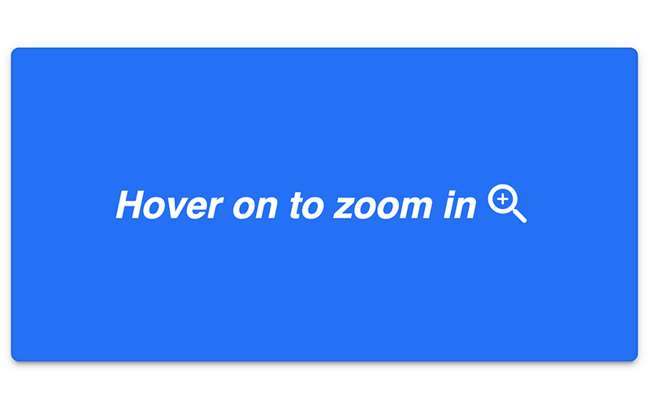
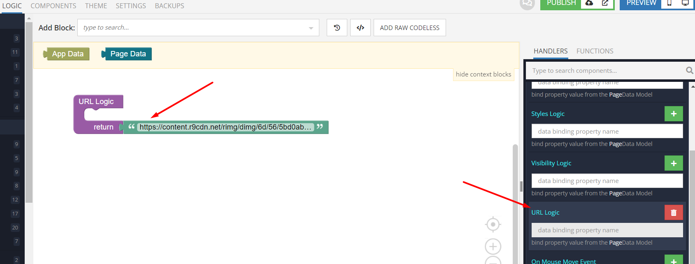

# Inner Image Zoom

Inner Image Zoom is the component that can be used in Backendless [UI-Builder](https://backendless.com/developers/#ui-builder). It allows the user to apply an image zoom effect inside that image in the application.

<p align="center">
  
</p>

## Configuration

Configuration can be done in the UI Builder or using the Codeless Logic. You have to specify the URL of the image that will be displayed in the component and to which the zoom effect will be applied.

## Properties

| Property           | Type     | Default value                                     | Logic     | Data Binding | UI Setting | Description                                         |
|--------------------|----------|---------------------------------------------------|-----------|--------------|------------|-----------------------------------------------------|
| URL <br> `source`  | *Text*   | `https://via.placeholder.com/300x150.png/09f/fff` | URL Logic | YES          | YES        | Specifies the image source to zoom.                 |
| Zoom <br> `zoomIn` | *Number* | 200                                               |           | NO           | YES        | Controlled zoom in percent(%) to enlarge the image. |

## Events

| Name                | Triggers                                                 | Context Blocks  |
|---------------------|----------------------------------------------------------|-----------------|
| On Mouse Move Event | when the user moves the mouse over or touches the image. | Event: `Object` |
| On Mouse Over Event | when the mouse pointer hovers over the image.            |                 |
| On Mouse Out Event  | when the mouse pointer leaves the image.                 |                 |

## Styles

**Theme**

````
@bl-customComponent-innerImageZoom-theme: @themePrimary;
@bl-customComponent-innerImageZoom-shadow: @appComponentShadow;
@bl-customComponent-innerImageZoom-border: @appBlockBorder;
@bl-customComponent-innerImageZoom-border-radius: @appComponentBorderRadius;
````

**General**

````
@bl-customComponent-innerImageZoom-background-color: if(@isLightTheme, rgba(0, 0, 0, 0.04), rgba(255, 255, 255, 0.04));
@bl-customComponent-innerImageZoom-cursor: crosshair;
````

**Dimensions**

````
@bl-customComponent-innerImageZoom-width: fit-content;
@bl-customComponent-innerImageZoom-margin: 10px;
````

## Examples

### Usage

The following is an example showing how to specify the image source in the URL Logic of the Inner Image Zoom component:

<p align="center">
  
</p>
