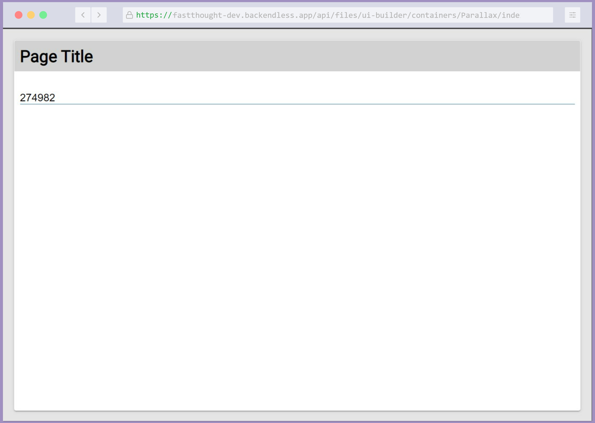

# Input with Mask

Input with Mask is a component of Backendless UI-Builder designer. This allows you to add input with mask.

This component is based on an external library [imask.js](https://github.com/uNmAnNeR/imaskjs)

## Properties

| Property                            | Type                                  | Default Value | Logic                  | Data Binding | UI Setting | Description                                                                                                                                                                                                                                               |
|-------------------------------------|---------------------------------------|---------------|------------------------|--------------|------------|-----------------------------------------------------------------------------------------------------------------------------------------------------------------------------------------------------------------------------------------------------------|
| Mask Type: `maskType`               | Select [`Number`, `String`, `RegExp`] | "Number"      | Mask Type Logic        | NO           | YES        | Allows select type of mask(Number, String, RegExp).                                                                                                                                                                                                       |
| Mask: `mask`                        | Text                                  |               | Mask Logic             | YES          | YES        | Allows to specify mask. 0 - any digit; a - any letter; * - any char. Or you can write RegExp.                                                                                                                                                             |
| Placeholder: `placeholder`          | Text                                  |               | Placeholder Logic      | YES          | YES        | Allows to specify placeholder.                                                                                                                                                                                                                            |
| Placeholder Char: `placeholderChar` | Text                                  | "_"           | Placeholder Char Logic | YES          | YES        | Allows to specify placeholder char.                                                                                                                                                                                                                       |
| Lazy: `lazy`                        | Checkbox                              | `false`       | Lazy Logic             | NO           | YES        | Allows to specify lazy or not lazy. Lazy it's when the input doesn't display the template of the mask. For example, Mask: `000 000 000`, Placeholder Char: `_`, Lazy: `checked` input will be empty, but if Lazy: `unchecked` input will be `___ ___ ___` |

## Events

| Name            | Triggers                                                                                                                     | Context Blocks  | Return   |
|-----------------|------------------------------------------------------------------------------------------------------------------------------|-----------------|----------|
| On Change Value | when the component's state (value) changes.                                                                                  | `value: string` |          |
| On Validate     | before the component value changes. Using this event we can additionally ourself check and modify each symbol that we input. | `value: string` | `string` |

## Styles

**Theme**

````
@bl-customComponent-inputWithMask-themeColor: @themePrimary;
@bl-customComponent-inputWithMask-backgroundColor: @appBackgroundColor;
@bl-customComponent-inputWithMask-textColor: @appTextColor;
````

## Mask Example

`0` - any digit
`a` - any letter
`*` - any char

`[]` - make input optional

If definition character should be treated as fixed it should be escaped by ` \ `

| Mask                    | Input                                     |
|-------------------------|-------------------------------------------|
| `+1 (000) 000-0000`     | `+1 (555) 555-1234`                       |
| `000-aaa-000-aaa`       | `254-jle-634-lji`                         |
| `****/****/****`        | `jie./kao4/1f?.`                          |
| `aaaa aaaa aaaa [aaaa]` | `JLKI HUER LAGI` or `JLKI HUER LAGI OIUK` |
| `+38\0 (00) 000 0000`   | `+380 (85) 547 8653`                      |

## Usage guide

1. Add component Input with Mask to page:

    

2. Now you can see result in the preview. You can input only Number:

    

3. In the "On Validate" event, we can further validate each character before changing the value of the component. Just
   return a valid value or null. For example, if we enter "i" or "I" they will not be written to the input value, other
   values will be written in upper case:

    
    

    <details>
    <summary>Try yourself</summary>

    ```
    <block xmlns="http://www.w3.org/1999/xhtml" type="controls_if" id="?)?aPQEB,7Ee]yox$:A;" x="122" y="253"><value name="IF0"><block type="list_contains" id="SHZu0mC9rAnu:2iy628~"><value name="list"><block type="lists_create_with" id="B,RSxW49Rdh%pr-U_M#k"><mutation items="2"></mutation><value name="ADD0"><block type="text" id="vB9v0nd^(#auwN.~Bzdk"><field name="TEXT">i</field></block></value><value name="ADD1"><block type="text" id="Q:fF;W(}/|jnOCigz?fo"><field name="TEXT">I</field></block></value></block></value><value name="item"><block type="root_block_ui_builder_c_7b75bce61a728dc952497ba8409da7b1_onValidate_handler_context_blocks_value" id="(F8de,7NDhzBG#-/VwEf" bl_meta="{&quot;label&quot;:&quot;Value&quot;}"></block></value></block></value><statement name="DO0"><block type="immediate_return" id="TvZyLsOZaGSCCi%n=/;y"><value name="value"><block type="logic_null" id="ezE,YMxp.2e]CCFeYfuE"></block></value></block></statement></block>
    ```

   return:
    ```
    <block xmlns="http://www.w3.org/1999/xhtml" type="text_changeCase" id="1*-3ZF!c%gq6*mnU=$4_" x="205.55555725097656" y="355"><field name="CASE">UPPERCASE</field><value name="TEXT"><shadow type="text" id="t=_6?b1`ukO5vEab:L[;"><field name="TEXT">abc</field></shadow><block type="root_block_ui_builder_c_7b75bce61a728dc952497ba8409da7b1_onValidate_handler_context_blocks_value" id="ER]yx.}GWfC53i,8}m$s" bl_meta="{&quot;label&quot;:&quot;Value&quot;}"></block></value></block>
    ```
    </details>

    


4. Also, you can add a custom mask to the UI Setting property Mask:

    
    

5. And you can create a mask with RegExp:

   
   
