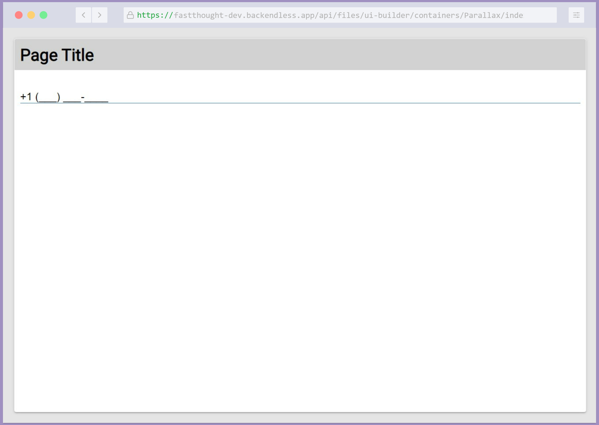

# Input with Mask

Input with Mask is a component of Backendless UI-Builder designer. This allows you to add input with mask.

This component is based on an external library [imask.js](https://github.com/uNmAnNeR/imaskjs)

## Properties

| Property        | Type                                  | Default Value | Logic                  | Data Binding | UI Setting | Description                                                                                   |
| --------------- | ------------------------------------- | ------------- | ---------------------- | ------------ | ---------- | --------------------------------------------------------------------------------------------- |
| maskType        | Select ["Number", "String", "RegExp"] | "Number"      | Mask Type Logic        | NO           | YES        | Allows select type of mask(Number, String, RegExp).                                           |
| mask            | String                                |               | Mask Logic             | YES          | YES        | Allows to specify mask. 0 - any digit; a - any letter; * - any char. Or you can write RegExp. |
| placeholder     | String                                |               | Placeholder Logic      | YES          | YES        | Allows to specify placeholder.                                                                |
| placeholderChar | String                                | "_"           | Placeholder Char Logic | YES          | YES        | Allows to specify placeholder char.                                                           |
| lazy            | Boolean                               | `false`       | Lazy Logic             | NO           | YES        | Allows to specify lazy or not lazy.                                                           |

## Events

| Name            | Triggers                                                                                                                     | Context Blocks  | Return   |
| --------------- | ---------------------------------------------------------------------------------------------------------------------------- | --------------- | -------- |
| On Change Value | when the component's state (value) changes.                                                                                  | `value: string` |          |
| On Validate     | before the component value changes. Using this event we can additionally ourself check and modify each symbol that we input. | `value: string` | `string` |

## Styles

**Theme**
````
@bl-customComponent-inputWithMask-themeColor: @themePrimary;
@bl-customComponent-inputWithMask-backgroundColor: @appBackgroundColor;
@bl-customComponent-inputWithMask-textColor: @appTextColor;
````

## Mask Example

`0` - any digit
`a` - any letter
`*` - any char

`[]` - make input optional

| Mask                | Input               |
| ------------------- | ------------------- |
| `+1 (000) 000-0000` | `+1 (555) 555-1234` |
| `000-aaa-000-aaa`   | `254-jle-634-lji`   |
| `****/****/****`    | `jie./kao4/1f?.`    |

## Usage guide

1. Add component Input with Mask to page:

    

2. In the "On Validate" event, we can further validate each character before changing the value of the component. Just return a valid value or nothing. If you don't need additional validation, you can simply return the "Value" that is in the context block:

    

3. Now you can see result in the preview. You can input only Number:

    

4. Also, you can add a custom mask to the UI Setting property Mask:

    
    

5. And you can create a mask with RegExp:

   
   
