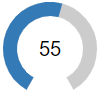

# Knob

Knob is a component of Backendless UI-Builder designer. This allows you to define number inputs with a dial.

The component based on external [Knob](https://www.primefaces.org/primereact/knob/).

  

## Properties

| Property       | Type       | Default Value | Logic                | Data Binding | UI Setting | Description                                                                                                                                                                                  |
|----------------|------------|---------------|----------------------|--------------|------------|----------------------------------------------------------------------------------------------------------------------------------------------------------------------------------------------|
| Initial Value  | *Number*   | 0             | Initial Value Logic  | YES          | YES        | This is a handler to control the initial value.                                                                                                                                              |
| Read Only      | *Checkbox* | `false`       | Read Only Logic      | YES          | YES        | This is a handler that controls the readOnly property.                                                                                                                                       |
| Disabled       | *Checkbox* | `false`       | Disabled Logic       | YES          | YES        | This is a handler to control the disabled property.                                                                                                                                          |
| Set Max Value  | *Number*   | 100           | Set Max Logic        | YES          | YES        | This is a handler to control the max value.                                                                                                                                                  |
| Set Min Value  | *Number*   | 0             | Set Min Logic        | YES          | YES        | This is a handler to control the min value.                                                                                                                                                  |
| Step           | *Number*   | 1             | Step Logic           | YES          | YES        | This is a handler to control the step of the Knob.                                                                                                                                           |
| Dial Width     | *Number*   | 14            |                      | NO           | YES        | This is a handler to control the dial width of the Knob.                                                                                                                                     |
| Value Template | *Number*   | "{value}"     | Value Template Logic | YES          | YES        | This is a handler to control the value template of the Knob. To change the view of the value write before or after the curly brackets.   Example: `{value}%` => `0%`, `${value}` => `$0` |
| Size           | *Number*   | 100           |                      | NO           | YES        | This is a handler to control the size of the Knob.                                                                                                                                           |
| Value Color    | *Color*    | "#6366F1"     | Value Color Logic    | YES          | YES        | This is a handler to control the value color of the Knob.                                                                                                                                    |
| Range Color    | *Color*    | "#DFE7EF"     | Range Color Logic    | YES          | YES        | This is a handler to control the range color of the Knob.                                                                                                                                    |

## Events

| Name      | Triggers                                | Context Blocks |
|-----------|-----------------------------------------|----------------|
| On Change | when the user changes the knob value    | Data: `Number` |

## Action

| Action        | Inputs               | Returns |
|---------------|----------------------|---------|
| Set Value     | Value: `Number`      |         |
| Set Read Only | Read Only: `Boolean` |         |
| Set Disabled  | Disabled: `Boolean`  |         |
