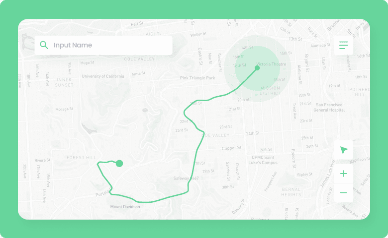
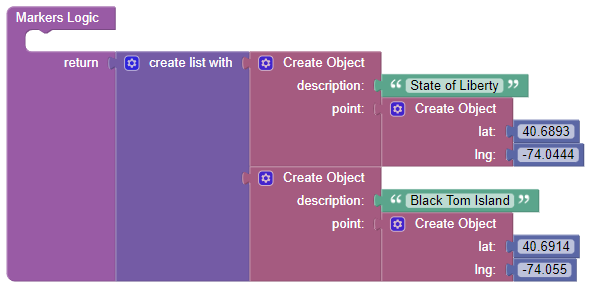
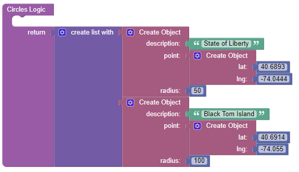
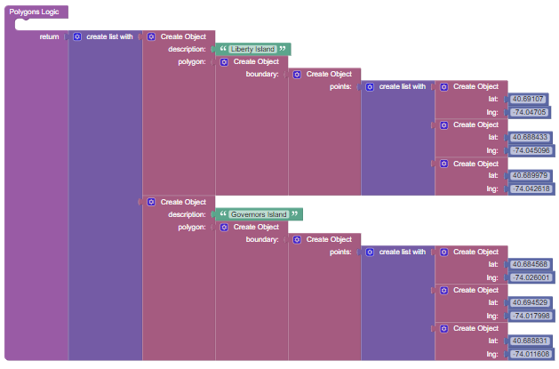

# Leaflet Map

This is a component for Backendless [UI-Builder](https://backendless.com/developers/#ui-builder) designer based on the [Leaflet](https://github.com/Leaflet/Leaflet) library.

The component covers all the main features of the library and allows you in a couple click render an interactive map in your UI-Builder application.

<p align="center">
  
</p>

## Properties

| Property           | Type                                                                             | Default value          | Logic                     | Data Binding | UI Setting | Description                                                                                                                                                                     |
|--------------------|----------------------------------------------------------------------------------|------------------------|---------------------------|--------------|------------|---------------------------------------------------------------------------------------------------------------------------------------------------------------------------------|
| mapType            | *Select* <br/>[`carto`, `cartoDark`, `openStreet`, `cyclosm`, `esriWorldStreet`] | openStreet             | Map Type Logic            | YES          | YES        | controls the map type.                                                                                                                                                          |
| mapTypeControl     | *Checkbox*                                                                       | true                   | Map Type Control Logic    | YES          | YES        | enables switching the map type                                                                                                                                                  |
| center             | *Text*                                                                           | 40.6893, <br/>-74.0444 | Center Logic              | YES          | YES        | controls the map center. `'lat, lng'`                                                                                                                                           |
| zoom               | *Number*                                                                         | 10                     | Zoom Logic                | YES          | YES        | controls the map zoom.                                                                                                                                                          |
| zoomControl        | *Checkbox*                                                                       | true                   | Zoom Control Logic        | YES          | YES        | enables zoom controls on the map                                                                                                                                                |
| Fullscreen         | *Checkbox*                                                                       | false                  | Fullscreen Control Logic  | YES          | YES        | enables fullscreen mode for the map type                                                                                                                                        |
| fullscreenControl  | *Checkbox*                                                                       | true                   | Fullscreen Control Logic  | YES          | YES        | enables toggling fullscreen for the map                                                                                                                                         |
| draggingControl    | *Checkbox*                                                                       | true                   | Dragging Control Logic    | YES          | YES        | enables dragging on the map                                                                                                                                                     |
| geopositionControl | *Checkbox*                                                                       | true                   | Geoposition Control Logic | YES          | YES        | enables geoposition controls on the map                                                                                                                                         |
| markers            | *JSON*                                                                           |                        | Markers Logic             | YES          | YES        | Specifies an array of markers to display on the map. Watch [Codeless Examples](#codeless-examples). Signature of marker: `{description, point: {lat, lng}}`.                             |
| circles            | *JSON*                                                                           |                        | Circles Logic             | YES          | YES        | Specifies an array of circles to display on the map. Watch [Codeless Examples](#codeless-examples). Signature of circle: `{description, point: {lat, lng}, radius}`.                     |
| polygons           | *JSON*                                                                           |                        | Polygons Logic            | YES          | YES        | Specifies an array of polygons to display on the map. Watch [Codeless Examples](#codeless-examples). Signature of polygon: `{description, polygon: {boundary: {points: [{lat, lng}]}}}`. |


## Events

| Name                       | Triggers                               | Context Blocks                                                                                                                                                                     |
|----------------------------|----------------------------------------|------------------------------------------------------------------------------------------------------------------------------------------------------------------------------------|
| On Click                   | when a user click on map               | Coordinates: `[lat: Number, lng: Number]`                                                                                                                                          |
| On Marker Click            | when a user click on a marker          | Coordinates: `[lat: Number, lng: Number]` <br/> Description: `String`                                                                                                              |
| On Circle Click            | when a user click on a circle          | Coordinates: `[lat: Number, lng: Number]` <br/> Radius: `Number` <br/> Description: `String`                                                                                       |
| On Polygon Click           | when a user click on a polygon         | Coordinates: `[lat: Number, lng: Number]` <br/> Description: `String`                                                                                                              |
| On Map Type Change         | when a user changed the map type       | Previous Type: `String` <br/> Current Type: `String`                                                                                                                               |
| On Determining Geoposition | when a user determining geoposition    | Coordinates: `[lat: Number, lng: Number]`                                                                                                                                          |
| On Fullscreen Button Click | when a user click on fullscreen button | Fullscreen: `Boolean`                                                                                                                                                              |
| On Pan Event               | when the user moves the map around     | Changed Center Position: `{lat: Number, lng: Number}` <br/> Changed NorthEast Position: `{lat: Number, lng: Number}` <br/> Changed SouthWest Position: `{lat: Number, lng: Number}`|

## Actions

| Action           | Inputs                                       | Returns                            |
|------------------|----------------------------------------------|------------------------------------|
| Set map center   | latitude: `Number` <br/> longitude: `Number` |                                    |
| Set map zoom     | value: `Number`                              |                                    |
| Get map zoom     |                                              | `Number`: current map zoom         |
| Get map center   |                                              | `Number`: current map center       |
| Get all markers  |                                              | `List`: of all markers on the map  |
| Get all circles  |                                              | `List`: of all circles on the map  |
| Get all polygons |                                              | `List`: of all polygons on the map |

## Styles

**Theme**
````
@bl-customComponent-leafletMap-themeColor: @themePrimary;
````

**Dimensions**
````
@bl-customComponent-leafletMap-width: 500px;
@bl-customComponent-leafletMap-height: 400px;
@bl-customComponent-leafletMap-margin: 0;
````
## Codeless Examples

Addition of markers on map:



<details><summary>Try yourself</summary>

````javascript
<block xmlns="http://www.w3.org/1999/xhtml" type="lists_create_with" id="V)EJ7.stcEuE.oxtP?C+" x="223" y="345"><mutation items="2"></mutation><value name="ADD0"><block type="create_object" id="=O$AYWntnuES@R1yg5yI"><mutation><properties><item id="property" prop-name="description"></item><item id="property" prop-name="point"></item></properties></mutation><value name="create_object_mutator_container_properties_stack_property0"><block type="text" id="V_NqO}4u!T(@VKS!YV4k"><field name="TEXT">State of Liberty</field></block></value><value name="create_object_mutator_container_properties_stack_property1"><block type="create_object" id="yEx_iL.=HW,uyXF#gl%h"><mutation><properties><item id="property" prop-name="lat"></item><item id="property" prop-name="lng"></item></properties></mutation><value name="create_object_mutator_container_properties_stack_property0"><block type="math_number" id="Gb(!+N,Ifv=(86zd`YuU"><field name="NUM">40.6893</field></block></value><value name="create_object_mutator_container_properties_stack_property1"><block type="math_number" id="`)v+ZY1G,IV-/S]@QG%9"><field name="NUM">-74.0444</field></block></value></block></value></block></value><value name="ADD1"><block type="create_object" id="fXa!m7|{8dP_1(?Ao253"><mutation><properties><item id="property" prop-name="description"></item><item id="property" prop-name="point"></item></properties></mutation><value name="create_object_mutator_container_properties_stack_property0"><block type="text" id=",B}|:Xu;NM+^L]iZ0y%7"><field name="TEXT">Black Tom Island</field></block></value><value name="create_object_mutator_container_properties_stack_property1"><block type="create_object" id="}K;IUT%OVHmHby31m?O0"><mutation><properties><item id="property" prop-name="lat"></item><item id="property" prop-name="lng"></item></properties></mutation><value name="create_object_mutator_container_properties_stack_property0"><block type="math_number" id="eg5aVor,fP5$[cvjktNX"><field name="NUM">40.6914</field></block></value><value name="create_object_mutator_container_properties_stack_property1"><block type="math_number" id="[(-tS08tEJAhLc%S$x#-"><field name="NUM">-74.055</field></block></value></block></value></block></value></block>
````
</details>

Addition of circles on map:



<details><summary>Try yourself</summary>

````javascript
<block xmlns="http://www.w3.org/1999/xhtml" type="lists_create_with" id="V)EJ7.stcEuE.oxtP?C+" x="225" y="325"><mutation items="2"></mutation><value name="ADD0"><block type="create_object" id="=O$AYWntnuES@R1yg5yI"><mutation><properties><item id="property" prop-name="description"></item><item id="property" prop-name="point"></item><item id="property" prop-name="radius"></item></properties></mutation><value name="create_object_mutator_container_properties_stack_property0"><block type="text" id="V_NqO}4u!T(@VKS!YV4k"><field name="TEXT">State of Liberty</field></block></value><value name="create_object_mutator_container_properties_stack_property1"><block type="create_object" id="yEx_iL.=HW,uyXF#gl%h"><mutation><properties><item id="property" prop-name="lat"></item><item id="property" prop-name="lng"></item></properties></mutation><value name="create_object_mutator_container_properties_stack_property0"><block type="math_number" id="Gb(!+N,Ifv=(86zd`YuU"><field name="NUM">40.6893</field></block></value><value name="create_object_mutator_container_properties_stack_property1"><block type="math_number" id="`)v+ZY1G,IV-/S]@QG%9"><field name="NUM">-74.0444</field></block></value></block></value><value name="create_object_mutator_container_properties_stack_property2"><block type="math_number" id="fm0JJ)FO*q;(xF)`V1.F"><field name="NUM">50</field></block></value></block></value><value name="ADD1"><block type="create_object" id="fXa!m7|{8dP_1(?Ao253"><mutation><properties><item id="property" prop-name="description"></item><item id="property" prop-name="point"></item><item id="property" prop-name="radius"></item></properties></mutation><value name="create_object_mutator_container_properties_stack_property0"><block type="text" id=",B}|:Xu;NM+^L]iZ0y%7"><field name="TEXT">Black Tom Island</field></block></value><value name="create_object_mutator_container_properties_stack_property1"><block type="create_object" id="}K;IUT%OVHmHby31m?O0"><mutation><properties><item id="property" prop-name="lat"></item><item id="property" prop-name="lng"></item></properties></mutation><value name="create_object_mutator_container_properties_stack_property0"><block type="math_number" id="eg5aVor,fP5$[cvjktNX"><field name="NUM">40.6914</field></block></value><value name="create_object_mutator_container_properties_stack_property1"><block type="math_number" id="[(-tS08tEJAhLc%S$x#-"><field name="NUM">-74.055</field></block></value></block></value><value name="create_object_mutator_container_properties_stack_property2"><block type="math_number" id="b6$U@^.LnNaOP;7([3p6"><field name="NUM">100</field></block></value></block></value></block>
````
</details>

Addition of polygons on map:



<details><summary>Try yourself</summary>

````javascript
<block xmlns="http://www.w3.org/1999/xhtml" type="lists_create_with" id="V)EJ7.stcEuE.oxtP?C+" x="300.6044238683128" y="323.1095679012346"><mutation items="2"></mutation><value name="ADD0"><block type="create_object" id="=O$AYWntnuES@R1yg5yI"><mutation><properties><item id="property" prop-name="description"></item><item id="property" prop-name="polygon"></item></properties></mutation><value name="create_object_mutator_container_properties_stack_property0"><block type="text" id="V_NqO}4u!T(@VKS!YV4k"><field name="TEXT">State of Liberty</field></block></value><value name="create_object_mutator_container_properties_stack_property1"><block type="create_object" id="yEx_iL.=HW,uyXF#gl%h"><mutation><properties><item id="property" prop-name="boundary"></item></properties></mutation><value name="create_object_mutator_container_properties_stack_property0"><block type="create_object" id="G%5qem$0C-sV`$@vF/q`"><mutation><properties><item id="property" prop-name="points"></item></properties></mutation><value name="create_object_mutator_container_properties_stack_property0"><block type="lists_create_with" id="|]y7cQ+H*tf{iGTZP:XE"><mutation items="3"></mutation><value name="ADD0"><block type="create_object" id="}K;IUT%OVHmHby31m?O0"><mutation><properties><item id="property" prop-name="lat"></item><item id="property" prop-name="lng"></item></properties></mutation><value name="create_object_mutator_container_properties_stack_property0"><block type="math_number" id="eg5aVor,fP5$[cvjktNX"><field name="NUM">40.69107</field></block></value><value name="create_object_mutator_container_properties_stack_property1"><block type="math_number" id="[(-tS08tEJAhLc%S$x#-"><field name="NUM">-74.04705</field></block></value></block></value><value name="ADD1"><block type="create_object" id="zW2osMmsGh~%sFx1c/%N"><mutation><properties><item id="property" prop-name="lat"></item><item id="property" prop-name="lng"></item></properties></mutation><value name="create_object_mutator_container_properties_stack_property0"><block type="math_number" id="WLUh3TTJsBXM*c!xhH*D"><field name="NUM">40.688433</field></block></value><value name="create_object_mutator_container_properties_stack_property1"><block type="math_number" id="!(Y:!`I8$sTt#e,bn/E-"><field name="NUM">-74.045096</field></block></value></block></value><value name="ADD2"><block type="create_object" id="]?Asj0g%e2`y4N#Bc_xK"><mutation><properties><item id="property" prop-name="lat"></item><item id="property" prop-name="lng"></item></properties></mutation><value name="create_object_mutator_container_properties_stack_property0"><block type="math_number" id="rPcU@XZ:ti/{`mk;}C|w"><field name="NUM">40.689979</field></block></value><value name="create_object_mutator_container_properties_stack_property1"><block type="math_number" id="5,{6veXh/atsT?u4rOz@"><field name="NUM">-74.042518</field></block></value></block></value></block></value></block></value></block></value></block></value><value name="ADD1"><block type="create_object" id="/Z-R4M03tO[83v3*JjE="><mutation><properties><item id="property" prop-name="description"></item><item id="property" prop-name="polygon"></item></properties></mutation><value name="create_object_mutator_container_properties_stack_property0"><block type="text" id=",B}|:Xu;NM+^L]iZ0y%7"><field name="TEXT">Black Tom Island</field></block></value><value name="create_object_mutator_container_properties_stack_property1"><block type="create_object" id="%FQH/c?6GNc7PrYA%wa*"><mutation><properties><item id="property" prop-name="boundary"></item></properties></mutation><value name="create_object_mutator_container_properties_stack_property0"><block type="create_object" id="Cg]tplc}WN|H6T6E)zIT"><mutation><properties><item id="property" prop-name="points"></item></properties></mutation><value name="create_object_mutator_container_properties_stack_property0"><block type="lists_create_with" id="zMSg+(b;huB-~!I-~T`l"><mutation items="3"></mutation><value name="ADD0"><block type="create_object" id="tJ{jsI.U1u4#/W8s_T-4"><mutation><properties><item id="property" prop-name="lat"></item><item id="property" prop-name="lng"></item></properties></mutation><value name="create_object_mutator_container_properties_stack_property0"><block type="math_number" id=";~7nsQb[h_HzrPp!IiTI"><field name="NUM">40.684568</field></block></value><value name="create_object_mutator_container_properties_stack_property1"><block type="math_number" id="OoVsAx3cvd_~#P]h*R)h"><field name="NUM">-74.025001</field></block></value></block></value><value name="ADD1"><block type="create_object" id="9Xt=z+hP3z$TxeiV%1(P"><mutation><properties><item id="property" prop-name="lat"></item><item id="property" prop-name="lng"></item></properties></mutation><value name="create_object_mutator_container_properties_stack_property0"><block type="math_number" id="}[OLp!t:G?/j@ie2.%cY"><field name="NUM">40.694529</field></block></value><value name="create_object_mutator_container_properties_stack_property1"><block type="math_number" id="et~v+Fxo2-PX+}haPS1#"><field name="NUM">-74.017998</field></block></value></block></value><value name="ADD2"><block type="create_object" id="p(8}3,C^t()FrJctad@:"><mutation><properties><item id="property" prop-name="lat"></item><item id="property" prop-name="lng"></item></properties></mutation><value name="create_object_mutator_container_properties_stack_property0"><block type="math_number" id="w{~tyJYfROpVviYY3d=8"><field name="NUM">40.688831</field></block></value><value name="create_object_mutator_container_properties_stack_property1"><block type="math_number" id="v7.0paDr1x4*s~TEUa!z"><field name="NUM">-74.011608</field></block></value></block></value></block></value></block></value></block></value></block></value></block>
````
</details>
