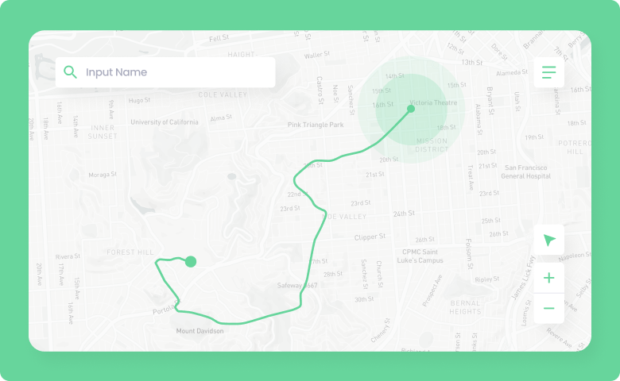
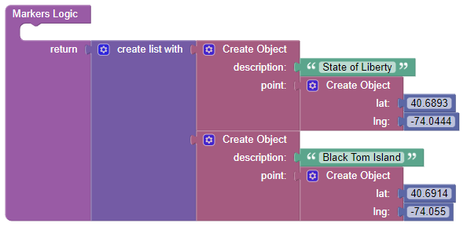
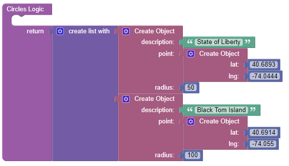
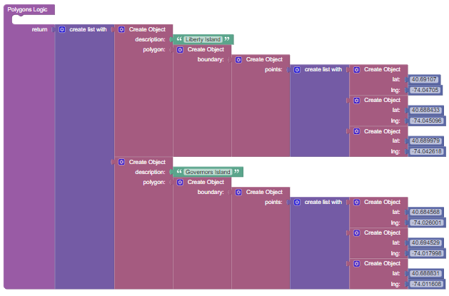

# Leaflet Map

This is a component for Backendless [UI-Builder](https://backendless.com/developers/#ui-builder) designer based on the [Leaflet](https://github.com/Leaflet/Leaflet) library.

The component covers all the main features of the library and allows you in a couple click render an interactive map in your UI-Builder application.

<p align="center">
  
</p>

## Properties

| Property           | Type                                                                             | Default value          | Logic                     | Data Binding | UI Setting | Description                                                                                                                                                                     |
|--------------------|----------------------------------------------------------------------------------|------------------------|---------------------------|--------------|------------|---------------------------------------------------------------------------------------------------------------------------------------------------------------------------------|
| mapType            | *Select* <br/>[`carto`, `cartoDark`, `openStreet`, `cyclosm`, `esriWorldStreet`] | openStreet             | Map Type Logic            | YES          | YES        | controls the map type.                                                                                                                                                          |
| mapTypeControl     | *Checkbox*                                                                       | true                   | Map Type Control Logic    | YES          | YES        | enables switching the map type                                                                                                                                                  |
| center             | *Text*                                                                           | 40.6893, <br/>-74.0444 | Center Logic              | YES          | YES        | controls the map center. `'lat, lng'`                                                                                                                                           |
| zoom               | *Number*                                                                         | 10                     | Zoom Logic                | YES          | YES        | controls the map zoom.                                                                                                                                                          |
| zoomControl        | *Checkbox*                                                                       | true                   | Zoom Control Logic        | YES          | YES        | enables zoom controls on the map                                                                                                                                                |
| Fullscreen         | *Checkbox*                                                                       | false                  | Fullscreen Control Logic  | YES          | YES        | enables fullscreen mode for the map type                                                                                                                                        |
| fullscreenControl  | *Checkbox*                                                                       | true                   | Fullscreen Control Logic  | YES          | YES        | enables toggling fullscreen for the map                                                                                                                                         |
| draggingControl    | *Checkbox*                                                                       | true                   | Dragging Control Logic    | YES          | YES        | enables dragging on the map                                                                                                                                                     |
| geopositionControl | *Checkbox*                                                                       | true                   | Geoposition Control Logic | YES          | YES        | enables geoposition controls on the map                                                                                                                                         |
| markers            | *JSON*                                                                           |                        | Markers Logic             | YES          | YES        | Specifies an array of markers to display on the map. Watch [Codeless Examples](#Examples). Signature of marker: `{description, point: {lat, lng}}`.                             |
| circles            | *JSON*                                                                           |                        | Circles Logic             | YES          | YES        | Specifies an array of circles to display on the map. Watch [Codeless Examples](#Examples). Signature of circle: `{description, point: {lat, lng}, radius}`.                     |
| polygons           | *JSON*                                                                           |                        | Polygons Logic            | YES          | YES        | Specifies an array of polygons to display on the map. Watch [Codeless Examples](#Examples). Signature of polygon: `{description, polygon: {boundary: {points: [{lat, lng}]}}}`. |


## Events

| Name                       | Triggers                               | Context Blocks                                                                                                                                                                     |
|----------------------------|----------------------------------------|------------------------------------------------------------------------------------------------------------------------------------------------------------------------------------|
| On Click                   | when a user click on map               | Coordinates: `[lat: Number, lng: Number]`                                                                                                                                          |
| On Marker Click            | when a user click on a marker          | Coordinates: `[lat: Number, lng: Number]` <br/> Description: `String`                                                                                                              |
| On Circle Click            | when a user click on a circle          | Coordinates: `[lat: Number, lng: Number]` <br/> Radius: `Number` <br/> Description: `String`                                                                                       |
| On Polygon Click           | when a user click on a polygon         | Coordinates: `[lat: Number, lng: Number]` <br/> Description: `String`                                                                                                              |
| On Map Type Change         | when a user changed the map type       | Previous Type: `String` <br/> Current Type: `String`                                                                                                                               |
| On Determining Geoposition | when a user determining geoposition    | Coordinates: `[lat: Number, lng: Number]`                                                                                                                                          |
| On Fullscreen Button Click | when a user click on fullscreen button | Fullscreen: `Boolean`                                                                                                                                                              |
| On Pan Event               | when the user moves the map around     | Changed Center Position: `{lat: Number, lng: Number}` <br/> Changed NorthEast Position: `{lat: Number, lng: Number}` <br/> Changed SouthWest Position: `{lat: Number, lng: Number}`|

## Actions

| Action           | Inputs                                       | Returns                            |
|------------------|----------------------------------------------|------------------------------------|
| Set map center   | latitude: `Number` <br/> longitude: `Number` |                                    |
| Set map zoom     | value: `Number`                              |                                    |
| Get map zoom     |                                              | `Number`: current map zoom         |
| Get map center   |                                              | `Number`: current map center       |
| Get all markers  |                                              | `List`: of all markers on the map  |
| Get all circles  |                                              | `List`: of all circles on the map  |
| Get all polygons |                                              | `List`: of all polygons on the map |

## Styles

**Theme**
````
@bl-customComponent-leafletMap-themeColor: @themePrimary;
````

**Dimensions**
````
@bl-customComponent-leafletMap-width: 500px;
@bl-customComponent-leafletMap-height: 400px;
@bl-customComponent-leafletMap-margin: 0;
````
## <a name="Examples"></a> Codeless Examples

Addition of markers on map:



Addition of circles on map:



Addition of polygons on map:


